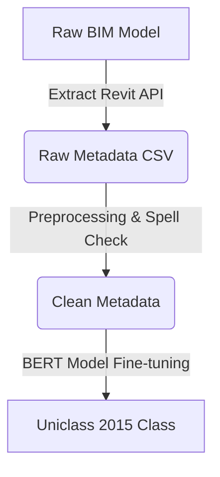

# Abstract
This paper presents an automated BIM element classification method utilizing fine-tuned BERT and Large Language Models (LLMs) to map custom Revit and IFC element metadata directly to Uniclass 2015 tables. We address the challenge of inconsistent spelling and non-standard abbreviations in BIM files. Our model achieves over 90% accuracy on common architectural elements.

# Introduction
BIM metadata classification plays a key role in automated compliance checking and quantity takeoff [1]. However, manual classification is prone to errors due to inconsistent family naming conventions. While deep learning has been widely studied, model sensitivity to typos remains a critical issue [2]. In this study, we introduce an NLP-based pre-processing and classification framework to resolve these inconsistencies automatically.

# Materials and Methods
We collected a dataset of 5,000 BIM elements from 10 real-world building models. The raw metadata was extracted using a custom Autodesk Revit API exporter.
For pre-processing, we normalized Vietnamese text and expanded abbreviations using a predefined technical dictionary.
Let \(x_i\) represent the raw metadata text vector. The similarity score is calculated as:
\[S(x_i, y_j) = \frac{x_i \cdot y_j}{\|x_i\| \|y_j\|}\]

The architecture of our data flow is illustrated below:

# Results
Our results show that the BERT model achieved a classification accuracy of 92.4% for architectural elements (such as doors, walls, and windows) [3]. However, the accuracy for MEP equipment (valves, dampers) was lower at 76.5% due to the dense use of non-standard technical abbreviations (e.g., cb, dt, mep).

# Discussion
We found that text normalization drastically improved classification accuracy. Our results indicate that pre-processing Vietnamese metadata reduces BERT sensitivity to typos. However, the study is limited to French-Vietnamese hybrid abbreviations. Future work should focus on expanding the dictionary database.

# References
[1] Eastman, C. et al. (2018). BIM Handbook: A Guide to Building Information Modeling.
[2] Swales, J. M., & Feak, C. B. (2012). Academic Writing for Graduate Students.
[3] Kallestinova, E. D. (2011). How to Write Your First Research Paper.
