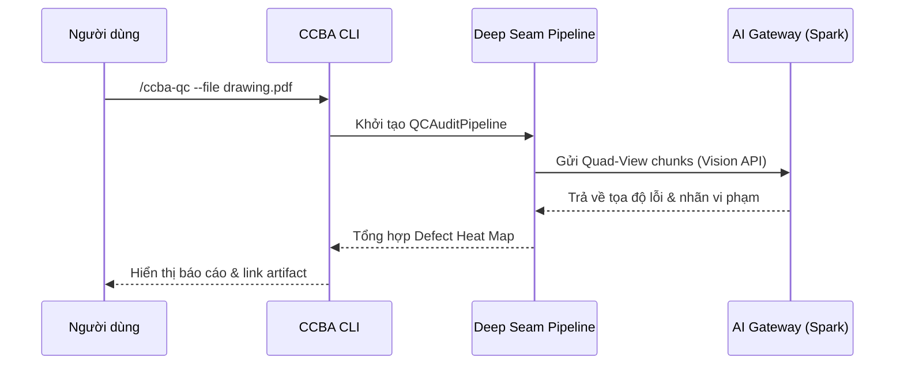

# ccba-show-me — Reference Guide

> **Mục đích & Ngữ cảnh sử dụng:** Hướng dẫn trực quan hóa giải thuật, sơ đồ dữ liệu qua Excalidraw
> **Mô tả gốc:** Trực quan hóa khái niệm, thuật toán, luồng dữ liệu và cấu trúc hệ thống bằng sơ đồ tinh gọn, code-shape sketches hoặc HTML widget.

---

# Kỹ Năng: Trực Quan Hóa Hội Thoại (Show-Me)

> Nguồn gốc: Thích ứng từ `show-me` của Humanlayer (MIT License). Tinh chỉnh cho CCBA Agent Services Platform & môi trường Antigravity IDE.

Hỗ trợ người dùng hiểu nhanh chủ đề, kiến trúc hoặc luồng xử lý hiện tại thông qua các lát cắt trực quan cô đọng.

**Triết lý cốt lõi:**
- **Show, don't tell**: Trực quan hóa thay vì mô tả văn bản dài dòng.
- **Cắt bỏ dạo đầu (Skip preamble)**: Đi thẳng vào trọng tâm, giữ phần lời dẫn cực kỳ ngắn gọn.
- **Lát cắt tối thiểu (Smallest view)**: Chọn hình thức trực quan nhỏ nhất và đơn giản nhất làm sáng tỏ vấn đề cốt lõi.

---

## 1. Các Hình Thức Trực Quan Cốt Lõi (Visual Primitives)

### A. Thuật toán hoặc Logic cốt lõi $\rightarrow$ Dùng Pseudocode

```text
on(save_document)
  if content_hash == last_saved_hash:
    return cached_result
  validate_schema(new_content)
  write_to_storage(new_content)
  invalidate_cache()
  return fresh_result
```

### B. Luồng điều khiển Runtime $\rightarrow$ Dùng Call Tree

Minh họa thứ tự gọi hàm, luồng thực thi trong CLI hoặc Deep Seam:

```text
execute_qc_audit
  discover_documents
    scan_workspace_context
    resolve_drawing_layers
  run_quad_view_vision
    tile_pdf_pages
    dispatch_multimodal_audit
  generate_heat_map_report
    compile_defect_matrix
    export_markdown_artifact
```

### C. Cấu trúc UI hoặc Khối hiển thị $\rightarrow$ Dùng Component Tree

Minh họa phân cấp component, ranh giới module và trạng thái quan trọng:

```tsx
<QCAuditDashboard> (apps/qc-portal/src/routes/audit.tsx)
  useAuditStream()
  <InspectionToolbar>
    <FilterDisciplineDropdown /> (PCCC | MEP | Arch)
    <RunAuditButton> (packages/ui)
  <QuadViewHeatmap>
    <DrawingViewport page={activePage} />
    <DefectMarkerOverlay defects={filteredDefects} />
```

### D. Trách nhiệm file hoặc Phạm vi Refactor $\rightarrow$ Dùng Shallow File Tree

```text
packages/
├── ccba-ai/            # SDK gọi AI Gateway Spark (:8090)
├── ccba-ooxml/         # Thư viện xử lý Word / Excel OOXML
└── mdconverter/        # Deep Seam chuyển đổi tài liệu chuẩn hóa
```

### E. Tương tác thành phần hoặc Luồng dữ liệu phức tạp $\rightarrow$ Dùng Mermaid Sequence/Flow



### F. Minh họa Thay Đổi Có Chủ Đích $\rightarrow$ Dùng Contextual Diff

Khi ngữ cảnh xung quanh đã tồn tại và trọng tâm là **sự thay đổi**, sử dụng `diff`. Khớp định dạng diff với chủ đề:

**Thay đổi Component UI:**
```diff
 <InspectionToolbar>
   <FilterDisciplineDropdown />
+  <SeverityThresholdSlider min={1} max={5} />
   <RunAuditButton />
 </InspectionToolbar>
```

**Thay đổi cấu trúc tệp / Module:**
```diff
 packages/ccba-ai/
 ├── src/
 │   ├── client.py
-│   └── gateway_router.py
+│   ├── routing/
+│   │   ├── litellm_client.py
+│   │   └── circuit_breaker.py
```

**Thay đổi Call Tree / Luồng gọi:**
```diff
 run_qc_pipeline
   validate_input_pdf
+  check_file_stability_guard
   dispatch_quad_view
-  generate_plain_text_report
+  generate_heat_map_report
```

**Thay đổi Trạng thái / Kiểm soát luồng:**
```diff
 on_issue_detected
-  log_error_and_terminate()
+  if circuit_breaker.is_tripped:
+    return fallback_local_cache()
+  record_defect_to_matrix()
```

### G. Khối mã hoàn chỉnh mẫu $\rightarrow$ Dùng Target Shape

Chỉ hiển thị toàn bộ khối code khi hầu hết nội dung là mới, khi việc lược bỏ ngữ cảnh sẽ làm mất thứ tự hoặc quyền sở hữu dữ liệu, hoặc khi người dùng cần một khuôn mẫu chuẩn (boilerplate) có thể copy-paste được:

```python
def dispatch_vision_audit(page_image: bytes, discipline: str) -> list[DefectRecord]:
    """Gửi ảnh lát cắt bản vẽ lên AI Gateway để phát hiện lỗi theo bộ môn."""
    response = ai.chat(
        model="qwen-vl-max",
        messages=[{"role": "user", "content": [{"type": "image", "image": page_image}]}],
    )
    return parse_defect_matrix(response.text, discipline=discipline)
```

### H. Giao diện trực quan hoặc Khái niệm quá dày đặc $\rightarrow$ Dùng Generative HTML Artifact

Khi sơ đồ Mermaid hoặc ASCII text không đủ sức biểu đạt (ví dụ: so sánh đa trạng thái, infographic, slider tương tác), tạo một file HTML độc lập theo chuẩn `generative_ui` của Antigravity:
- Sử dụng script Tailwind CSS được gstatic cho phép:
  ```html
  <script src="https://www.gstatic.com/antigravity/web/dev/tailwindcss.min.js"></script>
  ```
- Sử dụng các biến giao diện hệ thống (`bg-[var(--card)]`, `text-[var(--foreground)]`, `border-[var(--border)]`) để thích ứng tự động với cả Light và Dark mode.
- Lưu file HTML vào thư mục artifact (`<appDataDir>/brain/<conversation-id>/show_me_<topic>.html`).
- **Quy tắc nhúng**:
  - Nếu widget gọn gàng (chiều cao < 500px): Nhúng inline trực tiếp trong chat bằng `<agent-embed src="file:///..."></agent-embed>` với `<body class="bg-transparent ...">`.
  - Nếu là dashboard hoặc nội dung lớn: Mở toàn màn hình ở side panel và cung cấp liên kết click được.

---

## 2. Nguyên Tắc Điều Phối (Guidance & Best Practices)

1. **Vị trí hiển thị**: Đặt khối trực quan ngay sát bên cạnh đoạn văn bản ngắn hỗ trợ nó.
2. **Loại bỏ nhiễu**: Chỉ giữ lại các hàm, props, files, states và ranh giới thực sự cần thiết để giải quyết câu hỏi hoặc lựa chọn đang thảo luận.
3. **KISS & Không quá tải**: Bạn có thể dùng một hoặc kết hợp vài hình thức trên, nhưng **tuyệt đối không dùng tất cả cùng lúc** trong một câu trả lời. Hãy ưu tiên hình thức nhỏ nhất làm rõ được vấn đề.

---
*Tạo bởi CCBA — Trung tâm Tư vấn và Ứng dụng BIM trong Xây dựng*
