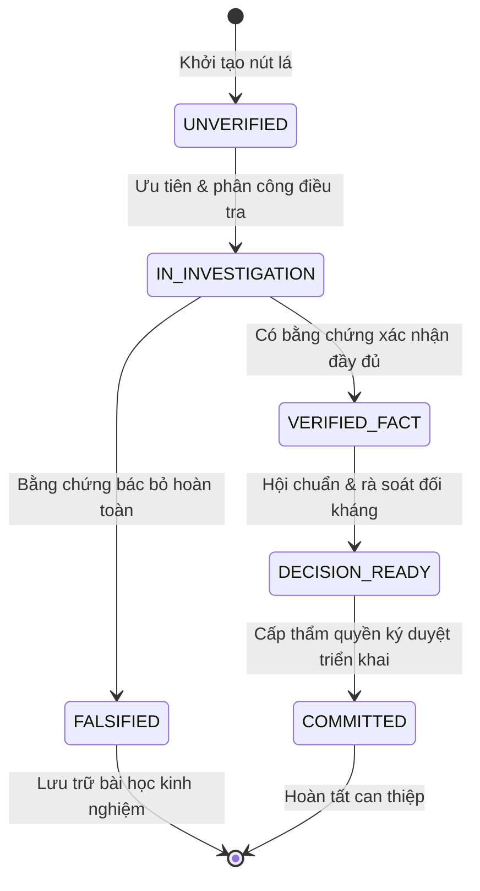

[SKILL.md](../SKILL.md)

# Hướng Dẫn Tầng Vận Hành & Quản Trị Vòng Đời Giả Thuyết (Governed Lifecycle Guide)

Tài liệu này đặc tả tầng vận hành (**Operating Layer**) theo phản biện đối kháng của Jack Quinn, biến Cây Vấn Đề (Issue Tree) từ một sơ đồ tư duy tĩnh thành một hệ thống quản trị động, kiểm soát chặt chẽ trạng thái vòng đời của từng nhánh lá, phân định thẩm quyền theo Hiến chương CCBA và neo giữ bằng chứng bất biến (Evidence Grounding).

---

## 1. Máy Trạng Thái Vòng Đời Nhánh (6-State Lifecycle Machine)

Mỗi nút lá trên cây (dù là Giả thuyết trong Why-Tree hay Phương án trong How-Tree) bắt buộc phải tồn tại trong một trạng thái xác định thuộc máy trạng thái 6 trạng thái dưới đây:



### Bảng Tra Cứu Trạng Thái & Điều Kiện Chuyển Dịch (State Transition Invariants)

| Trạng Thái | Ý Nghĩa Nghiệp Vụ | Điều Kiện Đầu Vào (Entry Conditions) | Điều Kiện Chuyển Tiếp (Exit Transition Criteria) |
| :--- | :--- | :--- | :--- |
| `UNVERIFIED` | Giả thuyết mới hình thành sau khi phân rã cây, chưa kiểm chứng. | Cây hoàn thành Pha 3 (MECE Gate). | Được chọn vào danh sách ưu tiên điều tra và phân công kỹ sư phụ trách $\rightarrow$ `IN_INVESTIGATION`. |
| `IN_INVESTIGATION` | Đang trong quá trình thu thập tài liệu, đo đạc hoặc chạy mô phỏng. | Có kế hoạch kiểm chứng cụ thể và tài nguyên thực thi. | Thu thập đủ bằng chứng đạt ngưỡng tin cậy để xác nhận $\rightarrow$ `VERIFIED_FACT` hoặc bác bỏ $\rightarrow$ `FALSIFIED`. |
| `VERIFIED_FACT` | Giả thuyết được chứng minh là sự thật khách quan bằng chứng cứ thực nghiệm. | Có bằng chứng thuộc cấp độ `FACT_LOG`, `STATUTE_VERBATIM` hoặc `MEASURED_METRIC`. | Được đưa vào phương án can thiệp và hoàn tất rà soát đối kháng $\rightarrow$ `DECISION_READY`. |
| `FALSIFIED` | Giả thuyết đã bị chứng minh là sai, loại bỏ khỏi không gian nguyên nhân. | Có số liệu hoặc luận cứ phủ định chắc chắn 100%. | Đóng nhánh, ghi nhận nguyên nhân loại trừ vào biên bản để tránh lặp lại. |
| `DECISION_READY` | Phương án/nguyên nhân đã đủ cơ sở vững chắc, sẵn sàng trình duyệt. | Vượt qua vòng kiểm định phản biện (Adversarial Review) của Chủ trì bộ môn. | Cấp có thẩm quyền ký biên bản nghiệm thu hoặc quyết định can thiệp $\rightarrow$ `COMMITTED`. |
| `COMMITTED` | Đã cam kết thực hiện, phân bổ ngân sách và nhân lực triển khai. | Có phê duyệt chính thức bằng văn bản từ Ghế phụ trách tương ứng. | Triển khai hoàn tất và nghiệm thu kết quả hiện trường/sản phẩm. |

---

## 2. Thang Đo Cấp Độ Bằng Chứng (Evidence Grounding Matrix - ADR-0059)

Tuyệt đối cấm Agent tự nâng trạng thái lên `VERIFIED_FACT` dựa trên suy luận trừu tượng hoặc phỏng đoán. Mọi xác nhận phải gắn với cấp độ bằng chứng cụ thể:

| Cấp Độ Bằng Chứng | Định Nghĩa & Tiêu Chuẩn Nghiệm Thu | Nguồn Dữ Liệu Hợp Lệ | Giá Trị Pháp Lý / Kỹ Thuật |
| :--- | :--- | :--- | :--- |
| `FACT_LOG` | Bản ghi kỹ thuật số bất biến từ hệ thống thực thi, log máy tính, commit sha. | File log máy chủ, telemetry runtime, trace log CI/CD. | Tuyệt đối xác thực về mặt vận hành hệ thống. |
| `STATUTE_VERBATIM` | Trích dẫn nguyên văn 100% từ VBPL, tiêu chuẩn xây dựng quốc gia, hợp đồng. | Văn bản từ TVPL, Công báo, tệp PDF/DOCX chính thức kèm SHA-256. | Căn cứ pháp lý cao nhất trong tranh chấp và thẩm tra. |
| `MEASURED_METRIC` | Số liệu đo đạc thực địa hoặc kết quả thí nghiệm độc lập có biên bản ký tá. | Biên bản quan trắc lún móng, kết quả nén mẫu bê tông, test áp lực nước. | Cơ sở khoa học thực nghiệm vững chắc. |
| `INFERRED_HYPOTHESIS` | Kết luận suy luận logic dựa trên các tiền đề gián tiếp. | Ý kiến phỏng vấn sơ bộ, giả định thiết kế chưa có hồ sơ hoàn công. | **Chỉ được giữ ở `IN_INVESTIGATION`**, không được tự ý chuyển `VERIFIED_FACT`. |

---

## 3. Ma Trận RACI Ánh Xạ Các Ghế Trách Nhiệm Hiến Chương CCBA

Tầng vận hành gắn kết trách nhiệm giải trình trực tiếp vào các Ghế trách nhiệm của CCBA Charter 2026 (Phụ lục 01 Quy chế CCBA 2026 & ADR-0046):

| Ghế Trách Nhiệm Hiến Chương | Vai Trò Trong Vận Hành Cây Vấn Đề (RACI) | Quyền Hạn Trạng Thái Nút Lá |
| :--- | :--- | :--- |
| `KY_SU_THUC_THI` | **Responsible (R)**: Thu thập dữ liệu thực địa, trích xuất log, đo kiểm kỹ thuật và thực thi kiểm chứng | Đề xuất nhánh mới, chuyển `UNVERIFIED` $\rightarrow$ `IN_INVESTIGATION`, đề xuất bằng chứng |
| `CHU_TRI_BO_MON` | **Accountable (A)**: Chủ trì tính toán chuyên ngành, phản biện kỹ thuật nội bộ bộ môn | Thẩm định và ký xác nhận `VERIFIED_FACT` / `FALSIFIED` cho các nhánh kỹ thuật |
| `CHU_TRI_HOP_DONG_PM` | **Accountable (A)**: Điều phối toàn diện các gói việc (What-Tree), tiến độ và hợp đồng dự án | Phê duyệt chuyển `DECISION_READY` $\rightarrow$ `COMMITTED` ở cấp gói việc/dự án |
| `TRUONG_PHONG_BIM_THIET_KE` | **Consulted (C)**: Rà soát các nhánh giải pháp kiến trúc, kết cấu, MEP và mâu thuẫn mô hình BIM | Tham vấn chuyên môn, đồng thuận nghiệm thu kỹ thuật cho nhánh mô hình thiết kế |
| `TRUONG_PHONG_BIM_DU_AN` | **Consulted (C)**: Thẩm định các nhánh tiến độ thi công 4D, chi phí 5D và bàn giao thông tin dự án | Tham vấn biện pháp phối hợp và kiểm soát rủi ro triển khai hiện trường |
| `IDOP_LEAD` | **Accountable (A)**: Tích hợp các nhánh hành động `[COMMITMENT]` vào hệ thống Phiếu Giao Việc PGV | Đăng ký nghiệm thu IDOP và quản lý hạn mức tạm ứng nhiệm vụ theo Điều 17 |
| `CO_VAN_PHAP_LY_QA` | **Consulted/Accountable (C/A)**: Thẩm tra căn cứ pháp lý, điều khoản hợp đồng FIDIC, rà soát VBPL | Thẩm định bằng chứng `STATUTE_VERBATIM`, phê duyệt pháp lý chuyển `DECISION_READY` |
| `TRUONG_PHONG_RD_HTQT` | **Accountable (A)**: Thẩm định kiến trúc giải pháp, thuật toán, công nghệ nền tảng và Deep Seams | Phê duyệt chuyển trạng thái `DECISION_READY` cho các bài toán phức tạp nền tảng |
| `TRUONG_PHONG_TONG_HOP` | **Consulted (C)**: Hỗ trợ rà soát năng lực nhân sự, thủ tục hành chính và pháp nhân phục vụ điều tra | Tham vấn điều kiện hậu cần và tính pháp lý hồ sơ doanh nghiệp |
| `PHU_TRACH_KE_TOAN` | **Consulted (C)**: Thẩm định dòng tiền, chi phí tài chính và ngân sách phân bổ cho các nhánh giải pháp | Tham vấn kiểm soát trần chi phí và thanh quyết toán cho các nhánh How/What |
| `PHO_GIAM_DOC` | **Accountable (A)**: Phê duyệt giải pháp kỹ thuật liên bộ môn, phân xử bất đồng chuyên môn | Phê duyệt `DECISION_READY` cho các ca sự cố đa bộ môn |
| `GIAM_DOC` | **Accountable (A)**: Phê duyệt tối cao về chiến lược, cam kết nguồn lực và phát hành chính thức | Phê duyệt tối cao chuyển `DECISION_READY` $\rightarrow$ `COMMITTED` cho toàn bộ cây |

---

## 4. Quy Trình Xử Lý Xung Đột Giả Thuyết Đối Nghịch (Competing Hypotheses Dispute Resolution)

Khi xuất hiện hai hay nhiều giả thuyết cạnh tranh cùng giải thích một hiện tượng sự cố:

1. **Nguyên Tắc Bất Độc Quyền (Non-Exclusivity Until Proven):** Không vội vàng loại bỏ giả thuyết nào khi chưa có bằng chứng phủ định dứt điểm. Cả hai nhánh đều giữ trạng thái `IN_INVESTIGATION`.
2. **Thiết Kế Phép Thử Phân Định (Discriminative Test):** Xây dựng một kịch bản đo đạc hoặc kiểm thử mà kết quả trả về chỉ có thể ủng hộ một bên và phủ định dứt điểm bên còn lại.
3. **Hội Chuẩn Đối Kháng (Adversarial Session):**
   - Đại diện bảo vệ từng nhánh trình bày chứng cứ theo bảng Evidence Grounding Matrix.
   - Nhánh nào có bằng chứng ở bậc cao hơn (`FACT_LOG` / `MEASURED_METRIC` > `INFERRED_HYPOTHESIS`) sẽ được ưu tiên xem xét.
4. **Phán Quyết & Lưu Vết (Resolution Log):**
   - Nhánh thắng cuộc chuyển sang `VERIFIED_FACT`.
   - Nhánh thua cuộc chuyển sang `FALSIFIED` kèm lý do cụ thể trong Decision Log.

---

## 5. Cơ Chế Cắt Tỉa Nhánh Tự Động & Phép Thử Nhị Phân (Cascading Branch Pruning)

Để tránh lãng phí nguồn lực điều tra và phân tích lan man, hệ thống cưỡng chế 2 quy tắc tối ưu hóa không gian tìm kiếm:

### 5.1. Cắt Tỉa Tự Động Theo Tầng (Cascading Falsification Engine)
- Khi một nút cha hoặc giả thuyết tiền đề bị chứng minh là sai (`FALSIFIED`), **toàn bộ các nút con phụ thuộc trực tiếp và gián tiếp lập tức bị gán nhãn `FALSIFIED_BY_CASCADE`**.
- **Quy tắc dừng ngay lập tức:** Dừng 100% mọi hoạt động đo đạc, khảo sát hiện trường hoặc điều tra log đối với các nhánh bị cắt tỉa này.
- **Biểu diễn trực quan:** Trong sơ đồ Mermaid, các nhánh bị cắt tỉa được chuyển sang nét đứt và màu xám mờ (`classDef pruned fill:#f9f9f9,stroke:#bbb,stroke-dasharray: 5 5`).

### 5.2. Ma Trận Phép Thử Nhị Phân Phân Định (Discriminative Binary Test Matrix)
- Thay vì kiểm tra tuần tự từng nhánh lá riêng lẻ, Agent chủ trì phải thiết kế **1 phép thử mang tính chất nhị phân ($0$ hoặc $1$)** dựa trên mốc thời gian hoặc tính chất vật lý của sự cố.
- **Nguyên lý Binary Search trên RCA:** Phép thử nhị phân phải được thiết kế sao cho kết quả kiểm chứng nhị phân lập tức loại trừ ít nhất $50\%$ số nhánh giả thuyết còn lại, giúp giảm thời gian khoanh vùng sự cố từ hàng giờ xuống vài phút.

---

## 6. Neo Giữ Mã Băm Chứng Cứ Bất Biến Cryptographic SHA-256 (ADR-0059 Hardening)

Tuân thủ nghiêm ngặt Hiến pháp Layer 1 (`AGENTS.md`) và Nguyên tắc Bất biến ADR-0059, mọi nút lá chuyển sang trạng thái `VERIFIED_FACT` bắt buộc phải kèm metadata chứng cứ mật mã:

```markdown
### [WHY-01.2] Lỗi rò rỉ tiến trình con không kế thừa Session Leader
- **Trạng thái:** `VERIFIED_FACT`
- **Cấp độ bằng chứng:** `FACT_LOG`
- **Nguồn chứng cứ:** `<ABSOLUTE_LOG_PATH>/runner_deadlock_trace.log#L340-L385`
- **Mã băm SHA-256:** `a1b2c3d4e5f67890123456789abcdef0123456789abcdef0123456789abcdef0`
- **Thời điểm xác nhận:** 2026-09-17T20:55:00+07:00
- **Ghế thẩm duyệt:** CHU_TRI_BO_MON
```

> [!CAUTION]
> **Khóa Toàn Vẹn Chứng Cứ (Integrity Tamper Lock):** Khi thực thi lệnh kiểm chứng hệ thống (`python -m ccba_harness verify-patch`), nếu tệp nguồn chứng cứ bị thay đổi nội dung làm sai lệch mã băm SHA-256, trạng thái nút lá lập tức bị giáng cấp tự động về `INTEGRITY_VIOLATED` $\rightarrow$ `IN_INVESTIGATION` và khóa quyền phê duyệt `DECISION_READY`.

---
*Hướng dẫn quản trị tầng vận hành chuẩn hóa thuộc kỹ năng ccba-issue-tree.*
