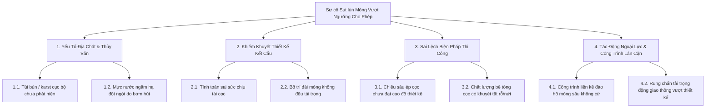
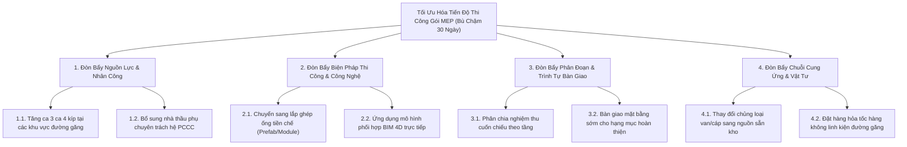
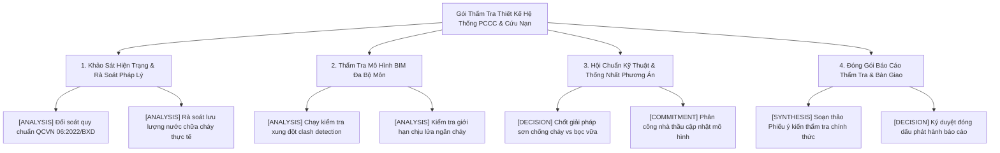
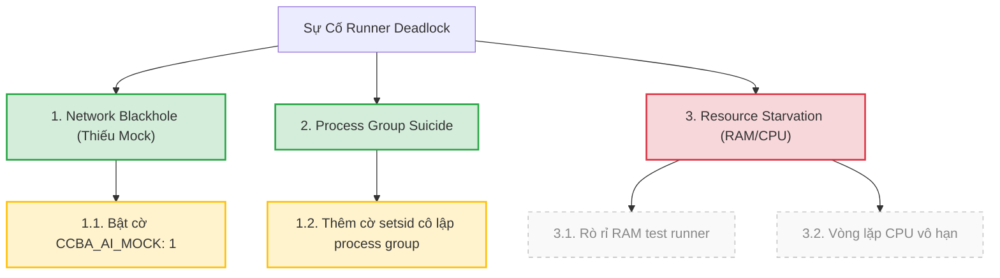

[SKILL.md](../SKILL.md)

# Mẫu Cây Vấn Đề Chuẩn Hóa (McKinsey MECE Issue Tree Templates)

Tài liệu này cung cấp bộ mẫu trực quan (Mermaid Diagrams) và cấu trúc phân rã văn bản (Text Tree Templates) cho 3 biến thể Cây Vấn Đề chuẩn McKinsey MECE, phục vụ các nghiệp vụ tư vấn xây dựng, thẩm tra mô hình BIM, kỹ nghệ phần mềm và tranh chấp pháp lý.

---

## 1. Diagnostic Why-Tree (Cây Chẩn Đoán Nguyên Nhân)

### Đặc điểm & Mục tiêu
- **Mục tiêu:** Truy tìm nguồn gốc cốt lõi của một sự cố, sai lệch hoặc khiếu nại.
- **Trục phân rã:** Cơ chế vật lý, trình tự thời gian hoặc ranh giới trách nhiệm hợp đồng.
- **Đặc tính nút lá:** Mỗi nút lá là một **Giả thuyết có thể kiểm chứng** (`testable hypothesis`).

### Mẫu Biểu Đồ Mermaid (Diagnostic Why-Tree)



### Mẫu Cấu Trúc Phân Rã Văn Bản (Text Format)

```text
[GỐC] Sự cố Sụt lún Móng Vượt Ngưỡng Cho Phép
├── 1. [NHÁNH] Yếu Tố Địa Chất & Thủy Văn
│   ├── 1.1. [HYPOTHESIS] [H-01] Xuất hiện túi bùn/hang karst cục bộ ngoài vị trí lỗ khoan khảo sát
│   └── 1.2. [HYPOTHESIS] [H-02] Mực nước ngầm bị hạ thấp nghiêm trọng do hoạt động bơm hút xung quanh
├── 2. [NHÁNH] Khiếm Khuyết Thiết Kế Kết Cấu
│   ├── 2.1. [HYPOTHESIS] [H-03] Mô hình tính toán nội lực dùng sai chỉ tiêu cơ lý đất nền
│   └── 2.2. [HYPOTHESIS] [H-04] Thiết kế đài cọc phân bổ độ cứng không tương thích tải trọng lệch tâm
├── 3. [NHÁNH] Sai Lệch Biện Pháp Thi Công
│   ├── 3.1. [HYPOTHESIS] [H-05] Cọc chưa đóng/ép tới tầng chịu lực đã dừng do hiện tượng chối giả
│   └── 3.2. [HYPOTHESIS] [H-06] Khuyết tật thân cọc trong quá trình đúc hoặc vận chuyển dẫn đến suy giảm tải
└── 4. [NHÁNH] Tác Động Ngoại Lực & Công Trình Liền Kề
    ├── 4.1. [HYPOTHESIS] [H-07] Công trình liền kề đào mở móng sâu gây dịch chuyển ngang khối đất
    └── 4.2. [HYPOTHESIS] [H-08] Tải trọng thi công tập kết trên bề mặt vượt quá giới hạn thiết kế
```

---

## 2. Solution How-Tree (Cây Chiến Lược Giải Pháp)

### Đặc điểm & Mục tiêu
- **Mục tiêu:** Tìm kiếm và xếp hạng các phương án can thiệp tối ưu để giải quyết bài toán đã rõ nguyên nhân.
- **Trục phân rã:** Các đòn bẩy can thiệp (Chi phí, Thời gian, Kỹ thuật, Tổ chức).
- **Đặc tính nút lá:** Mỗi nút lá là một **Phương án hành động xếp hạng** (`ranked option`) kèm ma trận Giá trị / Độ phức tạp / Rủi ro / KISS.

### Mẫu Biểu Đồ Mermaid (Solution How-Tree)



### Mẫu Cấu Trúc Phân Rã Văn Bản & Ma Trận Đánh Giá

```text
[GỐC] Tối Ưu Hóa Tiến Độ Thi Công Gói MEP (Bù Chậm 30 Ngày)
├── 1. [ĐÒN BẨY] Nhân Lực & Ca Làm Việc
│   ├── 1.1. [OPTION] [OPT-01] Tổ chức tăng ca 3 ca liên tục tại các trục kỹ thuật đứng
│   │   └── Đánh giá: Giá trị: CAO | Độ phức tạp: TRUNG BÌNH | Rủi ro: AN TOÀN LAO ĐỘNG | KISS: ĐẠT
│   └── 1.2. [OPTION] [OPT-02] Huy động nhà thầu phụ vệ tinh gia công tại xưởng ngoài công trường
│       └── Đánh giá: Giá trị: TRUNG BÌNH | Độ phức tạp: CAO | Rủi ro: SAI SỐ GIA CÔNG | KISS: KHÔNG
├── 2. [ĐÒN BẨY] Công Nghệ Thi Công Tiền Chế
│   ├── 2.1. [OPTION] [OPT-03] Module hóa giá đỡ đa hệ (Multi-service Bracket Prefab)
│   │   └── Đánh giá: Giá trị: RẤT CAO | Độ phức tạp: THẤP | Rủi ro: THẤP | KISS: ĐẠT
│   └── 2.2. [OPTION] [OPT-04] Rút ngắn chu kỳ phê duyệt bản vẽ thi công qua BigBim Coordination
│       └── Đánh giá: Giá trị: CAO | Độ phức tạp: THẤP | Rủi ro: THẤP | KISS: ĐẠT
└── 3. [ĐÒN BẨY] Chuỗi Cung Ứng Vật Tư
    ├── 3.1. [OPTION] [OPT-05] Thay thế vật tư tương đương nguồn nội địa sẵn có (Trình CĐT duyệt)
    │   └── Đánh giá: Giá trị: CAO | Độ phức tạp: TRUNG BÌNH | Rủi ro: PHÁP LÝ NGHIỆM THU | KISS: ĐẠT
    └── 3.2. [OPTION] [OPT-06] Giao hàng chia nhỏ theo từng tầng thay vì gom nguyên lô
        └── Đánh giá: Giá trị: TRUNG BÌNH | Độ phức tạp: THẤP | Rủi ro: THẤP | KISS: ĐẠT
```

---

## 3. Workplan What-Tree (Cây Kế Hoạch Hành Động & Gói Việc)

### Đặc điểm & Mục tiêu
- **Mục tiêu:** Bóc tách toàn bộ gói việc của một dự án hoặc chiến dịch tư vấn mà không bỏ sót đầu việc.
- **Trục phân rã:** Các hợp phần công việc, giai đoạn vòng đời hoặc cấu phần sản phẩm giao nộp.
- **Đặc tính nút lá:** Mỗi nút lá bắt buộc mang một trong 4 nhãn MECE:
  - `[ANALYSIS]`: Phân tích dữ liệu, khảo sát, đo đạc hiện trường, rà soát văn bản pháp lý.
  - `[DECISION]`: Điểm chốt phê duyệt, lựa chọn phương án chiến lược của cấp có thẩm quyền.
  - `[COMMITMENT]`: Cam kết ngân sách, phân bổ nguồn lực, ký kết phụ lục hợp đồng hoặc giao việc.
  - `[SYNTHESIS]`: Tổng hợp báo cáo bàn giao, hồ sơ hoàn thành công trình, tài liệu nghiệm thu.

### Mẫu Biểu Đồ Mermaid (Workplan What-Tree)



### Mẫu Cấu Trúc Phân Rã Văn Bản (Text Format)

```text
[GỐC] Gói Thẩm Tra Thiết Kế Hệ Thống PCCC & Cứu Nạn
├── 1. [HỢP PHẦN] Rà Soát Cơ Sở Pháp Lý & Đầu Vào Kỹ Thuật
│   ├── 1.1. [ANALYSIS] [ACT-01] Trích xuất và lập bảng đối chiếu chỉ tiêu QCVN 06:2022/BXD
│   ├── 1.2. [ANALYSIS] [ACT-02] Tính toán thủy lực mạng lưới cấp nước chữa cháy ngoài nhà
│   └── 1.3. [DECISION] [ACT-03] Xác nhận danh mục tiêu chuẩn áp dụng với Chủ đầu tư
├── 2. [HỢP PHẦN] Thẩm Tra Mô Hình Thiết Kế Đa Bộ Môn
│   ├── 2.1. [ANALYSIS] [ACT-04] Rà quét xung đột không gian giữa ống PCCC và dầm kết cấu
│   ├── 2.2. [ANALYSIS] [ACT-05] Kiểm tra khoảng cách di chuyển thoát nạn và cửa thoát hiểm
│   └── 2.3. [ANALYSIS] [ACT-06] Kiểm tra công suất quạt tăng áp hút khói buồng thang bộ
├── 3. [HỢP PHẦN] Hội Chuẩn Kỹ Thuật & Xử Lý Bất Cập
│   ├── 3.1. [DECISION] [ACT-07] Thống nhất giải pháp bọc cách nhiệt ống gió ngăn khói
│   └── 3.2. [COMMITMENT] [ACT-08] Ký biên bản thống nhất thời hạn nộp bản vẽ hiệu chỉnh
└── 4. [HỢP PHẦN] Đóng Gói Hồ Sơ Thẩm Tra
    ├── 4.1. [SYNTHESIS] [ACT-09] Lập báo cáo thẩm tra kỹ thuật tích hợp hình ảnh nhiệt
    └── 4.2. [DECISION] [ACT-10] Phê duyệt và đóng dấu bản phát hành chính thức
```

---

## 4. Mẫu Cây Có Nhánh Cắt Tỉa (Cascading Pruned Tree Template)

Khi một nhánh giả thuyết bị chứng minh là sai (`FALSIFIED`), toàn bộ các nhánh con phụ thuộc bị cắt tỉa (`FALSIFIED_BY_CASCADE`), được trực quan hóa bằng nét đứt và màu xám mờ trong Mermaid:



### Mẫu Text Cắt Tỉa:
```text
[GỐC] Sự Cố Runner Deadlock
├── 1. [NHÁNH] [VERIFIED_FACT] Network Blackhole (Commit 863187d1 gỡ bỏ CCBA_AI_MOCK)
├── 2. [NHÁNH] [VERIFIED_FACT] Process Group Suicide (kill_process_tree giết runner worker)
└── 3. [NHÁNH] [FALSIFIED] Resource Starvation
    ├── 3.1. [FALSIFIED_BY_CASCADE] [DỪNG ĐIỀU TRA] Rò rỉ RAM test runner
    └── 3.2. [FALSIFIED_BY_CASCADE] [DỪNG ĐIỀU TRA] Vòng lặp CPU vô hạn
```

---
*Tài liệu mẫu tham chiếu chuẩn hóa thuộc kỹ năng ccba-issue-tree.*
