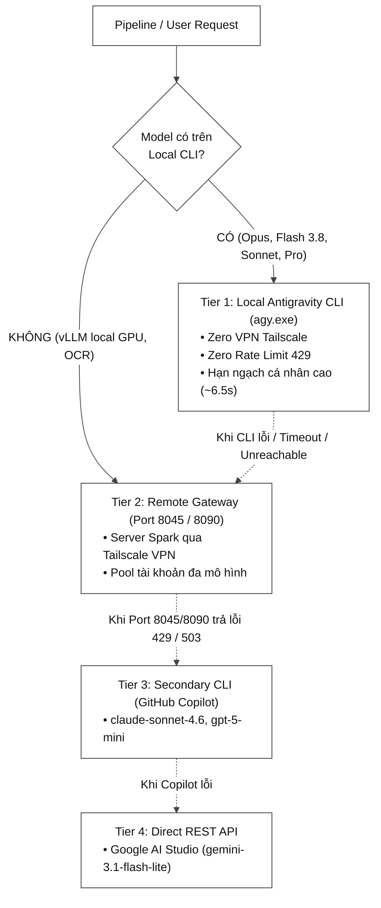

# LLM Pipeline Patterns

Pattern library cho các pipeline LLM multi-stage — đúc rút từ thực tế vận hành **VvC LLM OS** (v5.1 → v8.15, 2026). Mỗi pattern đều có ít nhất 1 incident thực tế chứng minh sự cần thiết.

> [!IMPORTANT]
> Đây là **documentation skill** — không có code cần install. Load file này khi thiết kế bất kỳ pipeline LLM nào trong CCBA.

---

## Pattern 1: 2-Pass Architecture (Quality vs Speed)

### Vấn đề
Single-pass synthesis (dù với Ground Truth) vẫn sinh ra lỗi OCR, hallucination, hay sai format trong một số trường hợp.

### Giải pháp
```
Pass 1: Fast model (local GPU / claude-haiku)
        → Generate toàn bộ draft
        → ~30-90 giây

Pass 2: Reasoning model (claude-sonnet-thinking / gemma-reasoning)
        → Verify/correct MỘT SECTION CỤ THỂ duy nhất
        → KHÔNG audit toàn bộ output (quá chậm, overkill)
        → ~15-30 giây
```

### Anti-pattern cần tránh
❌ **SAI**: Pass 2 re-generates toàn bộ output → tốn 3-5x thời gian, mất context.  
✅ **ĐÚNG**: Pass 2 chỉ nhận vào đoạn cần verify + ground truth, trả ra patch duy nhất.

### Safety Fallback (2-layer)
1. **Abort on Error**: Nếu Pass 1 trả `"Error connecting"` → abort ngay, không tạo file.
2. **Graceful Degradation**: Nếu Pass 2 timeout → giữ nguyên Pass 1 draft, vẫn lưu.

---

## Pattern 2: Ground Truth Scoping (BM25 + Chapter Filter)

### Vấn đề
BM25 trên toàn bộ corpus (400+ đoạn văn) thường match sai chapter. VD: query về "strategic agility" match text từ "Chapter 8 - Idea Generation" thay vì "Chapter 3 - Strategic Agility".

**Score trước khi scope**: ~60  
**Score sau khi scope theo chapter**: ~1193 (20x chính xác hơn)

### Giải pháp: Chapter-Scoped Search
```
1. Detect page number từ input (OCR / metadata)
2. Resolve chapter từ page number via TOC map
3. Load ONLY paragraphs từ 1-2 chapters liên quan
4. BM25 search trên corpus đã filter (44-97 đoạn thay vì 400+)
```

### Key Insight
Dùng **chapter opening text** (~500 chars đầu mỗi chapter) để routing — thay vì chỉ dùng title ngắn. BM25 score tăng từ ~60 → ~188 khi matching title + description + opening text.

---

## Pattern 3: Minimum Content Threshold

### Vấn đề
Input quá ngắn (< 50 chars) vẫn được đưa qua pipeline đắt tiền → tạo ra Concept Notes rỗng như `"tái tạo là một Hệ sinh thái."`.

### Giải pháp
```python
# Stage đầu tiên của pipeline — gate tất cả stages đắt tiền
if len(extracted_text.strip()) < 50:
    mark_as_low_confidence()
    skip_expensive_llm_stages()
    return  # early exit
```

### Ngưỡng tham chiếu từ thực tế
| Ngưỡng | Ý nghĩa |
|---|---|
| < 50 chars | Bỏ qua — có thể chỉ là header trang / caption |
| 50-200 chars | `confidence: low` — synthesize nhưng flag review |
| > 200 chars | Xử lý bình thường |

---

## Pattern 4: Idempotent Pipeline Stages

### Vấn đề
Khi daemon restart hoặc xử lý lại file, các stage không idempotent sẽ tạo duplicate output, corrupt state, hoặc fail với "file already exists".

### Giải pháp — Checklist Idempotency
```python
# ✅ ĐÚNG — kiểm tra trước khi tạo
output_path = concepts_dir / f"{stem}.md"
if output_path.exists():
    logger.info(f"Skip — đã tồn tại: {stem}")
    return existing_path

# ✅ ĐÚNG — upsert thay vì insert
yaml.safe_dump(new_data, stream, allow_unicode=True)  # overwrite toàn bộ

# ❌ SAI — append không kiểm tra
with open(output_path, "a") as f:
    f.write(new_content)  # → duplicate content mỗi lần chạy
```

### Rule cho Metadata Sync
Khi sync ngược metadata (VD: TOC → Source Note), luôn dùng `safe_load → merge → safe_dump` thay vì string append. Đảm bảo không overwrite các field user đã customize.

---

## Pattern 5: LLM Error String Detection

### Vấn đề
Nhiều LLM client trả về error message dưới dạng string (không phải exception). Pipeline xử lý "bình thường" → lưu error message vào database.

### Danh sách error patterns cần detect
```python
ERROR_SIGNATURES = [
    "Error connecting",
    "Connection timeout",
    "Rate limit exceeded",
    "context_length_exceeded",
    "maximum context length",
    "I cannot",            # Model refusal
    "I'm unable to",       # Model refusal
]

def is_llm_error(text: str) -> bool:
    if not text or len(text.strip()) < 10:
        return True
    return any(text.strip().startswith(sig) for sig in ERROR_SIGNATURES)
```

### Behavior khi detect error
- **Stage đầu (critical)**: Abort toàn bộ pipeline, không tạo file output.
- **Stage cuối (optional enrichment)**: Log warning, keep partial output, continue.

---

## Pattern 6: Semantic Duplicate Detection (Pre-Save Gate)

### Vấn đề
Khi xử lý nhiều trang của cùng một khái niệm, pipeline tạo ra nhiều Concept Notes khác nhau với nội dung chồng chéo lớn (90%+). Zettelkasten bị phân mảnh.

### Giải pháp: 3-Tier Merge Control
```
Tier 1 — Hook Count Gate:
    Nếu existing note đã có ≥4 Evidence Hooks → force SEPARATE + cross-link
    (tránh "God Notes" chứa quá nhiều quotes)

Tier 2 — Dynamic Size Limit:
    Nếu existing note > P95 size × 1.3 (≈ 7,700 bytes) → force SEPARATE
    Threshold = vault-wide P95 size của tất cả concept notes

Tier 3 — LLM Arbitrator:
    Nếu cosine similarity ≥ 0.88 → hỏi LLM: MERGE / SEPARATE / SUBSUME
    Bias toward SEPARATE để tránh information loss
```

### 3 Outcomes
| Decision | Hành động |
|---|---|
| `MERGE` | Academic Merge — xếp chồng Evidence Hooks, viết lại Core Idea |
| `SEPARATE` | Lưu note mới + tạo two-way cross-link tự động |
| `SUBSUME` | Drop note mới hoàn toàn — existing note đã cover 100% |

---

## Pattern 7: Context File Hierarchy

### Vấn đề
Dự án phức tạp có nhiều context files cho AI agents (instructions, rules, pipeline config). AI không biết file nào có authority cao nhất, dẫn đến conflict rules.

### Giải pháp: 3-Layer Self-Describing Headers
```
Layer 1 — Constitution (AGENTS.md):
    [!IMPORTANT] "Đây là nguồn quy tắc duy nhất — highest authority"
    Chứa: Full schema, architecture rules, behavior specs

Layer 2 — Quick Reference (GEMINI.md / README.md):
    [!NOTE] "Quick reference — defer to AGENTS.md for full schema"
    Chứa: Pointer đến Layer 1, DRY principle — KHÔNG duplicate schema

Layer 3 — Scope Override (scripts/GEMINI.md):
    [!NOTE] "Scoped override — chỉ override BEHAVIOR, KHÔNG override schema"
    Chứa: Mode-specific behavior (VD: Pipeline Mode = text-only, no explanations)
```

### DRY Violation Rule
Nếu Layer 2 hoặc 3 duplicate nội dung từ Layer 1 → replace bằng pointer: `📖 Full schema defined in AGENTS.md §3`. Không cho phép 2 nguồn truth cho cùng 1 rule.

---

## Pattern 8: PowerShell Exit Code Fix

### Vấn đề
Python scripts chạy từ PowerShell terminal trả về **exit code 1** dù không có lỗi. Confuses CI/CD pipelines.

### Root Cause
Python `logging` mặc định ghi vào `stderr`. PowerShell coi bất kỳ output trên `stderr` là error → exit code 1.

### Fix (1 dòng)
```python
# ❌ SAI — ghi vào stderr, PowerShell báo lỗi
logging.basicConfig(level=logging.INFO)

# ✅ ĐÚNG — ghi vào stdout
logging.basicConfig(level=logging.INFO, stream=sys.stdout)
```

### Rule bổ sung cho Windows scripts
```python
# Nếu script in ký tự Unicode (tiếng Việt) ra terminal Windows
sys.stdout.reconfigure(encoding='utf-8')  # phải gọi TRƯỚC logging.basicConfig
```

**Áp dụng cho**: Mọi script có `if __name__ == "__main__"` block chạy từ PowerShell terminal.  
**Không áp dụng**: Daemon dùng `pythonw.exe` (headless, không có terminal).

---

## Pattern 9: Asynchronous Poller Drainage Loop (Anti-Starvation Seam)

### Vấn đề
Trong kiến trúc LLM OS tương tác qua tệp (như `Command.md`, `Brain_Dump.md`), background daemon liên tục thăm dò thời gian sửa đổi tệp (`mtime`) và kích hoạt worker chạy ngầm trong thread riêng (mất 5–30s cho LLM inference).
Nếu worker chỉ xử lý 1 truy vấn duy nhất rồi cập nhật `Command.md`, đĩa sẽ mang `mtime` mới. Khi worker kết thúc, poller gán `_poller_state.command_mtime = mtime`.
Hậu quả: Nếu người dùng nhập $\ge 2$ truy vấn liên tiếp hoặc gõ thêm câu hỏi mới trong lúc worker đang xử lý, điều kiện `mtime <= poller_mtime` luôn đúng ở các tick tiếp theo $\rightarrow$ **Các câu hỏi còn lại bị "bỏ quên vĩnh viễn" (Starvation)** cho đến khi tệp bị sửa đổi thủ công lần nữa.

### Giải pháp (Drainage Loop)
Worker seam BẮT BUỘC phải chạy vòng lặp vét cạn nội bộ (`while find_pending_item():`) kèm giới hạn an toàn (`max_queries = 10`):
```python
# ✅ ĐÚNG: Vét cạn toàn bộ truy vấn trong một chu trình worker
def handle_command(command_file: Path | None = None, max_queries: int = 10) -> int:
    processed = 0
    while processed < max_queries:
        content = cmd_file.read_text(encoding="utf-8")
        query = find_pending_query(content)
        if not query:
            break
        response = process_query(query)
        write_response(content, query, response)
        processed += 1
    return processed
```

### Quy tắc Kiểm Thử Tệp Đa Phân Vùng (Dual-Section Assertion Invariant)
Khi viết unit test cho các tệp vừa làm Inbox vừa lưu Lịch sử (Inbox + History):
- ❌ **KHÔNG BAO GIỜ** assert: `assert query not in full_file_text` — vì khối lưu lịch sử cố tình ghi chép lại `@AI: {query} ---` bên trong Callout!
- ✅ **BẮT BUỘC**: Phân rã tệp bằng `extract_sections()` và assert tách biệt:
  ```python
  before, inbox, after = extract_sections(final_text)
  assert query not in inbox   # Đã dọn sạch khỏi hộp thư
  assert query in after       # Đã lưu vết vào lịch sử
  ```

---

## Pattern 10: Dual-Scope Context for Visual Workers (Target Section + Full Reference)

### Vấn đề
Khi một bài viết dài (7,000–10,000 ký tự) kích hoạt worker sinh sơ đồ nền (Mermaid, Excalidraw, D2):
- Nếu chỉ cắt cửa sổ hạn hẹp quanh thẻ nhúng (±500 ký tự) $\rightarrow$ **Đói ngữ cảnh (Context Starvation)**: Worker chỉ nhìn thấy tiêu đề và 1–2 câu mở bài, buộc phải suy diễn hư cấu toàn bộ nội dung sơ đồ.
- Nếu nạp toàn bộ bài viết phẳng mà không phân biệt $\rightarrow$ **Lost in the Middle**: Mô hình không xác định được sơ đồ đang minh họa cho phần nào.

### Giải pháp
Cấu trúc ngữ cảnh phân tầng 2 lớp (Dual-Scope Context) với ngưỡng an toàn tối đa 12,000 ký tự (~3,000 tokens):
```python
# 1. Xác định phân mục chứa placeholder (từ heading ## trước đến heading kế tiếp)
target_section = source_text[sec_start:sec_end].strip()

# 2. Toàn bộ bài viết tham chiếu
full_context = source_text[:12000].strip()

return (
    f"=== [TARGET SECTION (Trọng tâm sơ đồ)] ===\n{target_section}\n\n"
    f"=== [FULL ARTICLE CONTEXT (Toàn bộ bài viết tham chiếu)] ===\n{full_context}"
)
```

---

## Pattern 11: Prompt Conditional Artifact Anchors (Anti-Spurious Worker Storm)

### Vấn đề
Khi prompt hệ thống quy định cú pháp nhúng sơ đồ/tệp dưới dạng mệnh lệnh khẳng định không điều kiện:
`4. Vẽ sơ đồ: chèn ![[tên_sơ_đồ.mermaid.md|100%]]`
$\rightarrow$ **100% các dòng mô hình (Claude Opus, Sonnet, Gemini Flash) đều tự động chèn sơ đồ vào mọi câu trả lời**, kể cả khi câu hỏi chỉ là giải thích định nghĩa đơn giản. Điều này gây bùng nổ tác vụ rác, chiếm dụng GPU và làm nghẽn hàng đợi Gateway.

### Giải pháp
Áp dụng **Rào cản Điều kiện Hóa (Conditional Artifact Directives)** và phân định ngữ nghĩa trực quan rõ ràng:
1. **Điều kiện tiên quyết**: CHỈ chèn khi (1) người dùng yêu cầu trực tiếp, HOẶC (2) nội dung phân tích có quy trình nhiều bước hoặc kiến trúc hệ thống đa tầng phức tạp cần trực quan hóa; TUYỆT ĐỐI KHÔNG chèn khi chỉ giải thích khái niệm.
2. **Phân định ngữ nghĩa sơ đồ**:
   - Excalidraw: bản đồ tư duy, mô hình khái niệm trừu tượng, ma trận 2x2.
   - Mermaid: lưu đồ tiến trình (Flowchart TD), chuỗi tuần tự (Sequence), cây phân cấp.
   - D2: kiến trúc hạ tầng kỹ thuật, topology mạng, hệ thống phân tán.
3. **Tài liệu đính kèm (DOCX/CSV/XLSX)**: BẮT BUỘC chỉ chèn khi người dùng có yêu cầu cụ thể.

---

## Pattern 12: Zero-Broken-Link Diagram Fallbacks & Windows Path Hygiene

### Vấn đề
1. Khi worker gặp lỗi mạng, timeout, hoặc lỗi cú pháp (LLM sinh mã sơ đồ lỗi), nếu kết thúc bằng `return` im lặng, trên Obsidian ghi chú sẽ chứa liên kết gãy đỏ `file not created yet`.
2. Trên hệ điều hành Windows, nếu tên sơ đồ do LLM tạo ra chứa dấu ngoặc kép hoặc ký tự đặc biệt (`<>:"/\\|?*`), thao tác ghi đĩa sẽ crash với `OSError: [Errno 22] Invalid argument`.

### Giải pháp
1. **Fallback Placeholder**: Luôn tạo một file sơ đồ cảnh báo tối giản hợp lệ (Mermaid flowchart viền đỏ, Excalidraw warning card, D2 error SVG) thay vì bỏ dở:
   ```python
   # Mermaid Fallback ví dụ
   mermaid_code = (
       "flowchart TD\n"
       f'    err["⚠️ Không thể khởi tạo sơ đồ: {safe_title}<br/><i>{safe_error}</i>"]\n'
       "    style err fill:#fee2e2,stroke:#ef4444,stroke-width:2px,color:#991b1b;\n"
   )
   ```
2. **Windows Path Sanitization**: Vệ sinh bắt buộc mọi tên file trước khi ghi đĩa:
   ```python
   safe_name = re.sub(r'[<>:"/\\|?*]', '_', raw_filename)
   ```

---

## Pattern 13: Heading-Aware 2-Phase Map-Reduce for Mega Documents (>200,000 chars)

### Vấn đề
Khi tài liệu đầu vào (bài báo kỹ thuật, podcast transcript, sách điện tử, hoặc Fleeting Brain Dump tích lũy nhiều tuần) vượt quá 200,000 ký tự (~50,000–70,000 tokens):
1. **Silent Information Drop**: Nếu áp dụng cắt thô cứng (Hard Truncation, ví dụ `text[:4000]`), hệ thống sẽ vứt bỏ 95%+ nội dung, làm mất hoàn toàn các luận điểm cốt lõi ở nửa sau tài liệu.
2. **Context Blowout & Lost in the Middle**: Nếu nhồi nhét toàn bộ 200k+ ký tự vào một prompt duy nhất, chi phí inference tăng vọt, thời gian trễ kéo dài (>30s), và mô hình suy luận thường bỏ qua các chi tiết ở giữa văn bản.

### Giải pháp: 2-Phase Map-Reduce với Sliding Window Overlap
Tách biệt xử lý thành 2 pha độc lập, kết hợp ưu thế về tốc độ của mô hình siêu nhẹ và năng lực tổng hợp của mô hình lý luận sâu:

```
[Mega Document (>200,000 chars)]
               │
               ▼
[Heading-Aware Chunking] ── (Ưu tiên # > ## > ### > \n\n, chunk_size=40k, overlap=1k)
  ├── Chunk 1 (40k chars) ──► Pass 1 (Map): Gemini 3.8 Flash High (~2s) ──► Summary 1
  ├── Chunk 2 (40k chars) ──► Pass 1 (Map): Gemini 3.8 Flash High (~2s) ──► Summary 2
  └── Chunk N (40k chars) ──► Pass 1 (Map): Gemini 3.8 Flash High (~2s) ──► Summary N
                                                     │
                                                     ▼
[Pass 2 (Reduce)] ◄── Ghép các bản tóm tắt (<20,000 chars)
  │
  └──► Claude Opus 4.6 Thinking / Gemini 3.1 Pro ──► Tổng hợp toàn diện & trích xuất cấu trúc
```

### Triển khai Tham Khảo
```python
def map_reduce_summarize(text: str, target_model: str = "gemini-3.8-flash-high", max_chars: int = 200_000) -> str:
    """Tóm tắt Map-Reduce cho tài liệu vượt ngưỡng an toàn."""
    if len(text) <= max_chars:
        return text  # Zero-Truncation: Dưới ngưỡng thì giữ nguyên 100%

    chunks = split_into_chunks(text, chunk_size=40_000, overlap=1_000)
    summaries = []
    for idx, chunk in enumerate(chunks):
        map_prompt = (
            f"Bạn là chuyên gia phân tích. Hãy tóm tắt trích xuất các luận điểm cốt lõi, "
            f"số liệu, thực thể và cấu trúc logic của phần {idx+1}/{len(chunks)}:\n\n{chunk}"
        )
        chunk_sum = call_fast_llm(map_prompt, model=target_model)
        summaries.append(f"### Phân đoạn {idx+1}/{len(chunks)}\n{chunk_sum}")

    combined = "\n\n".join(summaries)
    reduce_prompt = (
        f"Hãy tổng hợp các phân đoạn tóm tắt sau thành một bản tóm tắt học thuật toàn diện, "
        f"giữ trọn vẹn số liệu và luận điểm logic:\n\n{combined}"
    )
    final_summary = call_reasoning_llm(reduce_prompt)
    return (
        f'<large_document_map_reduce_summary original_chars="{len(text)}" chunks="{len(chunks)}">\n'
        f"{final_summary}\n"
        f"</large_document_map_reduce_summary>"
    )
```

### Key Invariants
1. **Heading-Aware Split Priority**: Ưu tiên cắt tại ranh giới ngữ nghĩa Markdown Heading (`#`, `##`, `###`), sau đó mới đến đoạn văn kép (`\n\n`), bảo đảm không cắt xé giữa chừng một bảng biểu hay danh sách.
2. **Boundary Overlap**: Duy trì 1,000 ký tự gối đầu (overlap) giữa 2 chunk liên tiếp để không làm đứt mạch câu văn ở đường biên.
3. **Traceable Metadata Tag**: Bản tóm tắt tổng hợp bắt buộc phải được bọc trong thẻ XML có thuộc tính `original_chars` và `chunks` để downstream modules biết tài liệu gốc đã qua tiền xử lý nén.

---

## Pattern 14: Conditional Short-term Multi-turn Memory & Prompt Budget Protection

### Vấn đề
Trong giao diện tương tác qua tệp tri thức (như `Command.md`), người dùng thường đặt các câu hỏi nối tiếp có tính phụ thuộc ngữ cảnh ("Ở trên bạn nói...", "Giải thích rõ hơn mục 2", "So sánh với cái vừa rồi"):
1. **Stateless Amnesia**: Nếu pipeline hoàn toàn không lưu trạng thái (Stateless), mô hình không hiểu các đại từ thay thế, trả lời sai lệch hoặc yêu cầu người dùng nhắc lại câu hỏi.
2. **Context Bloat & RAG Pollution**: Nếu nạp toàn bộ lịch sử trò chuyện (Full History) vào mọi lượt hỏi, số lượng input tokens phình to nhanh chóng, làm loãng không gian truy xuất của RAG (Vector/BM25) và tăng chi phí API không cần thiết.

### Giải pháp: Conditional Injection + Single-Turn Bounded Extraction
Chỉ kích hoạt nạp lịch sử khi phát hiện tín hiệu liên kết ngữ nghĩa (Semantic Continuity Signals), và chỉ bóc tách duy nhất $N=1$ lượt trao đổi gần nhất với giới hạn trần cố định:

```
User Query ──► [Regex Continuity Detector]
                     │
         ┌───────────┴───────────┐
         ▼ (Không có tín hiệu)     ▼ (Có tín hiệu: "ở trên", "vừa rồi", "phần 2"...)
    [Zero Context]          [Bounded Extraction (N=1, max 4,000 chars)]
         │                         │
         ▼                         ▼
  Pure RAG Query            RAG Query + <previous_conversation_context>
```

### Triển khai Tham Khảo
```python
CONTINUITY_PATTERN = re.compile(
    r"(ở trên|vừa rồi|trước đó|vừa nêu|bảng trên|phần \d+|mục \d+|ý thứ \d+|luận điểm \d+|"
    r"nói rõ hơn|giải thích thêm|làm rõ|chi tiết hơn|tiếp tục|tiếp theo|bổ sung|so sánh với cái trước)",
    re.IGNORECASE,
)

def detect_continuity_signal(query: str) -> bool:
    """Xác định xem truy vấn có phụ thuộc vào lượt trao đổi trước không."""
    return bool(CONTINUITY_PATTERN.search(query))

def extract_last_exchange(file_content: str, max_chars: int = 4_000) -> dict[str, str] | None:
    """Trích xuất duy nhất 1 lượt hỏi-đáp gần nhất ngay trước mục Input hiện tại."""
    # Bóc tách câu hỏi và phản hồi gần nhất từ lịch sử
    ...
    return {"query": clean_q[:1000], "response": clean_r[:max_chars]}
```

### Key Invariants
1. **Zero-Impact on Independent Queries**: Các câu hỏi độc lập (chiếm 80%+ số lượng) hoàn toàn không bị chèn thêm bất kỳ token ngữ cảnh lịch sử nào.
2. **Bounded Memory Ceiling**: Bối cảnh lịch sử được giới hạn cứng tối đa 4,000 ký tự (~1,000 tokens), bảo đảm không lấn chiếm ngân sách của tài liệu RAG thực tế.
3. **XML Isolation**: Đóng gói lịch sử bên trong thẻ `<previous_conversation_context>` riêng biệt với `<rag_context>` để LLM phân định rạch ròi giữa tri thức tham chiếu và ngữ cảnh hội thoại phụ.

---

## Pattern 11: Deterministic Defense-in-Depth & SLM Prompt Anti-Literalism

### Vấn đề
Khi pipeline fallback từ frontier reasoning models (Claude Opus 4.6 Thinking, Gemini Pro) sang các mô hình nhẹ tầng dưới (Gemini Flash, Haiku, SLMs), các mô hình nhẹ này thường mắc lỗi **Token Literalism**: sao chép máy móc từng ký tự minh họa từ prompt ví dụ thay vì hiểu ngữ dụng ngữ nghĩa (ví dụ: prompt minh họa cú pháp bằng `` `[[slug|[1]]]` ``, Flash sao chép nguyên trạng dấu backticks vào bài viết khiến wikilink biến thành inline code pill xám và làm gãy đồ thị Graph View trong Obsidian).
Ngoài ra, nếu backend chỉ tin tưởng 100% vào output LLM mà không có lớp lọc regex tất định, các lỗi định dạng sẽ lọt thẳng xuống đĩa.

### Giải pháp: Cơ chế Phòng Thủ Chiều Sâu 3 Tầng
```
[LLM Prompt] ────► 1. Zero-Fencing Examples (dùng XML <example>, cấm backticks)
                   2. Explicit Negative Constraints (CẤM TUYỆT ĐỐI bọc backtick...)
                          │
                          ▼
[LLM Raw Output] ──► 3. Deterministic Pre-Save Regex Gate (clean_wikilink_quotes)
                          │
                          ▼
[Vault Markdown] ──► 4. CI / Vault Maintenance Linter (scan_wikilink_code_pills)
```

1. **Zero-Fencing Examples**: Trong prompt hệ thống, tuyệt đối KHÔNG dùng backticks bọc ví dụ định dạng nếu output mong muốn là text trần. Sử dụng thẻ XML:
   ```xml
   <example>
   Đúng: Luận điểm này được kế thừa từ [[supercell_cell_model|[15]]].
   Sai: Không viết `[[supercell_cell_model|[15]]]` (cấm backtick).
   </example>
   ```
2. **Explicit Negative Constraints**: Khai báo điều khoản cấm rõ ràng trong `<rules>`: *"CẤM TUYỆT ĐỐI bọc backtick quanh wikilink trên mọi bề mặt Markdown"*.
3. **Deterministic Pre-Save Sanitization Gate**: Ở tầng Python runtime, bắt buộc chạy hàm lọc regex trước khi lưu file:
   ```python
   def clean_wikilink_quotes(text: str) -> str:
       # Bóc tách backticks bao quanh wikilink hoặc image embed
       return re.sub(r"`(!?\[\[[^`\n]+?\]\])`", r"\1", text)
   ```
4. **CI / Linter Scan**: Quét định kỳ hoặc tiền kiểm định để phát hiện các code-pill wikilinks còn sót lại trong kho tri thức.

---

## Pattern 12: Local-First CLI Runtime Hierarchy & The Silent Gateway Downgrade Trap

### Vấn đề (The Incident)
Khi xây dựng các pipeline tích hợp LLM đa tầng, việc phụ thuộc hoàn toàn vào Remote Gateway Proxy (như LiteLLM trên Server riêng qua VPN) thường đối mặt 2 rủi ro kiến trúc nghiêm trọng:
1. **Upstream Rate-Limit Clumping**: Nhiều client hoặc background daemons gọi dồn vào 1-2 tài khoản trong pool của Proxy gây lỗi `HTTP 429` ngay khi gặp bối cảnh lớn ($\ge 30\text{k}$ tokens, cạn sliding-window TPM của upstream provider).
2. **The Silent Downgrade Trap**:
   - **Server-side**: Gateway Proxy âm thầm định tuyến lại (remap/redirect ngầm) từ mô hình cao cấp (vd: `gemini-3.8-flash-high` hoặc `claude-opus`) sang mô hình cấp thấp (`gemini-3.5-flash-low`) nhằm ép request trả về HTTP 200 thay vì báo lỗi, khiến chất lượng tổng hợp suy giảm mà không có bất kỳ warning header nào.
   - **Client-side**: Tầng client bắt lỗi 429 rồi tự ý giáng cấp sang model yếu hơn trên cùng server thay vì trả lỗi về bộ điều phối đa tầng để kích hoạt provider khác có **CÙNG ĐẲNG CẤP MÔ HÌNH**.

### Giải pháp: Kiến Trúc Phân Tầng Ưu Tiên CLI Cục Bộ (Local-First CLI Hierarchy)

Sử dụng tài khoản cá nhân có bản quyền trên công cụ CLI cục bộ (như `agy.exe` Antigravity CLI) làm **Tier 1 Primary**:



### Các Bất Biến Kỹ Thuật Bắt Buộc (Invariants)
1. **Local Account Precedence Invariant**: Bất kỳ mô hình nào được hỗ trợ bởi Local CLI (`claude-opus-4-6-thinking`, `gemini-3.8-flash-high`, `claude-sonnet-4-6`, `gemini-3.1-pro`, `gpt-oss-120b-medium`) **BẮT BUỘC** phải được định tuyến qua Local CLI trước (Tier 1 Primary). Remote Gateway chỉ đóng vai trò Tier 2 Fallback hoặc chuyên trách các tác vụ mô hình cục bộ GPU (vLLM, OCR).
2. **Zero-Silent Downgrade Invariant**:
   - Khi gọi mô hình Frontier/Reasoning, nếu provider chính gặp sự cố (429/timeout), hệ thống phải thử fallback sang provider khác với **CÙNG ĐẲNG CẤP MÔ HÌNH** (ví dụ: Opus Local CLI $\rightarrow$ Opus Port 8045) trước khi chấp nhận giáng cấp về năng lực suy luận (Flash).
   - Tầng Gateway client tuyệt đối không tự ý giáng cấp ngầm mà phải ném ngoại lệ hoặc trả kết quả rỗng để tầng orchestrator toàn cục kiểm soát trạng thái.
3. **Polymorphic Test Mocking for Aliased Wrappers**:
   Khi một wrapper API có cả tên cũ và tên mới (alias, ví dụ: `call_antigravity_cli = call_gemini_cli`), việc kiểm tra mock trong test suite không được so sánh lẫn nhau (`call_antigravity_cli is not call_gemini_cli`) vì khi test chỉ monkeypatch 1 trong 2 hàm, hàm còn lại sẽ vô tình kích hoạt lệnh thực thi subprocess thật ra ngoài hệ thống. Bắt buộc so sánh với tham chiếu gốc:
   ```python
   # scripts/core/llm/__init__.py
   import scripts.core.llm.gemini_client as _gc_orig

   def _invoke_cli(prompt: str, model_name: str, timeout: int) -> str | None:
       """Gọi CLI an toàn cho cả mock riêng lẻ lẫn production runtime."""
       # Nếu test suite monkeypatch call_antigravity_cli trực tiếp
       if call_antigravity_cli is not _gc_orig.call_gemini_cli:
           return call_antigravity_cli(prompt, model=model_name, timeout=timeout)
       # Nếu test suite monkeypatch call_gemini_cli
       if call_gemini_cli is not _gc_orig.call_gemini_cli:
           return call_gemini_cli(prompt, model=model_name, timeout=timeout)
       # Runtime bình thường
       return call_antigravity_cli(prompt, model=model_name, timeout=timeout)
   ```

---

## Quick Reference — Model Routing cho Pipeline Tasks

| Task trong pipeline | Model khuyến nghị | Lý do |
|---|---|---|
| Deep reasoning & synthesis | `claude-opus-4-6-thinking` (Local CLI) | **Tier 1: Antigravity CLI cục bộ** (`agy.exe`), Zero VPN, Zero 429, suy luận học thuật sâu cho Map-Reduce Reduce phase |
| Fast JIT Map / Interactive | `gemini-3.8-flash-high` (Local CLI) | **Tier 1: Antigravity CLI cục bộ**, ~2s phản hồi, JIT URL Map phase, fallback xuống Gateway |
| OCR / Vision extract | `ocr-primary` (Gemini Flash) | Fast, cheap, multimodal qua Remote Gateway |
| Draft synthesis (Pass 1) | `gemini-3.8-flash-high` (Local CLI) / `qwen-local-primary` | Local CLI tốc độ cao hoặc Local GPU |
| Quality check (Pass 2) | `claude-opus-4-6-thinking` (Local CLI) / `claude-sonnet-thinking` | Precision verify trên Local CLI |
| Metadata extract | `claude-haiku-4-5` | Clean JSON, no reasoning overhead qua Remote Gateway |
| Large corpus (> 50k tokens) | `gemini-3.1-pro-high` (Local CLI) | 1M context window trên Local CLI |
| Cross-reference audit | `qwen-local-primary` | Private data, offline |

---

## Files Tham Khảo (VvC Implementation)

| Pattern | Reference file |
|---|---|
| 2-Pass Architecture | `D:\VvC_Notes\scripts\pipeline\synthesize.py` + `self_correct.py` |
| Ground Truth Scoping | `D:\VvC_Notes\scripts\pipeline\ground_truth.py` |
| Think-Tag Stripping | `D:\VvC_Notes\scripts\core\llm\utils.py` |
| Semantic Duplicate Detection | `D:\VvC_Notes\scripts\pipeline\post_process.py` |
| Output Sanitization | xem `ai-gateway-sdk` SKILL.md §Output Processing |
| Dual-Scope Context | `D:\VvC_Notes\scripts\services\diagram_base.py` |
| Conditional Artifact Directives | `D:\VvC_Notes\scripts\core\prompts\services.py` |
| Zero-Broken-Link Fallbacks | `D:\VvC_Notes\scripts\services\diagram_base.py` + workers |
| Heading-Aware Map-Reduce | `D:\VvC_Notes\scripts\core\text_chunker.py` |
| Conditional Multi-turn Memory | `D:\VvC_Notes\scripts\services\command\coordinator.py` |
| Deterministic Sanitization & SLM Anti-Literalism | `D:\VvC_Notes\scripts\services\command\citations.py` + `wiki_maintain.py` |
| Local-First CLI Hierarchy & Downgrade Defense | `D:\VvC_Notes\scripts\core\llm\gemini_client.py` + `scripts\core\llm\__init__.py` |
