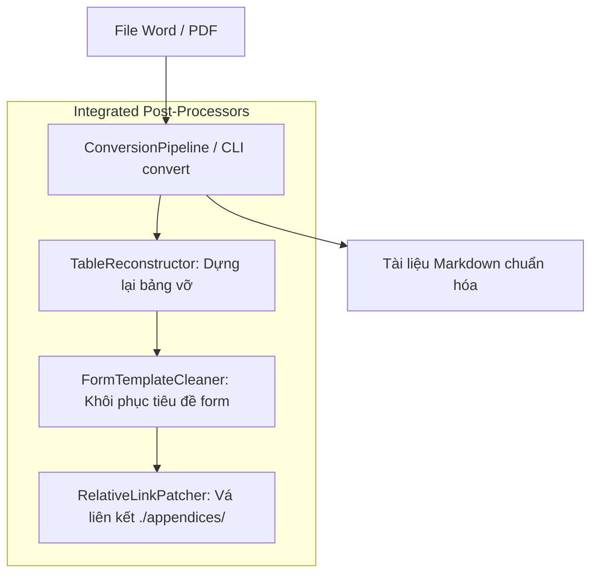

# Master Skill: Markdown Document Processing

Kỹ năng này điều phối toàn bộ quy trình chuyển đổi, làm sạch và chuẩn hóa tài liệu Markdown trong CCBA Agent Services Platform thông qua Deep Seam **`ConversionPipeline`** ([`packages/mdconverter`](../../../packages/mdconverter)).

---

## Kiến trúc Deep Seam & Hậu xử lý Tự động

`ConversionPipeline` đóng gói trọn gói quá trình chuyển đổi thô và 3 giai đoạn hậu xử lý tự động trong một lệnh duy nhất:



1. **`table-reconstructor`**: Tự động nhận diện và ghép lại các bảng bị vỡ dọc/lệch cột (Xem chi tiết tại [table_reconstruction.md](references/table_reconstruction.md)).
2. **`form-template-cleaner`**: Tự động khôi phục tiêu đề biểu mẫu bị lỗi placeholder (Xem chi tiết tại [form_cleaner.md](references/form_cleaner.md)).
3. **`relative-link-patcher`**: Tự động chuẩn hóa liên kết phụ lục `./appendices/` và đồng bộ `index.md` (Xem chi tiết tại [link_patcher.md](references/link_patcher.md)).

---

## Hướng dẫn Vận hành Chung cho Agent

Khi nhận được yêu cầu xử lý chuyển đổi tài liệu, hãy tuân thủ quy trình sau:

1. **Chuyển đổi toàn diện qua Deep Seam (All-in-One Pass)**:
   - Sử dụng Python API hoặc CLI để chuyển đổi tài liệu. Hệ thống tự động kích hoạt toàn bộ các post-processors làm sạch bảng, biểu mẫu và vá liên kết tương đối:
     ```python
     from mdconverter import ConversionPipeline

     pipeline = ConversionPipeline()
     result = pipeline.convert("path/to/document.docx")
     # Hoặc với async pipeline:
     # result = await ConversionPipeline.process_file("path/to/document.docx")
     ```
     Hoặc qua CLI:
     ```bash
     python -m mdconverter.cli convert "path/to/document.docx"
     ```
   - **Tiêu chí hoàn thành:** Tệp `.md` đầu ra được tạo thành công, bảng biểu nguyên vẹn, tiêu đề biểu mẫu chuẩn xác và các liên kết phụ lục hợp lệ.

2. **Kiểm tra chất lượng & Can thiệp chuyên biệt (Chỉ khi cần)**:
   - Đọc lướt tệp `.md` đầu ra để xác nhận chất lượng. Trong trường hợp đặc thù cần tinh chỉnh riêng lẻ từng cấu phần, tham chiếu tài liệu chuyên sâu:
     * Tinh chỉnh bảng thủ công $\rightarrow$ Xem [table_reconstruction.md](references/table_reconstruction.md)
     * Tinh chỉnh tiêu đề form bằng Prompt $\rightarrow$ Xem [form_cleaner.md](references/form_cleaner.md)
     * Vá lại liên kết tương đối $\rightarrow$ Xem [link_patcher.md](references/link_patcher.md)
   - **Tiêu chí hoàn thành:** Toàn bộ nội dung văn bản đạt chuẩn định dạng Markdown CCBA, không còn placeholder rác hoặc liên kết đứt gãy.

---

## 3. Rào Chắn Bóc Tách Phụ Lục Kỹ Thuật (Flexible Annex Header & Zero-Dropped Annex — ADR 0036)

> [!WARNING] **Routing Guardrail — Cấm Sử Dụng `mdconverter` Cho Văn Bản Pháp Lý (`legal_docs/`):**
> Tuyệt đối **KHÔNG** sử dụng `mdconverter` (hoặc `ConversionPipeline`) để chuyển đổi văn bản quy phạm pháp luật, tiêu chuẩn hay quy chuẩn trong thư mục `legal_docs/`.
> Mọi văn bản thuộc `legal_docs/` bắt buộc phải được định tuyến qua kỹ năng **`ccba-legal-ingest`** / **`ccba-legal-intel`** bằng lệnh:
> ```powershell
> python -m ccba_legal convert --docx-path "legal_docs/<category>/<doc_slug>/sources/<doc_slug>.docx" --target-bundle-dir "legal_docs/<category>/<doc_slug>"
> ```
> Điều này đảm bảo văn bản được tiền xử lý chuẩn hóa DOM qua **`DocxCanonicalSanitizer`** (ADR 0042) và vượt qua **15 Cổng Master CI Validator** (ADR 0036 - ADR 0042).

Khi xử lý văn bản có phụ lục kỹ thuật (như QCVN, TCVN):
1. **Khử Tiền Tố Markdown Trước Khi Khớp Regex:**
   * Tiêu đề Phụ lục trong file DOCX hoặc Markdown trung gian có thể có tiền tố `## PHỤ LỤC A` hoặc `**PHỤ LỤC A**`. Parser bắt buộc phải khử sạch tiền tố:
     ```python
     clean_candidate = re.sub(r"^[#*_>\s\-]+", "", text).strip()
     ```
     trước khi so khớp regex `^(?:Phụ\s+lục|PHỤ\s+LỤC)\s+([A-Z0-9]+)`.
2. **Quy Chuẩn Bóc Tách Độc Lập 100% (`annexes/`):**
   * Tuyệt đối không để phụ lục dồn ứ vào thân văn bản chính (`main_body`).
   * Mỗi phụ lục quy phạm phải được tách thành một tệp riêng biệt `legal_docs/<category>/<doc_slug>/annexes/phu_luc_[a-z]_*.md`.
   * Tạo tệp `annexes/README.md` và liên kết 2 chiều với `index.md`.
3. **Tiêu chí hoàn thành (Exit Criteria):**
   | Tiêu chí | Trạng thái | Yêu cầu kiểm tra |
   | :--- | :---: | :--- |
   | Annex Decoupling | ✅/❌ | 100% phụ lục được tách vào `annexes/` |
   | Pure Normative Body | ✅/❌ | Thân văn bản chính sạch 100% nội dung phụ lục |
   | Two-Way Links | ✅/❌ | `index.md` và `annexes/README.md` liên kết khớp 100% |

---

## 4. Quy Chuẩn Kỹ Thuật Sơ Đồ Mermaid, Excalidraw 16:9 & Công Thái Học Tài Liệu (v8.15.9)

Để đảm bảo tài liệu Markdown đạt chuẩn thẩm mỹ học thuật Academic Grayscale và tối ưu hóa công thái học đọc cho con người đồng thời bảo toàn ngữ cảnh cho AI Agent, mọi tài liệu Markdown do Agent tạo hoặc chuẩn hóa phải tuân thủ nghiêm ngặt các quy tắc:

### 4.1. Quy tắc Ngưỡng Vàng Lai (Hybrid Golden Threshold: Excalidraw 16:9 vs. Mermaid)
- **BẮT BUỘC tạo tệp đính kèm Excalidraw 16:9** (`03 - Resources/attachments/...excalidraw.md`) và nhúng `![[...excalidraw.md|100%]]` khi:
  1. Sơ đồ là Kiến trúc Hệ sinh thái / Ma trận Hệ thống đa tầng ($\ge 3$ layers).
  2. Tổng số nodes/boxes $\ge 9$.
  3. Đồ thị có liên kết chéo đa chiều phức tạp giữa $\ge 3$ subgraphs.
- **Mermaid inline CHỈ DÙNG cho**: Luồng quy trình tuyến tính, cặp tương tác song phương (2 cụm Hub-Spoke), hoặc chu trình nhỏ $\le 8$ nodes.

### 4.2. Bộ Ngũ Ràng Buộc Kỹ Thuật Mermaid (The 5 Mermaid Engineering Invariants v8.15.6)
1. **Dagre Cycle Stabilization via Asymmetric Weighting**: Khi có liên kết 2 chiều giữa 2 subgraphs, BẮT BUỘC dùng bất đối xứng trọng số: chiều xuôi `===>` hoặc `<===>` ($W=2$), chiều ngược `-.->` ($W=1$), đảm bảo $\Delta W \ge 2$ để khóa cứng Hub ở đỉnh (Rank 0). Cấm dùng 2 cạnh đối xứng cùng nét vẽ khiến Dagre ngẫu nhiên đảo chiều.
2. **Academic Grayscale Init Directive**: BẮT BUỘC chèn directive khởi tạo vào đầu mỗi khối Mermaid để triệt tiêu màu vàng mù tạt `#ffffde`:
   ```mermaid
   %%{init: {'theme': 'base', 'themeVariables': {'primaryColor': '#ffffff', 'primaryBorderColor': '#0f172a', 'primaryTextColor': '#0f172a', 'lineColor': '#334155', 'clusterBkg': '#f8fafc', 'clusterBorder': '#cbd5e1', 'edgeLabelBackground': '#ffffff'}}}%%
   ```
3. **Node Text Left-Alignment & HTML Entity**: Bọc nội dung có nhiều dòng hoặc bullet points trong `<div align='left'>...</div>` để chống căn giữa nham nhở. Dùng `#40;` và `#41;` thay cho dấu ngoặc đơn trần `()`.
4. **Invisible Edge LTR Ordering**: Trong sơ đồ hoặc subgraph `direction LR`, các cụm node song song bắt buộc phải liên kết bằng cạnh vô hình `T1 ~~~ T2 ~~~ T3` để khóa cứng thứ tự hiển thị từ trái sang phải.
5. **Flat Two-Node & Subgraph Title Invariant**: Với cặp đối trọng song phương (Edge vs Core, Client vs Server), CẤM TUYỆT ĐỐI việc dùng `subgraph` bọc 1 node con đơn lẻ (phẳng hóa thành 2 node độc lập). CẤM ngắt dòng `<br/>` trong tiêu đề `subgraph` để tránh lỗi clipping cắt cụt dòng thứ hai của Dagre. Cưỡng chế $100\%$ bọc bullet points trong `<div align='left'>...</div>`.

### 4.3. Công Thái Học Đóng Gói Khối Mã Dài (Two-Track Document Ergonomics & Callout Presentation Invariants)
Mọi khối code/cấu hình dài **$> 15$ dòng** BẮT BUỘC phải bọc trong Obsidian Callout:
- **Cấu hình mẫu, Schema, Minh họa tri thức**: Dùng Callout Mở sẵn:
  ```markdown
  > [!abstract]+ Cấu trúc Phân vùng Cấu hình: workspace_context.yaml
  > ```yaml
  > # --- GLOBAL SECTION ---
  > # << BEGIN HUB_MANAGED >>
  > enterprise_id: "CORP_VN"
  > # << END HUB_MANAGED >>
  > ```
  ```
- **Log thô, Siêu dữ liệu máy móc, Báo cáo chẩn đoán**: Dùng Callout Đóng sẵn:
  ```markdown
  > [!info]- Báo Cáo Kiểm Tra Toàn Vẹn: audit_log.txt
  > ```text
  > 2026-09-14 21:00:00 [INFO] System check passed with 0 errors
  > ```
  ```
- Tuyệt đối cấm code block trần $> 15$ dòng nằm trực tiếp ở cấp độ thân bài làm đứt gãy mạch đọc.
- **Bộ Ba Ràng Buộc Trình Bày Callout & Cấu Hình (The 3 Callout Presentation Invariants)**:
  1. *Clean Callout Header Invariant*: Cấm tuyệt đối emoji trong tiêu đề Callout (tránh Double Icon Glitch); cấm backticks trong tiêu đề Callout (viết plain text để bảo toàn baseline phẳng).
  2. *Target Language Syntax Alignment Invariant*: Dùng comment của ngôn ngữ đích (`#` cho YAML/Python, `//` cho JSONC/JS/TS, `<!-- -->` cho HTML/Markdown, `--` cho SQL).
  3. *Minimal Banner Invariant*: Dùng comment ngắn gọn (`# --- GLOBAL SECTION ---`) thay cho dòng kẻ dài `# ================================`.

### 4.4. Bộ Tứ Mẫu Thiết Kế Mermaid Công Thái Học (The 4 Mermaid Ergonomic Design Patterns v8.15.9)
Hệ thống chuẩn hóa 4 mẫu thiết kế Mermaid chuẩn mực theo `.agents/rules/diagramming_hygiene.md` §3.6:
1. **Macro Hub-and-Pods Layout**: Hub ở đỉnh liên kết mũi tên dày `HUB ===> POD` ($W \ge 3$) và cạnh vô hình `POD1 ~~~ POD2 ~~~ POD3` khóa chặt trục ngang, chống Dagre xếp lệch tầng.
2. **Semantic Decision Tree with Badges**: Phân nhánh quyết định với bảng màu pastel ngữ nghĩa: Xanh lá (`REUSE`), Xanh dương (`EXTEND`), Vàng hổ phách (`CREATE NEW`) kèm khối text căn lề trái `<div align='left'>`.
3. **Multi-Tier Governance Funnel**: Bố cục phễu lọc dọc `flowchart TD` phân tách nhánh từ chối/hạ cấp và nhánh đạt chuẩn, phân cấp tầng cuối theo điểm số định lượng ($GPI \ge 12.0$).
4. **Cross-Domain Subgraphs with Feedback Loop**: Hai vùng thẩm quyền riêng biệt (`subgraph SpokeZone` vs `subgraph HubZone`), luồng đóng góp xuôi dùng nét đậm `==>`, luồng phản hồi thẩm định dùng nét đứt `-.->` với $\Delta W \ge 2$, luồng phân phối quay lại khép kín chu trình.

### 4.5. Chuẩn Executive Typography 16:9 & Bảng Đặc Tả Ma Trận Kiến Trúc Markdown
Để triệt tiêu **Nghịch lý Co giãn Canvas (Canvas-to-Document Scaling Paradox)** khi nhúng sơ đồ Excalidraw vào cột đọc hẹp Obsidian (~700-750px):
1. **Khóa Chiều Rộng Bounding Box 16:9**: Giới hạn trong khoảng $1.000\text{px} \le W \le 1.150\text{px}$ để đảm bảo hệ số co giãn khi nhúng luôn đạt $\ge 65\%-70\%$.
2. **Quy Chuẩn Cỡ Chữ Sàn**:
   - Tiêu đề chính canvas: $\ge 17\text{px}-20\text{px}$ (Bold).
   - Tiêu đề khối/phân tầng: $\ge 14\text{px}-16\text{px}$ (Bold).
   - Nội dung nhãn/badge: $\ge 12\text{px}-13\text{px}$ (Kích thước hiển thị thực tế $\ge 8.5\text{px}-11.5\text{px}$).
3. **Nguyên Tắc Executive Poster & Cặp Bài Trùng**: Sơ đồ chỉ hiển thị từ khóa, vai trò cốt lõi và badge ngắn gọn ($\le 2-3$ dòng mỗi hộp). Mọi thông số kỹ thuật chi tiết BẮT BUỘC trình bày trong **Bảng Đặc Tả Ma Trận Kiến Trúc (Architecture Specification Matrix Table)** bằng Markdown đặt ngay dưới sơ đồ.

### 4.6. Quy Tắc Phân Tách Mũi Tên & Nhãn Kết Nối (Arrow-Label Clearance Invariant)
1. **Tách Rời Trục Tọa Độ Y**: Tách rời tọa độ Y giữa nhãn text và mũi tên với khoảng đệm an toàn $\ge 15\text{px}$ để chống đường kẻ cắt ngang qua chữ.
2. **Khoảng Cách Ngang Tối Thiểu**: Khoảng cách ngang giữa 2 khối có mũi tên liên kết kèm nhãn phải đạt tối thiểu $\ge 80\text{px}-90\text{px}$ để nhãn text 1 dòng nằm vừa vặn, không bị co kéo hay chạm vào mũi tên.

### 4.7. Chuẩn Hóa Liên Kết Wikilink & Trích Dẫn Trần (Clean Wikilink & Table Parity Invariant v8.15.7)
1. **Cấm Tuyệt Đối Backticks Quanh Wikilinks**: Nghiêm cấm bọc backticks quanh các liên kết wiki trên mọi bề mặt Markdown (thân bài, ô bảng biểu, callout, danh mục tham chiếu). Dấu backtick biến liên kết tương tác thành code-pill xám tĩnh, triệt tiêu tính năng click điều hướng và làm đứt gãy đồ thị liên kết Graph View trong Obsidian.
2. **Thoát Ký Tự Pipe Trong Bảng Biểu**: Khi sử dụng wikilink kèm alias bên trong bảng Markdown, BẮT BUỘC dùng cú pháp thoát ký tự pipe `[[slug\|alias]]` (ví dụ `[[supercell_cell_model\|Supercell]]` hoặc `[[concept_slug\|[15]]]`) để Chromium Table Engine không phân tách nhầm cột, NHƯNG BẮT BUỘC giữ nguyên liên kết trần (không bọc trong backticks).
3. **Đồng Bộ Hoàn Toàn Số Trích Dẫn Bảng Biểu**: Số thứ tự trích dẫn hiển thị trong bảng (`[15]`, `[17]`) BẮT BUỘC phải đồng bộ chính xác 1-1 với số thứ tự của cùng khái niệm đó trong thân bài và danh mục tài liệu tham chiếu ở cuối bài viết.

### 4.8. Cú Pháp Nhãn Mũi Tên Mermaid & Cách Ly Thực Thể HTML (v8.15.10)
1. **Mermaid Edge Label Invariant**: Cấm tuyệt đối chèn nhãn text vào giữa thân mũi tên (`===="text"====>`, `-."text".->`, `<===="text"====>`); bắt buộc dùng cú pháp pipe chuẩn:
   - Mũi tên đơn: `A -->|"Nhãn text"| B`
   - Mũi tên dày: `A ===>|"Nhãn text"| B`
   - Mũi tên nét đứt: `A -.->|"Nhãn text"| B`
   - Mũi tên hai chiều: `A <===>|"Nhãn text"| B`
   - Toán tử so sánh: bắt buộc chuẩn hóa `>=` $\rightarrow$ `≥`, `<=` $\rightarrow$ `≤` để chống xung đột với đầu mũi tên.
2. **Strict HTML Entity Context Isolation**: Thực thể `#40;` và `#41;` CHỈ được phép dùng trong khối ````mermaid` để chống lỗi cú pháp node shape. CẤM TUYỆT ĐỐI rò rỉ `#40;`/`#41;` ra ngoài bảng biểu hoặc thân bài Markdown; bảng Markdown bắt buộc sử dụng dấu ngoặc đơn thông thường `()`.

---

## 🛑 Điều cấm & Quy tắc rào chắn (Negative Constraints)

- **Không tự phân mảnh quy trình**: Tránh việc gọi lần lượt từng script phụ nếu đã có thể xử lý trọn gói bằng `ConversionPipeline`.
- **Tuyệt đối không sử dụng dấu chấm lửng (`...`)**: Trong tất cả câu trả lời, ví dụ minh họa hoặc tài liệu Markdown xuất ra, không bao giờ dùng ba dấu chấm lửng `...` để viết tắt hoặc làm ví dụ. Hãy tự viết đầy đủ chi tiết hoặc tự sinh văn bản mẫu cụ thể.

## Progressive Disclosure & Reference Index (Level 3)

Khi thực thi các tác vụ chuyên sâu, Agent sử dụng công cụ `view_file` để nạp hướng dẫn chi tiết theo nhu cầu:

| Tệp Tham Chiếu | Ngữ Cảnh Triệu Hồi & Mục Đích Sử Dụng |
| :--- | :--- |
| `references/form_cleaner.md` | Hướng dẫn làm sạch biểu mẫu và chuẩn hóa layout form trong văn bản Markdown |
| `references/link_patcher.md` | Hướng dẫn vá liên kết văn bản pháp lý hai chiều giữa thân văn bản và phụ lục |
| `references/table_reconstruction.md` | Kỹ thuật tái cấu trúc và chuẩn hóa bảng biểu phức tạp trong Markdown |

