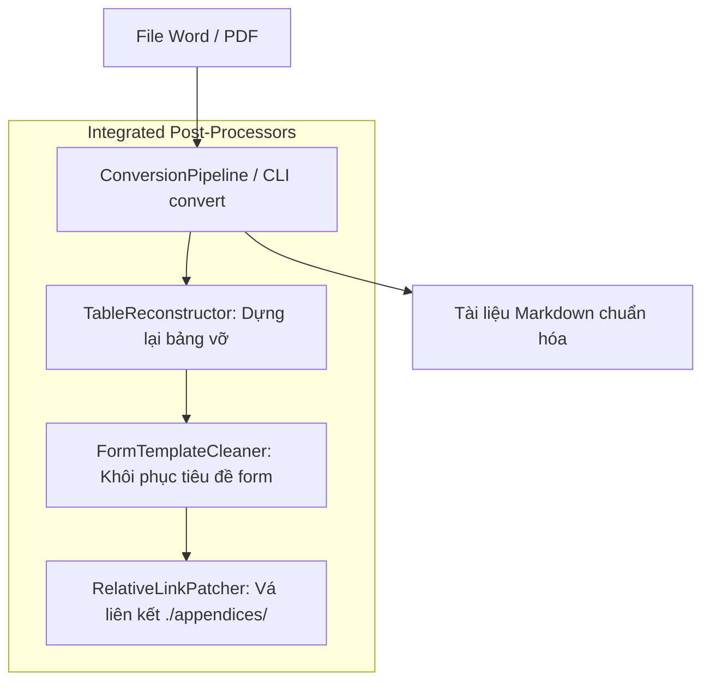

# Master Skill: Markdown Document Processing

Kỹ năng này điều phối toàn bộ quy trình chuyển đổi, làm sạch và chuẩn hóa tài liệu Markdown trong CCBA Agent Services Platform thông qua Deep Seam **`ConversionPipeline`** ([`packages/mdconverter`](../../../packages/mdconverter)).

---

## Kiến trúc Deep Seam & Hậu xử lý Tự động

`ConversionPipeline` đóng gói trọn gói quá trình chuyển đổi thô và 3 giai đoạn hậu xử lý tự động trong một lệnh duy nhất:



1. **`table-reconstructor`**: Tự động nhận diện và ghép lại các bảng bị vỡ dọc/lệch cột (Xem chi tiết tại [table_reconstruction.md](references/table_reconstruction.md)).
2. **`form-template-cleaner`**: Tự động khôi phục tiêu đề biểu mẫu bị lỗi placeholder (Xem chi tiết tại [form_cleaner.md](references/form_cleaner.md)).
3. **`relative-link-patcher`**: Tự động chuẩn hóa liên kết phụ lục `./appendices/` và đồng bộ `index.md` (Xem chi tiết tại [link_patcher.md](references/link_patcher.md)).

---

## Hướng dẫn Vận hành Chung cho Agent

Khi nhận được yêu cầu xử lý chuyển đổi tài liệu, hãy tuân thủ quy trình sau:

1. **Chuyển đổi toàn diện qua Deep Seam (All-in-One Pass)**:
   - Sử dụng Python API hoặc CLI để chuyển đổi tài liệu. Hệ thống tự động kích hoạt toàn bộ các post-processors làm sạch bảng, biểu mẫu và vá liên kết tương đối:
     ```python
     from mdconverter import ConversionPipeline

     pipeline = ConversionPipeline()
     result = pipeline.convert("path/to/document.docx")
     # Hoặc với async pipeline:
     # result = await ConversionPipeline.process_file("path/to/document.docx")
     ```
     Hoặc qua CLI:
     ```bash
     python -m mdconverter.cli convert "path/to/document.docx"
     ```
   - **Tiêu chí hoàn thành:** Tệp `.md` đầu ra được tạo thành công, bảng biểu nguyên vẹn, tiêu đề biểu mẫu chuẩn xác và các liên kết phụ lục hợp lệ.

2. **Kiểm tra chất lượng & Can thiệp chuyên biệt (Chỉ khi cần)**:
   - Đọc lướt tệp `.md` đầu ra để xác nhận chất lượng. Trong trường hợp đặc thù cần tinh chỉnh riêng lẻ từng cấu phần, tham chiếu tài liệu chuyên sâu:
     * Tinh chỉnh bảng thủ công $\rightarrow$ Xem [table_reconstruction.md](references/table_reconstruction.md)
     * Tinh chỉnh tiêu đề form bằng Prompt $\rightarrow$ Xem [form_cleaner.md](references/form_cleaner.md)
     * Vá lại liên kết tương đối $\rightarrow$ Xem [link_patcher.md](references/link_patcher.md)
   - **Tiêu chí hoàn thành:** Toàn bộ nội dung văn bản đạt chuẩn định dạng Markdown CCBA, không còn placeholder rác hoặc liên kết đứt gãy.

---

## 3. Rào Chắn Bóc Tách Phụ Lục Kỹ Thuật (Flexible Annex Header & Zero-Dropped Annex — ADR 0036)

> [!WARNING] **Routing Guardrail — Cấm Sử Dụng `mdconverter` Cho Văn Bản Pháp Lý (`legal_docs/`):**
> Tuyệt đối **KHÔNG** sử dụng `mdconverter` (hoặc `ConversionPipeline`) để chuyển đổi văn bản quy phạm pháp luật, tiêu chuẩn hay quy chuẩn trong thư mục `legal_docs/`.
> Mọi văn bản thuộc `legal_docs/` bắt buộc phải được định tuyến qua kỹ năng **`ccba-legal-ingest`** / **`ccba-legal-intel`** bằng lệnh:
> ```powershell
> python -m ccba_legal convert --docx-path "legal_docs/<category>/<doc_slug>/sources/<doc_slug>.docx" --target-bundle-dir "legal_docs/<category>/<doc_slug>"
> ```
> Điều này đảm bảo văn bản được tiền xử lý chuẩn hóa DOM qua **`DocxCanonicalSanitizer`** (ADR 0042) và vượt qua **15 Cổng Master CI Validator** (ADR 0036 - ADR 0042).

Khi xử lý văn bản có phụ lục kỹ thuật (như QCVN, TCVN):
1. **Khử Tiền Tố Markdown Trước Khi Khớp Regex:**
   * Tiêu đề Phụ lục trong file DOCX hoặc Markdown trung gian có thể có tiền tố `## PHỤ LỤC A` hoặc `**PHỤ LỤC A**`. Parser bắt buộc phải khử sạch tiền tố:
     ```python
     clean_candidate = re.sub(r"^[#*_>\s\-]+", "", text).strip()
     ```
     trước khi so khớp regex `^(?:Phụ\s+lục|PHỤ\s+LỤC)\s+([A-Z0-9]+)`.
2. **Quy Chuẩn Bóc Tách Độc Lập 100% (`annexes/`):**
   * Tuyệt đối không để phụ lục dồn ứ vào thân văn bản chính (`main_body`).
   * Mỗi phụ lục quy phạm phải được tách thành một tệp riêng biệt `legal_docs/<category>/<doc_slug>/annexes/phu_luc_[a-z]_*.md`.
   * Tạo tệp `annexes/README.md` và liên kết 2 chiều với `index.md`.
3. **Tiêu chí hoàn thành (Exit Criteria):**
   | Tiêu chí | Trạng thái | Yêu cầu kiểm tra |
   | :--- | :---: | :--- |
   | Annex Decoupling | ✅/❌ | 100% phụ lục được tách vào `annexes/` |
   | Pure Normative Body | ✅/❌ | Thân văn bản chính sạch 100% nội dung phụ lục |
   | Two-Way Links | ✅/❌ | `index.md` và `annexes/README.md` liên kết khớp 100% |

---

## 🛑 Điều cấm & Quy tắc rào chắn (Negative Constraints)

- **Không tự phân mảnh quy trình**: Tránh việc gọi lần lượt từng script phụ nếu đã có thể xử lý trọn gói bằng `ConversionPipeline`.
- **Tuyệt đối không sử dụng dấu chấm lửng (`...`)**: Trong tất cả câu trả lời, ví dụ minh họa hoặc tài liệu Markdown xuất ra, không bao giờ dùng ba dấu chấm lửng `...` để viết tắt hoặc làm ví dụ. Hãy tự viết đầy đủ chi tiết hoặc tự sinh văn bản mẫu cụ thể.
