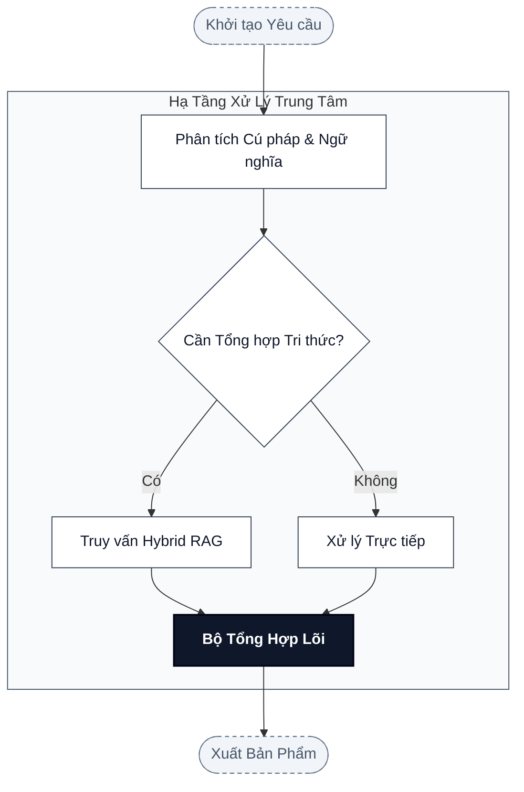
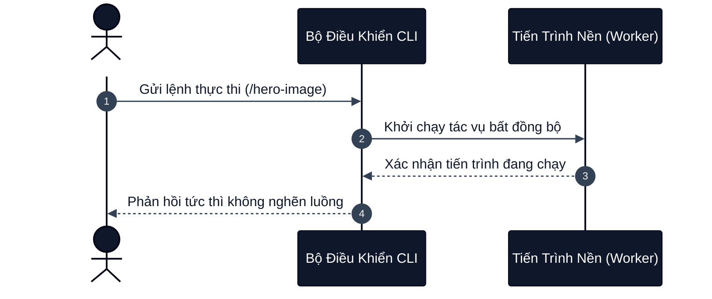

# Mermaid Diagram Skill

Skill này hướng dẫn và chuẩn hóa quy trình tạo sơ đồ Mermaid **an toàn cú pháp, chuẩn mực thẩm mỹ học thuật Academic Grayscale** dành cho tài liệu kỹ thuật, Zettelkasten Obsidian và xuất bản.

---

## Triết lý thiết kế: Trực quan hóa Học thuật & Tối ưu Đa thiết bị

> Sơ đồ Mermaid là dạng "Diagrams-as-Code" nhẹ nhất, nhúng trực tiếp trong Markdown. Nó phục vụ hoàn hảo cho việc đọc trên thiết bị di động (Mobile), xem mã nguồn trên GitHub, và xuất bản bài viết mà không phụ thuộc vào plugin đồ họa ngoài.

Để đạt chất lượng xuất bản cao:
1. **Academic Grayscale Palette**: Sử dụng bảng màu xám - xanh đen thanh lịch, độ tương phản cao, không dùng màu neon lòe loẹt.
2. **Cú pháp bất biến**: Khử triệt để lỗi xung đột ký tự đặc biệt, ngắt dòng đúng chuẩn `<br/>`.
3. **Phân lập Subgraph**: Tuyệt đối không dùng `classDef` cho Subgraph (vốn chỉ áp dụng cho leaf node).

---

## Bảng màu Học thuật Chuẩn (Academic Grayscale Palette)

Khi áp dụng chủ đề cho `flowchart` hoặc `graph`:

| Lớp (Class) | Vai trò | Màu nền (Fill) | Viền (Stroke) | Chữ (Color) |
|---|---|---|---|---|
| `principal` | Node trung tâm, lõi quyết định, Hub cốt lõi | `#0f172a` (Slate 900) | `#020617` (2px) | `#ffffff` (Bold) |
| `standard` | Node tiêu chuẩn, thành phần quy trình | `#ffffff` (White) | `#334155` (1px) | `#0f172a` |
| `auxiliary` | Node phụ trợ, đầu ra thứ cấp, ghi chú | `#f8fafc` (Slate 50) | `#64748b` (dashed 1px) | `#475569` |

### Mã khai báo mẫu (Class Definitions):
```mermaid
classDef principal fill:#0f172a,stroke:#020617,stroke-width:2px,color:#ffffff,font-weight:bold;
classDef standard fill:#ffffff,stroke:#334155,stroke-width:1px,color:#0f172a;
classDef auxiliary fill:#f8fafc,stroke:#64748b,stroke-width:1px,stroke-dasharray: 4 4,color:#475569;
```

---

## Quy trình thực hiện (6 bước)

### Bước 0: Xác định loại sơ đồ và chuẩn render
- Xác định mục tiêu biểu diễn:
  - Luồng quy trình, kiến trúc phân tầng, chu trình: dùng `flowchart TB` hoặc `flowchart LR`.
  - Tương tác giao thức, trao đổi thông điệp theo thời gian: dùng `sequenceDiagram`.
  - Dòng thời gian, lộ trình lịch sử: dùng `timeline`.
  - Cây phân cấp ý tưởng: dùng `mindmap`.
- **Lưu ý loại trừ**: Chỉ các sơ đồ dạng `flowchart` và `graph` mới hỗ trợ `classDef`. Các loại sơ đồ khác (`pie`, `timeline`, `mindmap`, `sequenceDiagram`, `stateDiagram`) **tuyệt đối không tiêm classDef** mà phải sử dụng directive `%%{init: ...}%%`.
- **Tiêu chí hoàn thành:** Chọn đúng loại sơ đồ và xác định chính xác cơ chế áp dụng phong cách (classDef hay directive %%{init}%%).

### Bước 1: Thiết kế kiến trúc và luồng dữ liệu (Visual Isomorphism)
- Xác định rõ các node và hướng di chuyển:
  - Tránh sơ đồ quá rộng theo chiều ngang gây tràn màn hình điện thoại; ưu tiên bố cục `flowchart TB` hoặc phân nhóm hợp lý.
  - Sử dụng các hình dạng node có chủ đích ngữ nghĩa:
    - `id["Hình chữ nhật"]`: Bước xử lý, module.
    - `id(["Viên thuốc - Rounded"])`: Điểm bắt đầu / kết thúc.
    - `id{"Hình thoi"}`: Điểm rẽ nhánh, quyết định logic.
    - `id[("Hình trụ")]`: Cơ sở dữ liệu, kho lưu trữ.
- **Tiêu chí hoàn thành:** Xây dựng cấu trúc trực quan thể hiện rõ mối quan hệ nhân quả và luồng dữ liệu mà không bị rối mắt.

### Bước 2: Chuẩn hóa nhãn văn bản và Escape ký tự đặc biệt
- **Bọc nhãn**: Mọi nhãn node phải nằm trong cặp ngoặc kép `["..."]`.
- **Ngắt dòng**: Sử dụng thẻ `<br/>` khi nhãn dài hơn 25 ký tự để tránh node bị bè ngang quá mức. Tuyệt đối không dùng ký tự xuống dòng thô.
- **Escape ký tự**:
  - Dấu ngoặc đơn: Thay `(` thành `#40;`, thay `)` thành `#41;`.
  - Dấu gạch đứng: Thay `|` thành `#124;`.
  - Dấu ngoặc kép: Thay `"` thành `#quot;`.
- **Tiêu chí hoàn thành:** Toàn bộ nhãn node được bọc trong ["..."], ngắt dòng an toàn bằng <br/> và escape triệt để các ký tự đặc biệt.

### Bước 3: Áp dụng bảng màu học thuật Academic Grayscale Palette
- Tiêm các định nghĩa lớp `principal`, `standard`, `auxiliary` vào cuối khối flowchart:
  ```mermaid
  class NodeChinh principal;
  class Node1,Node2,Node3 standard;
  class NodePhu auxiliary;
  ```
- Đối với sơ đồ phi-flowchart (`sequenceDiagram`, `mindmap`, v.v.), khai báo directive:
  ```mermaid
  %%{init: {'theme': 'base', 'themeVariables': {'primaryColor': '#ffffff', 'primaryBorderColor': '#334155', 'primaryTextColor': '#0f172a'}}}%%
  ```
- **Tiêu chí hoàn thành:** Định nghĩa và gán đúng các lớp phong cách học thuật cho từng node theo đúng phân cấp vai trò.

### Bước 4: Xử lý Subgraph & Cụm Container An Toàn
- **Quy tắc bất biến**: KHÔNG gán `class <subgraph_id> standard;` hoặc dùng `classDef` cho Subgraph.
- Định dạng Subgraph bằng lệnh `style`:
  ```mermaid
  subgraph ClusterA ["Phân Vùng Hệ Thống"]
      A1["Thành phần 1"]
      A2["Thành phần 2"]
  end
  style ClusterA fill:#f8fafc,stroke:#334155,stroke-width:1px;
  ```
- **Tiêu chí hoàn thành:** Toàn bộ subgraph trong sơ đồ được tạo kiểu bằng lệnh style riêng biệt, triệt tiêu nguy cơ lỗi cú pháp render.

### Bước 5: Kiểm tra và Nhúng vào Tài liệu
- Nhúng khối mã Mermaid trực tiếp vào tài liệu markdown:
  ````markdown
  ```mermaid
  flowchart TB
      A["Bắt đầu"] --> B["Xử lý"]
  ```
  ````
- Kiểm tra tính tương thích trên cả chế độ xem Dark Mode và Light Mode.
- **Tiêu chí hoàn thành:** Khối mã Mermaid hoàn chỉnh được nhúng trực tiếp vào tài liệu, render chính xác và thẩm mỹ trên mọi giao diện.

---

## Mẫu Thực Hành Chuẩn (Canonical Examples)

### Ví dụ 1: Flowchart với Subgraph và Phân cấp Học thuật


### Ví dụ 2: Sequence Diagram với Directive Theme

