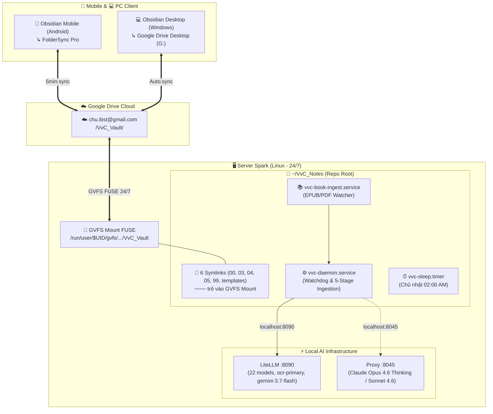

# Kỹ Năng: Triển Khai VvC Second Brain Lên Server Spark (/ccba-spark-deploy)

Kỹ năng này tự động hóa việc đưa toàn bộ hạ tầng **VvC Second Brain** (Pipeline compiler, Watchdog daemons, Weekly sleep timer) từ môi trường máy tính cá nhân (Windows) sang chạy ngầm 24/7 trên **Server Spark (Linux DGX)** theo chuẩn **LLM Compiler Pattern** và **ADR-0057 / ADR-0058**.

---

## 🏛️ Kiến Trúc Hệ Thống (System Architecture)



---

## 🚀 Cách Sử Dụng (Quick Start)

### Cách 1: Chạy Script Tự Động Từ Terminal (Khuyến nghị sau khi git clone)
Ngay sau khi clone repo về Server Spark, mở Terminal và chạy 1 dòng lệnh duy nhất:
```bash
cd ~/VvC_Notes && bash setup_spark.sh
```

### Cách 2: Gọi Từ AI Agent (/ccba-spark-deploy)
Nếu đang mở một phiên làm việc với AI Agent (Antigravity hoặc Copilot) trên Server Spark:
```text
/ccba-spark-deploy
```
Agent sẽ tự động kiểm tra trạng thái các symlinks, dịch vụ systemd và kích hoạt kiểm chứng.

---

## 📋 Hợp Đồng Vận Hành & Khắc Phục Sự Cố (Runbook & Contracts)

### 1. Quản Trị Dịch Vụ Systemd User (100% Không Cần `sudo`)
Vì toàn bộ dịch vụ chạy ở tầng User (`systemctl --user`), tuyệt đối **KHÔNG dùng `sudo`**:

| Thao tác | Lệnh |
| :--- | :--- |
| **Kiểm tra trạng thái** | `systemctl --user status vvc-daemon.service vvc-book-ingest.service` |
| **Xem log thời gian thực** | `journalctl --user -u vvc-daemon.service -f` |
| **Khởi động lại daemon** | `systemctl --user restart vvc-daemon.service` |
| **Dừng toàn bộ dịch vụ** | `systemctl --user stop vvc-daemon.service vvc-book-ingest.service` |
| **Kiểm tra lịch Weekly Sleep** | `systemctl --user list-timers vvc-sleep.timer` |

### 2. Sự Cố GVFS Mount Biến Mất Khi Đóng Desktop Session
* **Hiện tượng:** Log báo lỗi `No such file or directory` khi truy cập `05 - Fleeting` sau khi reboot hoặc log out khỏi desktop.
* **Nguyên nhân:** Linux ngắt tiến trình nền của user khi phiên GUI kết thúc.
* **Khắc phục:** Kích hoạt linger (đã được tích hợp trong `setup_spark.sh`):
  ```bash
  loginctl enable-linger $USER
  ```
  Nếu Thunar chưa tự động mount Google Drive khi khởi động máy, mở Thunar một lần duy nhất và bấm vào tài khoản `chu.ibst@gmail.com`.

### 3. Cấu Hình Biến Môi Trường (`scripts/.env`)
Tệp `scripts/.env` chuẩn mực trên Server Spark:
```bash
# Vault Root on Linux
VVC_VAULT_ROOT="/home/$USER/VvC_Notes"

# AI Gateway (Localhost Loopback on Server Spark)
VVC_GATEWAY_URL="http://127.0.0.1:8090/v1"
VVC_GATEWAY_KEY="sk-spark-secure-key-2026"
VVC_GATEWAY_PROXY_URL="http://127.0.0.1:8045/v1"
VVC_GATEWAY_PROXY_KEY="sk-spark-secure-key-2026"
GEMINI_API_KEY=""

# CCBA AI Gateway SDK Standard Conventions
AI_GATEWAY_URL="http://127.0.0.1:8090/v1"
AI_GATEWAY_KEY="sk-spark-secure-key-2026"
AI_MODEL="gemini-3.7-flash"
AI_GATEWAY_TIMEOUT=60.0
OPENAI_API_BASE="http://127.0.0.1:8090/v1"
OPENAI_API_KEY="sk-spark-secure-key-2026"
```

---

## 🛡️ Cổng Kiểm Chứng 4 Tầng Tất Định (ADR-0058)

Mỗi lần triển khai bắt buộc phải vượt qua 4 chốt chặn kiểm thử tự động:
1. **Gate 1 (Storage):** Đọc và ghi thử một file tạm vào `05 - Fleeting/` để đảm bảo quyền FUSE không bị lỗi `Permission denied`.
2. **Gate 2 (AI Gateway):** Ping `http://127.0.0.1:8090/health` và chạy thử suy luận 5 tokens.
3. **Gate 3 (Service):** Xác nhận `systemctl --user is-active` cho `vvc-daemon` và `vvc-book-ingest`.
4. **Gate 4 (Regression):** Chạy `pytest scripts/tests/test_daemon_restart.py` đạt 100% pass.
