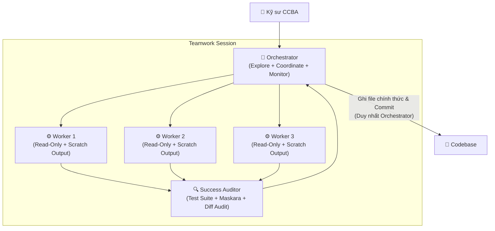

# 👥 Kỹ năng: ccba-teamwork (Điều Phối Đa Tác Nhân Dài Hạn)

Kỹ năng này hướng dẫn Agent đóng vai trò **Project Orchestrator** để điều phối các tác vụ kỹ thuật và dự án quy mô lớn (Monorepo refactoring, thẩm tra thiết kế 4 bộ môn, nạp kho pháp điển hàng loạt) theo **Teamwork Multi-Agent Framework** (lấy cảm hứng từ Antigravity `/teamwork-preview` và ADR 0053).

Khung làm việc này đảm bảo loại bỏ triệt để hiện tượng xung đột mã nguồn (merge conflicts), bảo vệ ngân sách ngữ cảnh (context budget) và duy trì sự phân tách rõ ràng giữa thẩm quyền con người (Accountability) và năng lực AI (Worker Assignments).

---

## 🏛️ Mô Hình 3 Vai Trò Tối Giản (KISS Hierarchy)



1. **🎯 Orchestrator (Nhạc Trưởng — Agent Chính):**
   - Phỏng vấn người dùng, xác định mục tiêu và ranh giới Non-Goals.
   - Biên soạn `team_sheet.md` và thực hiện File-path Pre-Check.
   - Điều phối workers theo batch (tối đa 3 workers/batch).
   - **Duy nhất Orchestrator** có quyền đọc kết quả scratch, tổng hợp, ghi file chính thức và commit Git.
2. **⚙️ Workers (Tác Nhân Thực Thi — Subagents):**
   - Thực thi độc lập và song song dưới nền.
   - **Tuân thủ Two-Layer Guardrail (ADR 0035):** Chỉ có quyền đọc (`view_file`, `grep_search`, `read_resource`) và chạy scoped test cô lập; tuyệt đối không ghi đè codebase.
   - Xuất toàn bộ code draft, báo cáo phân tích vào thư mục sandbox cô lập: `.system_generated/scratch/worker_{N}/`.
3. **🔍 Success Auditor (Kiểm Định Nghiệm Thu):**
   - Độc lập chạy scoped test suite (runtime < 2.0s).
   - Quét rò rỉ secrets và Spoke artifacts bằng Maskara.
   - Thực hiện **Post-Merge Diff Audit** đối chiếu `git diff --name-only` với phạm vi file scope được cấp.

---

## 📋 Tiêu Chí Hoàn Thành (Completion Criteria)

Kỹ năng hoàn thành khi:
1. Đã phỏng vấn và tạo tệp `.agents/teams/[project]_team_sheet.md` đầy đủ 2 lớp: **Accountability Mapping** (11 Ghế CCBA Charter 2026) và **Worker Assignments** (AI Subagents).
2. Toàn bộ Workers được dispatch tuân thủ **Worker Cap** (tối đa 3 workers đồng thời) và **Exclusive Seam Ownership** (chỉ đọc files trong scope).
3. Các tệp trung gian của Workers được lưu gọn trong `.system_generated/scratch/worker_{N}/`, không vứt rải rác ngoài root.
4. Orchestrator hoàn thành việc tổng hợp, ghi file chính thức và vượt qua **Success Auditor Gate**:
   - 100% Scoped Unit Tests pass.
   - Spoke Leakage Guard & Maskara exit code 0.
   - Post-Merge Diff Audit xác nhận không có file ngoài phạm vi seam bị can thiệp.
   - Catalog SSOT được biên dịch lại đồng bộ (`compile_catalog.py`).

---

## 🛠️ Quy Trình Thực Hiện 4 Giai Đoạn

### Giai Đoạn 1: Phỏng Vấn Mục Tiêu & Cấu Trúc Đội Ngũ (Structured Interview)
Orchestrator làm rõ yêu cầu với kỹ sư:
1. **Mục tiêu cốt lõi:** Đầu ra cụ thể cần đạt là gì?
2. **Ranh giới Non-Goals:** Những phần nào dứt khoát không chạm vào trong đợt này?
3. **Phân rã Seams:** Có bao nhiêu luồng công việc / modules độc lập?
4. **Phân quyền Phê duyệt (Accountability Mapping):** Lựa chọn các Ghế trong 11 Ghế CCBA Charter 2026 chịu trách nhiệm nghiệm thu các mốc bàn giao:
   - `TRUONG_PHONG_RD_HTQT` / `TRUONG_PHONG_BIM_THIET_KE` / `TRUONG_PHONG_BIM_DU_AN`
   - `CHU_TRI_HOP_DONG_PM` / `CHU_TRI_BO_MON` / `KY_SU_THUC_THI`
   - `CO_VAN_PHAP_LY_QA` / `IDOP_LEAD` / `GIAM_DOC`

---

**Tiêu chí hoàn thành:** Xác định rõ mục tiêu, non-goals và phân quyền phê duyệt.

---

### Giai Đoạn 2: Khởi Tạo Team Sheet (Team Sheet Generation)
1. Đọc template mẫu tại [team_sheet_template.md](resources/team_sheet_template.md).
2. Tạo tệp `.agents/teams/[project_slug]_team_sheet.md`.
3. **File-path Pre-Check:** Orchestrator liệt kê danh sách tệp tin cụ thể cho từng Worker trong Lớp 2 (Worker Assignments).
4. Phân chia các batches nếu tổng số workers $> 3$.

---

**Tiêu chí hoàn thành:** Tệp team_sheet.md được tạo với đầy đủ phân công worker.

---

### Giai Đoạn 3: Thực Thi Song Song Độc Quyền (Parallel Milestone Execution)
1. **Dispatch Batch:**
   - Khởi chạy các Worker subagents (tối đa 3 workers/batch) qua `invoke_subagent` hoặc công cụ điều phối nền tảng.
   - Prompt của từng Worker **bắt buộc** chứa:
     - Danh sách file được phép đọc (Exclusive File Scope).
     - Chỉ thị ghi kết quả nháp vào `.system_generated/scratch/worker_{N}/output.md`.
     - Tiêu chí nghiệm thu cụ thể (Acceptance Criteria).
2. **Worker Timeout & Fallback (10 Phút):**
   - Nếu Worker không hoàn thành sau 10 phút hoặc cạn ngân sách token:
     - Đánh dấu milestone là `INCOMPLETE`.
     - Trích xuất log trung gian từ scratch.
     - Quyết định: Dispatch Worker mới với prompt hẹp hơn HOẶC nếu lỗi logic sâu $\rightarrow$ đóng gói Deep Problem Brief và kích hoạt `/boost` (Escalation UP).
3. **Tổng Hợp Bởi Orchestrator:**
   - Sau khi các workers trong batch hoàn tất, Orchestrator đọc các tệp output từ `.system_generated/scratch/worker_{N}/`.
   - Orchestrator thực hiện ghi mã nguồn chính thức vào codebase.
   - Thực hiện commit Git theo từng logical unit: `feat(scope): ...` hoặc `refactor(scope): ...`.

---

**Tiêu chí hoàn thành:** Các worker hoàn thành nhiệm vụ song song và orchestrator tổng hợp code.

---

### Giai Đoạn 4: Cổng Kiểm Định Nghiệm Thu (Success Auditor Gate)
Auditor hoặc Orchestrator thực hiện chuỗi kiểm định tự động:
1. **Kiểm tra Unit Tests:**
   ```powershell
   python -m pytest [target_tests]
   ```
2. **Kiểm tra An toàn Maskara & Rò rỉ Spoke:**
   ```powershell
   python scripts/governance/check_spoke_leakage.py
   ```
3. **Post-Merge Diff Audit:**
   ```powershell
   git diff --name-only HEAD~1
   ```
   *Đối chiếu danh sách file bị sửa đổi với file scope trong `team_sheet.md`.*
4. **Biên dịch Catalog SSOT:**
   ```powershell
   python scripts/governance/compile_catalog.py
   ```
5. **Cập nhật trạng thái:** Cập nhật `team_sheet.md` sang `COMPLETED` và tóm tắt nghiệm thu cho người dùng.

**Tiêu chí hoàn thành:** Cả 3 bước kiểm định (tests, maskara, diff audit) đều vượt qua thành công.

---

## ⚠️ Rào Chắn An Toàn Bắt Buộc

1. **Cấm Subagent Ghi File:** Tuyệt đối không cấp quyền chỉnh sửa file hoặc lệnh Git cho Worker subagents. Chỉ xuất ra scratch.
2. **Không Vượt Quá Worker Cap (Max 3):** Luôn chia batch nếu $> 3$ workers để chống cạn kiệt CPU/RAM và context window.
3. **Phân Biệt Rõ `/boost` vs `/ccba-teamwork`:**
   - Dùng `/boost` khi gặp bài toán bế tắc kỹ thuật đơn lẻ (suy luận sâu).
   - Dùng `/ccba-teamwork` khi dự án cần phân rã nhiều việc độc lập (điều phối rộng).
