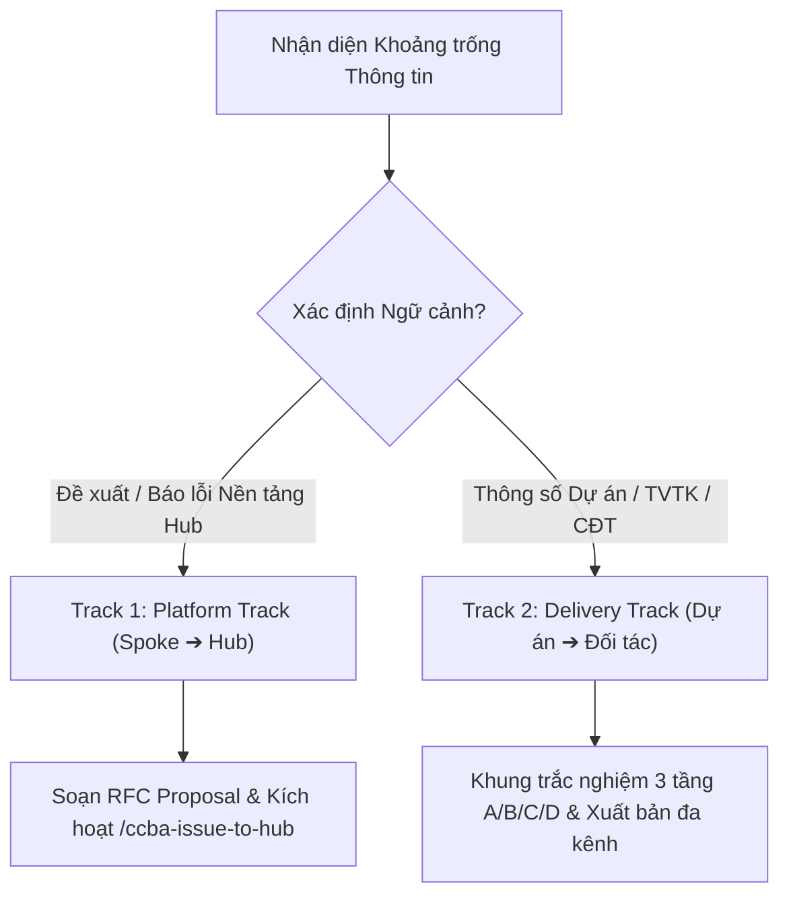

# ccba-to-questionnaire — Reference Guide

> **Mục đích & Ngữ cảnh sử dụng:** Kỹ thuật xây dựng bảng khảo sát thu thập yêu cầu từ người dùng
> **Mô tả gốc:** Hệ thống Khảo sát & Thu thập Quyết định Đa kênh Tương tác (Dual-Track Questionnaire Engine v2.0)

---

# Kỹ năng: Hệ Thống Bảng Hỏi Đa Kênh Tương Tác (Dual-Track Questionnaire Engine v2.0)

Kỹ năng này chuyển hóa một bài toán, quyết định kỹ thuật hoặc nhu cầu cải tiến chưa đủ thông tin thành **Bảng hỏi Đa kênh Tương tác (Dual-Track Questionnaire)**. Không chỉ dừng lại ở tệp Markdown tĩnh, Engine v2.0 hỗ trợ phân luồng ngữ cảnh (Platform vs Delivery), gợi ý khung trắc nghiệm 3 tầng thông minh (Pre-filled Hypotheses Matrix), xuất bản tức thời sang 4 định dạng phổ thông (Word `.docx`, Web HTML Form độc lập, Micro Chat, Email Table) và hỗ trợ chu trình nạp kết quả hai chiều `--reply` khép kín.

Nguyên tắc cốt lõi: **"Grill the send, not the subject"** & **"Pre-fill the choices, eliminate decision paralysis"** — Làm rõ người nhận và thông tin cần thu về, đồng thời chủ động phác thảo sẵn các phương án đánh đổi để người nhận chỉ cần 30 giây đưa ra quyết định.

---

## 🧭 1. Phân Luồng Ngữ Cảnh Kép (Dual-Track Context Routing)

Trước khi soạn thảo bảng hỏi, Agent chủ động xác định hoặc hỏi người dùng phân luồng:



1. **Track 1: Platform Track (Spoke ➔ Hub RFCs)**:
   - *Mục đích:* Dành cho thắc mắc kiến trúc, đề xuất tính năng mới, chuẩn hóa quy trình, hoặc báo lỗi nền tảng.
   - *Hành động:* Tự động đóng gói các câu hỏi thành bản đề xuất cải tiến chuẩn CCBA RFC và tích hợp trực tiếp với workflow [`/ccba-issue-to-hub`](../../ccba-issue-to-hub/SKILL.md) để mở GitHub Issue lên repository trung tâm (`ccba-agent-platform`).
2. **Track 2: Delivery Track (Spoke Dự án ➔ Đối tác / CĐT / TVTK)**:
   - *Mục đích:* Dành cho làm rõ thông số thiết kế, PCCC, MEP, kết cấu, quy chuẩn QCVN, và nghiệm thu hồ sơ hoàn thành (HSHT).
   - *Hành động:* Áp dụng khung trắc nghiệm 3 tầng giả định và xuất bản đồng thời sang Word `.docx`, Web HTML Form, Micro Chat và Email Table.

---

## 🎯 2. Khung Trắc Nghiệm 3 Tầng Giả Định (Pre-filled Hypotheses Matrix)

Thay vì đặt câu hỏi mở trống trơn (`> [Nhập câu trả lời tại đây]`), Agent **bắt buộc** phải đề xuất sẵn 3 phương án lựa chọn kèm 1 dòng tóm tắt đánh đổi (Trade-off: Chi phí - Tiến độ - Rủi ro - Quy chuẩn):

- **Phương án A (⭐ Chuẩn mực / Khuyến nghị CCBA)**: Giải pháp tối ưu kỹ thuật, tuân thủ nghiêm ngặt tiêu chuẩn hiện hành, tính ổn định cao nhất.
- **Phương án B (Nhanh gọn / Tối giản - Quick-Win)**: Chi phí thấp nhất hoặc thời gian thi công/triển khai nhanh nhất, đánh đổi một phần tiện ích thứ cấp.
- **Phương án C (Mở rộng dài hạn - Scalable)**: Giải pháp dự phòng phát triển tương lai hoặc công nghệ tiên tiến, chấp nhận CAPEX ban đầu cao hơn.
- **Phương án D (Tùy chỉnh / Ý kiến khác)**: Luôn dành một phương án để người nhận điền giải pháp riêng nếu muốn.

> [!NOTE]
> **Tương thích ngược (v1.0 Backward Compatibility):** Với các câu hỏi thu thập dữ liệu thô (ví dụ: *"Tải trọng sàn tầng mái là bao nhiêu kN/m²?"*) không thể gán phương án trắc nghiệm, Agent sử dụng loại câu hỏi mở `OPEN_ENDED`. Hệ thống sẽ tự động vẽ khung ghi chú trên Word và render thẻ `<textarea>` trên Web Form.

---

## 📦 3. Bộ Xuất Bản Đa Kênh (Omni-Format Adapters)

Tất cả bảng hỏi sau khi được tạo tại `.md/knowledge/questionnaires/to-questionnaire-<slug>.md` có thể được xuất bản tự động qua CLI:

```bash
# Xuất tất cả các định dạng (.docx, .html, .chat.txt, .email.html)
python scripts/questionnaire_engine.py <file.md> --format all

# Hoặc qua công cụ CCBA OOXML
ccba-ooxml questionnaire <file.md> --format all
```

1. **Word `.docx` (`docx_renderer.py`)**:
   - Biểu mẫu "Phiếu Lấy Ý Kiến Thiết Kế & Phối Hợp Kỹ Thuật" trang trọng chuẩn CCBA.
   - Bảng thông tin Metadata 2 cột, bảng trắc nghiệm với checkbox Unicode `☐`/`☑`, huy hiệu `⭐ Khuyến nghị CCBA`, và khung ký duyệt 3 bên (CCBA - TVTK - CĐT).
2. **Web Landing Page độc lập (`html_renderer.py`)**:
   - Tệp HTML đơn tệp, 100% offline, zero-dependency, bảo vệ chống XSS và Content Security Policy.
   - Giao diện hiện đại, tự động lưu tiến trình vào `localStorage`, thanh phản hồi nhanh thời gian thực kèm nút 1-click clipboard copy.
   - Tích hợp mã QR phản hồi để quét nhanh sang điện thoại gửi Zalo/SMS.
3. **Micro Chat Snippet (`chat_renderer.py`)**:
   - Bản tóm tắt siêu ngắn (<15 dòng) tối ưu cho Zalo, Viber, Microsoft Teams di động.
4. **Email HTML Table (`email_renderer.py`)**:
   - Bảng so sánh inline styling chuẩn mực, tương thích hoàn toàn Outlook, Gmail, Apple Mail.

---

## 🔄 4. Chu Trình Nạp Hai Chiều Khép Kín (`--reply`)

Khi đối tác phản hồi kết quả (qua Zalo, Email hoặc Web form), kỹ sư hoặc Agent thực hiện nạp kết quả:

```bash
python scripts/questionnaire_engine.py <file.md> --reply "1A, 2B, 3C" --resolved-by "Chủ đầu tư Masterise"
```

**Quy trình xử lý tự động của Engine:**
1. **Validation & Idempotency:** Kiểm tra phương án hợp lệ theo từng câu hỏi, tự động uncheck phương án cũ trước khi đánh dấu `- [x]` vào phương án mới.
2. **Cập nhật Metadata:** Chuyển trạng thái sang `status: "RESOLVED"`.
3. **Ghi nhận Quyết định (Decision Log):** Bổ sung mục `## Nhật ký Quyết định (Decision Log)` ở cuối file Markdown làm căn cứ pháp lý truy vết.
4. **Bàn giao quy trình tiếp theo (Workflow Hand-off):**
   - Kích hoạt kỹ năng [`/ccba-to-spec`](../SKILL.md) để chuyển hóa quyết định thành PRD / Đặc tả kỹ thuật.
   - Kích hoạt [`/ccba-to-spec`](../SKILL.md) để phân rã nhiệm vụ phát triển.

---

## 📝 5. Cấu Trúc Tài Liệu Chuẩn (Markdown Schema v2.0)

```markdown
---
title: "BẢNG HỎI LẤY Ý KIẾN THIẾT KẾ & PHỐI HỢP KỸ THUẬT"
track: "delivery"
status: "PENDING"
doc_code: "CCBA-QST-2026-01"
---
# BẢNG HỎI LẤY Ý KIẾN THIẾT KẾ: <Tên Vấn Đề>

**Mục đích:** Lý do bảng hỏi này tồn tại và quyết định phụ thuộc vào nó.
**Người gửi:** <Đơn vị gửi> — **Người nhận:** <Đối tác / CĐT / TVTK>
**Dự án:** <Tên Dự án> — **Thời hạn:** <YYYY-MM-DD>

## Ngữ cảnh (Context)
Đoạn văn ngắn (2-3 câu) giải thích bối cảnh kỹ thuật cho người nhận.

## Hướng dẫn Trả lời (How to answer)
Thời hạn và mức độ nỗ lực ước tính. Quý đối tác vui lòng chọn 1 phương án cho mỗi câu hỏi bên dưới hoặc phản hồi cú pháp nhanh (ví dụ: `1A, 2B, 3C`).

## <Chủ đề 1>
### Câu hỏi 1: <Nội dung vấn đề kỹ thuật cần quyết định>
> **Tại sao cần quyết định:** Giải thích ngắn gọn tại sao câu hỏi này quyết định đến giải pháp / quy chuẩn áp dụng.

- [ ] **Phương án A (⭐ Khuyến nghị)**: <Mô tả giải pháp chuẩn mực>
  * Trade-off: <Ưu điểm nổi bật và đánh đổi về chi phí/tiến độ>
- [ ] **Phương án B**: <Mô tả giải pháp nhanh gọn / tối giản>
  * Trade-off: <Đánh đổi chi phí thấp nhất nhưng tiện ích giới hạn>
- [ ] **Phương án C**: <Mô tả giải pháp mở rộng dài hạn>
  * Trade-off: <Đầu tư lớn hơn nhưng bền vững>
- [ ] **Phương án D**: Phương án khác của Tư vấn thiết kế
  * Trade-off: Do TVTK bảo vệ giải pháp.

## Ý kiến khác (Anything else?)
Quý đối tác vui lòng ghi chú thêm nếu có yêu cầu đặc thù khác chưa được đề cập.
```

---

*Tạo bởi CCBA — Trung tâm Tư vấn và Ứng dụng BIM trong Xây dựng*
