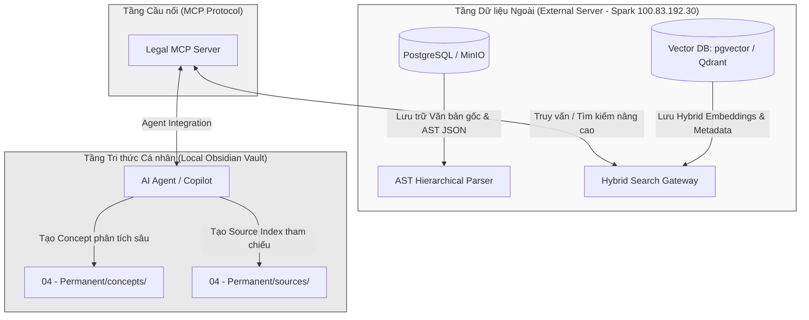
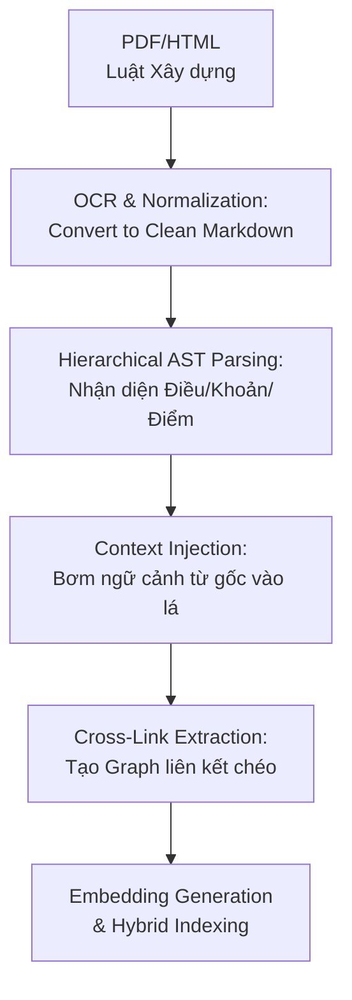

# Kiến trúc Hệ thống Lưu trữ & Tra cứu Pháp luật Xây dựng (Construction Law RAG System)

Tài liệu này trình bày giải pháp kiến trúc hệ thống phục vụ việc thu thập, cấu trúc hóa, tra cứu nâng cao (RAG) và quản trị tri thức đối với hệ thống văn bản pháp luật xây dựng Việt Nam (Luật, Nghị định, Thông tư, Quy chuẩn QCVN, Tiêu chuẩn TCVN). 

Giải pháp được thiết kế theo nguyên lý **First Principles**, tối ưu hóa cho các đặc thù phức tạp của dữ liệu pháp lý và tích hợp hài hòa với kiến trúc **VvC Obsidian Vault** hiện tại mà không làm ảnh hưởng đến hiệu năng của hệ thống Zettelkasten cá nhân.

---

## 1. Thách thức Đặc thù của Dữ liệu Pháp lý Xây dựng

Văn bản pháp lý xây dựng không giống như tài liệu kỹ thuật hay sách thông thường. Chúng sở hữu các đặc điểm đòi hỏi thiết kế chuyên biệt:

1. **Tính Phân cấp Nghiêm ngặt (Strict Hierarchy)**: Một văn bản được chia nhỏ thành *Chương -> Mục -> Điều -> Khoản -> Điểm*. Nếu sử dụng phương pháp chunking thông thường (cắt theo độ dài ký tự cố định), ngữ cảnh của một "Khoản" hoặc "Điểm" sẽ bị phá vỡ hoàn toàn khi tách rời khỏi "Điều" mẹ và tên "Luật/Nghị định" cha.
2. **Tham chiếu Chéo Phức tạp (Cross-References)**: Các điều khoản thường xuyên dẫn chiếu đến nhau (ví dụ: *"áp dụng theo quy định tại Khoản 2 Điều 15 Nghị định này"* hoặc *"tuân thủ Điều 32 Luật Xây dựng"*). Hệ thống RAG cần có khả năng tự động truy vết các mối liên kết này.
3. **Tính Động & Cập nhật Liên tục (Temporal Mutations)**: Văn bản pháp luật liên tục bị sửa đổi, bổ sung hoặc thay thế (ví dụ: Nghị định 35/2023/NĐ-CP sửa đổi một số điều của Nghị định 15/2021/NĐ-CP). Hệ thống phải quản lý được trạng thái hiệu lực (Còn hiệu lực, Hết hiệu lực, Hết hiệu lực một phần, Chưa có hiệu lực) và liên kết phiên bản (Version Control).

---

## 2. Mô hình Tổ chức Dữ liệu 3 Lớp (Tri-Layer Data Architecture)

Để giải quyết bài toán trên, kiến trúc đề xuất phân tách dữ liệu thành **3 tầng lớp rõ rệt**, kết hợp giữa cơ sở dữ liệu lớn bên ngoài và Vault tri thức Obsidian tinh gọn bên trong:



### Tầng 1: Tầng Lưu trữ Thô & Phân cấp (Raw & Structured Documents)
* **Vị trí**: Đặt tại máy chủ Spark (`100.83.192.30`), sử dụng PostgreSQL kết hợp lưu trữ file (MinIO/Local Disk).
* **Nhiệm vụ**: Lưu trữ toàn bộ các file PDF gốc, bản Markdown sạch đã được parse, và phiên bản cấu trúc hóa dạng cây **AST JSON** (Abstract Syntax Tree). 
* **Cấu trúc dữ liệu AST**: Mỗi văn bản được biểu diễn dưới dạng JSON phân cấp:
  ```json
  {
    "document_id": "ND_15_2021_ND_CP",
    "title": "Nghị định 15/2021/NĐ-CP",
    "children": [
      {
        "type": "chapter",
        "title": "Chương III: Thiết kế xây dựng công trình",
        "children": [
          {
            "type": "article",
            "title": "Điều 8: Thẩm quyền thẩm định thiết kế xây dựng",
            "children": [
              {
                "type": "clause",
                "number": "1",
                "content": "Cơ quan chuyên môn về xây dựng thẩm định..."
              }
            ]
          }
        ]
      }
    ]
  }
  ```

### Tầng 2: Tầng Chỉ mục & Tra cứu Hybrid (Hybrid Search Index)
* **Vị trí**: Cùng trên máy chủ Spark, sử dụng PostgreSQL với extension `pgvector` hoặc Vector DB chuyên dụng như Qdrant.
* **Nhiệm vụ**: Lưu trữ các embeddings của các chunk văn bản, phục vụ tìm kiếm kết hợp (**Hybrid Search**):
  * **Keyword Search (BM25)**: Cực kỳ quan trọng đối với pháp luật để tìm chính xác số hiệu văn bản, tên điều khoản (ví dụ: *"Khoản 2 Điều 15"*).
  * **Dense Vector Search**: Tìm kiếm theo ý nghĩa ngữ nghĩa (ví dụ: *"thẩm quyền phê duyệt phòng cháy chữa cháy đối với dự án nhóm A"*).
  * **RRF (Reciprocal Rank Fusion)**: Thuật toán trộn kết quả của Vector Search và BM25 để đưa ra các kết quả có độ chính xác cao nhất.

### Tầng 3: Tầng Tri thức Nguyên tử (Personal Zettelkasten Vault - Obsidian)
* **Vị trí**: Nằm trực tiếp trong **D:\VvC_Notes**.
* **Triết lý**: **KHÔNG** đưa hàng ngàn trang văn bản luật thô vào Vault. Điều này sẽ phá vỡ Zettelkasten cá nhân, làm chậm local search và loãng Graph tri thức.
* **Nhiệm vụ**: Chỉ lưu trữ các tri thức đã được "tiêu hóa":
  * **Source Notes (`04 - Permanent/sources/`)**: Chứa tóm tắt, mục lục liên kết và trạng thái hiệu lực của các văn bản pháp luật cốt lõi (ví dụ: `Luat_Xay_dung_2014.md`).
  * **Concept Notes (`04 - Permanent/concepts/`)**: Các bài phân tích chuyên sâu về quy trình áp dụng pháp luật, case-study thực tế, so sánh đối chiếu hoặc compliance checklist (ví dụ: `tham_quyen_tham_dinh_pccc_luat_55_2024.md`).

---

## 3. Thiết kế Pipeline Xử lý Dữ liệu Pháp lý (Hierarchical Data Pipeline)

Pipeline xử lý dữ liệu được thiết kế riêng để bảo toàn ngữ cảnh phân cấp thông qua kỹ thuật **Context Injection (Bơm ngữ cảnh)** và **Cross-Link Extraction (Trích xuất liên kết chéo)**:



### Chi tiết các giai đoạn xử lý:

#### 1. Ingestion & Normalization
* Thu thập văn bản từ nguồn đáng tin cậy (Cơ sở dữ liệu Quốc gia về Văn bản Quy phạm Pháp luật).
* Sử dụng bộ parser chuyên dụng (kết hợp Regex định dạng văn bản luật Việt Nam) để chuyển đổi thành Markdown tiêu chuẩn, làm sạch các lỗi chính tả, căn lề và định dạng thừa.

#### 2. AST-Based Hierarchical Chunking (Quyết định chất lượng RAG)
* Thay vì cắt chunk theo số lượng ký tự (ví dụ: 1000 ký tự), pipeline sử dụng **AST Parser** để chia nhỏ văn bản theo ranh giới tự nhiên của các **Điều (Articles)** hoặc **Khoản (Clauses)**.
* **Quy tắc Bơm Ngữ cảnh (Context Injection)**: Đối với mỗi chunk được tạo ra ở cấp lá (Khoản hoặc Điểm), hệ thống sẽ tự động tổng hợp thông tin đường dẫn từ gốc đến ngọn để chèn vào phần đầu của chunk văn bản trước khi sinh embedding.
  
  > **Ví dụ về một Chunk sau khi được bơm ngữ cảnh:**
  > ```text
  > [VĂN BẢN]: Nghị định 15/2021/NĐ-CP về quản lý dự án đầu tư xây dựng
  > [CHƯƠNG]: Chương III: Thiết kế xây dựng công trình
  > [ĐIỀU]: Điều 8: Thẩm quyền thẩm định thiết kế xây dựng công trình
  > [KHOẢN]: Khoản 2
  > [NỘI DUNG CHUNK]: 2. Đối với dự án sử dụng vốn đầu tư công, cơ quan chuyên môn về xây dựng thuộc Bộ quản lý công trình xây dựng chuyên ngành thẩm định...
  > ```
  *Kỹ thuật này giúp vector embedding của Khoản 2 chứa đựng đầy đủ thông tin về "Nghị định 15", "Thiết kế xây dựng công trình", và "Thẩm quyền thẩm định" mà không bị pha loãng bởi nội dung các điều khoản khác.*

#### 3. Cross-Link Extraction & Graph Construction
* Sử dụng Regex và LLM để nhận diện các mẫu dẫn chiếu trong nội dung văn bản.
* Xây dựng một **Relationship Graph** giữa các điều khoản:
  * Mối quan hệ `REPLACES` (Thay thế): Văn bản mới thay thế văn bản cũ.
  * Mối quan hệ `AMENDS` (Sửa đổi): Điều khoản này sửa đổi điều khoản kia.
  * Mối quan hệ `REFERENCES` (Dẫn chiếu): Điều khoản này dẫn chiếu đến điều khoản kia.
* Bằng cách lưu trữ đồ thị này, khi Agent thực hiện truy vấn RAG, hệ thống có thể kích hoạt cơ chế **Graph-RAG** để tự động tải thêm các tài liệu được dẫn chiếu nhằm bổ sung ngữ cảnh đầy đủ cho LLM.

#### 4. Embedding & Indexing
* Sử dụng mô hình embedding đa ngôn ngữ hỗ trợ Retrieval tốt (như `bge-m3` hoặc `text-embedding-3-large`).
* Đẩy vector lên Vector DB, đẩy text thô lên BM25 Index của PostgreSQL.

---

## 4. Chiến lược Tích hợp vào Vault hiện tại qua MCP

Để giữ cho Obsidian Vault luôn tinh gọn ("Lean & Clean") theo đúng triết lý Zettelkasten mà vẫn sở hữu khả năng tra cứu pháp luật vô hạn, chúng ta sẽ áp dụng **Mô hình Tích hợp Lai (Hybrid Integration)** thông qua **Model Context Protocol (MCP)**:

### 1. Kiến trúc Cầu nối MCP (Model Context Protocol)
* Chúng ta phát triển một **Legal MCP Server** chạy trên Spark Server (có thể truy cập qua Tailscale VPN `100.83.192.30`).
* Server này cung cấp các công cụ (Tools) và nguồn tài nguyên (Resources) cho AI Agent hoạt động trong Obsidian:
  * `query_legal_database(query, doc_filter, top_k)`: Tìm kiếm hybrid trên Vector DB ngoài.
  * `get_document_ast(doc_id)`: Trích xuất cấu trúc cây của một luật/nghị định.
  * `check_compliance(project_type, scope)`: Chạy bộ luật kiểm tra sự tuân thủ tự động.

### 2. Cấu trúc YAML Frontmatter cho Note Pháp lý trong Vault
Khi AI Agent phát hiện hoặc phân tích một điểm pháp lý quan trọng cần lưu trữ lâu dài trong Vault, nó sẽ tạo ra một Concept Note chuẩn Zettelkasten với cấu trúc Frontmatter mở rộng như sau để liên kết chặt chẽ với hệ thống bên ngoài:

```yaml
---
title: "Thẩm quyền thẩm định thiết kế xây dựng công trình theo NĐ 15/2021"
aliases:
  - "Thẩm quyền thẩm định thiết kế"
  - "Điều 8 Nghị định 15/2021"
tags:
  - knowledge
  - domain/legal
  - type/concept
type: concept
date_created: 2026-05-20
date_modified: 2026-05-20
source: "Nghị định 15/2021/NĐ-CP"
source_type: pdf
source_reference: "ND_15_2021_ND_CP#Article_8"
status: "in_force"             # Trạng thái hiệu lực: in_force, amended, repealed
confidence: high
related:
  - [[luat_xay_dung_2014]]
  - [[nghi_dinh_15_2021_nd_cp]]
---
```

### 3. Quy trình Đồng bộ hóa Tự động (`legal_sync_worker.py`)
Hệ thống hiện tại đã có `legal_sync_worker.py` kết nối trực tiếp với registry của `ccba-agent-platform`. Chúng ta sẽ nâng cấp worker này để hoạt động theo quy trình:
1. **Theo dõi thay đổi**: Worker định kỳ chạy ngầm (ví dụ: qua cronjob hoặc sleep daemon) để kiểm tra các cập nhật mới từ `legal_registry.yaml` trên Hub.
2. **Kích hoạt Lọc & Phân tích**: Khi phát hiện văn bản pháp luật mới liên quan đến lĩnh vực Xây dựng / PCCC, nó sẽ gọi **Semantic Arbitrator** để đánh giá tầm quan trọng.
3. **Biên soạn Tri thức**: Nếu văn bản có tác động lớn (ví dụ: Luật sửa đổi bổ sung), Agent sẽ tự động tạo một Concept Note tổng hợp các thay đổi chính, tác động đối với hoạt động tư vấn, và lưu trực tiếp vào `04 - Permanent/concepts/`.
4. **Tự động liên kết (Auto-linking)**: Chạy `wiki_maintain.py` để tự động tạo liên kết giữa Concept mới này với các Concept cũ bị ảnh hưởng, đảm bảo đồ thị tri thức (Knowledge Graph) của Vault luôn thống nhất và cập nhật.

---

## 5. Trải nghiệm Người dùng mẫu (User Scenario)

```
[Nhà tư vấn (User)]
      │
      ├─► Hỏi Agent: "QCVN 06:2022 có quy định gì mới về khoảng cách an toàn PCCC cho nhà văn phòng nhóm F4.3?"
      │
[AI Agent (Antigravity)]
      │
      ├─► Gọi Legal MCP Tool: query_legal_database("khoảng cách an toàn PCCC nhà văn phòng F4.3 QCVN 06:2022")
      │
[Legal MCP Server (External Spark Server)]
      │
      ├─► Thực hiện Hybrid Search + RRF trên Vector DB & BM25
      ├─► Trích xuất "Bảng 6 Khoản 4.3" kèm ngữ cảnh đầy đủ
      └─► Trả về kết quả thô đã được cấu trúc hóa
      │
[AI Agent (Antigravity)]
      │
      ├─► Phân tích, tổng hợp thông tin, kết hợp với Tri thức cá nhân trong Vault
      ├─► Tạo sơ đồ Mermaid minh họa khoảng cách an toàn theo Academic Grayscale Theme
      ├─► Trả lời người dùng chi tiết, chính xác 100% kèm Ground Truth trích dẫn
      └─► Tạo một Concept Note mới: `khoang_cach_an_toan_pccc_f4_3_qcvn_06.md` lưu vào Obsidian Vault
```

---

## 6. Khuyến nghị Kế hoạch Triển khai (Next Steps)

Để hiện thực hóa kiến trúc này, chúng ta nên đi theo lộ trình từng bước:

1. **Giai đoạn 1 (Tích hợp RAG ngoài)**: Xây dựng Legal MCP Server thô sơ đọc trực tiếp từ thư mục `D:\GitHubProjects\ccba-agent-platform\.agent\.agent\skills\legal-document-tracker` có sẵn để Agent có thể tra cứu nhanh các thông tin đã được đăng ký.
2. **Giai đoạn 2 (Xây dựng Cấu trúc Phân cấp - AST)**: Viết script Python phân tích cú pháp (parser) chuyển đổi văn bản pháp luật (.docx hoặc .md) thành dạng AST JSON để làm giàu ngữ cảnh cho RAG.
3. **Giai đoạn 3 (Đóng gói & Phân tách tri thức)**: Triển khai toàn diện MCP Server và tối ưu hóa quy trình sinh Concept Note tự động của `legal_sync_worker.py` để hoàn tất mô hình lưu trữ lai 3 tầng.
