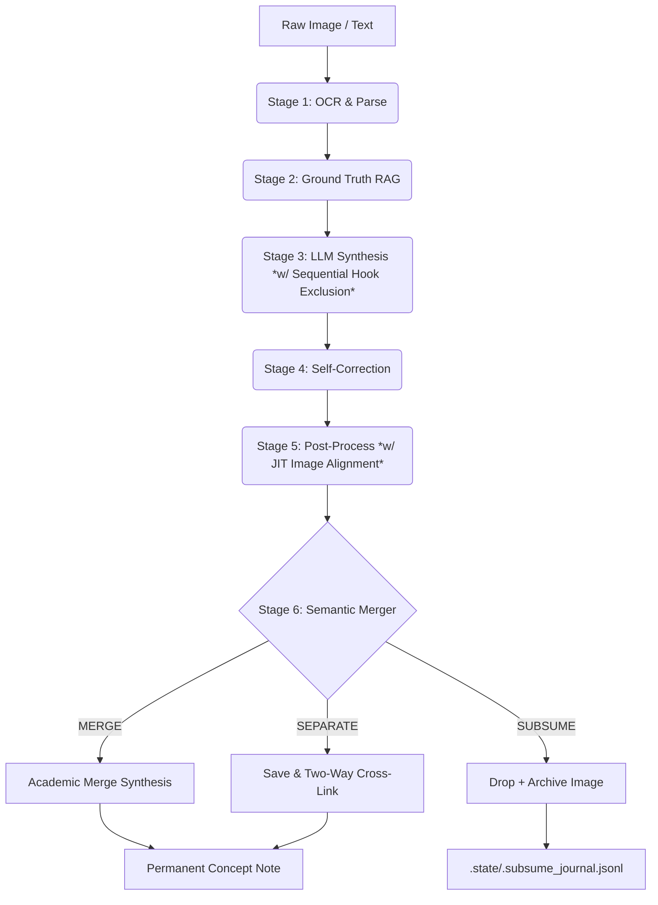

# VvC Second Brain — Pipeline Scripts (v8.15.13 - Deep Module Seams: Weekly Synthesis Extraction, RAG & Wiki Health Deep Packages)

Autonomous knowledge ingestion pipeline following the **LLM Compiler Pattern** (Karpathy, 2026).
*Upgraded in v8.15.13: Deep Module Seams: Weekly Synthesis Extraction, RAG & Wiki Health Deep Packages & Clean Command Seams (ccba-codebase-design): decomposed wiki_health.py into deep module package services/wiki_health/ (linter, link_healer, title_standardizer, domain_enricher, stub_lifecycle, code_pill_cleaner) with 100% backward compatibility and submodules strictly ≤ 289 lines, extracted generate_weekly_synthesis (260 lines) into services/weekly_synthesis.py, consolidated hybrid RAG into deep module package services/rag/ (hybrid_search.py, context_builder.py, __init__.py) with 100% backward-compatible shims for rag_search.py and rag_builder.py, cleaned markdown sanitizer imports in services/command/__init__.py, attached formal DeprecationWarning to services/chat_history.py, added comprehensive tests (test_wiki_health_package.py, test_weekly_synthesis.py, test_rag_package.py), achieving 564/564 passed tests (100% pass, 0 regressions).*
*Upgraded in v8.15.12: Deep Module Seams: Core Markdown Sanitizer, Orthography Disambiguation & Diagram Base Hygiene: extracted pure string transformation invariants into core/markdown_sanitizer.py eliminating pipeline/post_process.py coupling into services/command/citations.py (reducing cold import time by >20x), separated ASR/transcript orthographic preprocessing and smart bypass into services/orthography.py with backward-compatible text_chunker shim, consolidated diagram hygiene (wrap_label and sanitize_mermaid) into services/diagram_base.py with moc_mermaid re-export contract, added dedicated tests in test_diagram_base.py (550/550 passed), and cleaned unused worker imports.*
*Upgraded in v8.15.11: 4-Tier Native ASR Caption Hierarchy, Ground Truth Fallback & Multi-Evidence Hooks: distinguished native ASR captions (no tlang=) from machine-translated subtitles, prioritized Manual vi/en -> Native ASR vi/en -> Auto-translated fallback -> Whisper (language=None), standardized Ground Truth fallback instructions in prompts and self_correct.py bypass, documented Multi-Evidence Hooks for Stage 5 Merged Notes in AGENTS.md §4.1, and healed 10 concept notes and registry via deduplicate_sources.py.*
*Upgraded in v8.15.10: Mermaid Edge Label & Strict HTML Entity Context Isolation Invariants: formalized Mermaid Edge Label Invariant forbidding embedded text in arrow bodies (===="text"====>) and mandating pipe syntax (===>|"label"|), normalized comparison operators (>= -> ≥, <= -> ≤), established Strict HTML Entity Context Isolation confining #40;/#41; strictly to Mermaid blocks while reverting them to () on Markdown tables, implemented pure healing functions in citations.py and mermaid_worker.py integrated with clean_wikilink_quotes(), and expanded test suite.*
*Upgraded in v8.15.9: Stale Daemon Invariant, CLI Autonomous Artifact Ingestion & The 4 Mermaid Ergonomic Design Patterns: formalized Stale Daemon Invariant requiring clean daemon termination via daemon.py --restart before running tests or triggering pipelines, implemented autonomous artifact ingestion in core/llm/gemini_client.py (_resolve_cli_artifact_content) resolving file:/// URIs directly from CLI brain artifacts to prevent truncation downstream, and established the 4 Mermaid Ergonomic Design Patterns in diagramming_hygiene.md and ccba-markdown-document-processing.*
*Upgraded in v8.15.8: Local Antigravity CLI Opus Tier 1 Routing: upgraded local Antigravity CLI (agy.exe) to Tier 1 Primary for claude-opus-4-6-thinking and task="reasoning" eliminating 429 rate-limiting and silent downgrade from Port 8045/8090, auto-elevating reasoning timeout to 600s, and preserving multi-tier fallback cascade (Port 8045 -> Copilot -> API).*
*Upgraded in v8.15.7: Clean Wikilink & Zero-Code-Pill Invariant, SLM Prompt Anti-Literalism & Deterministic Sanitization Gate: formalized Clean Wikilink Invariant in AGENTS.md §4.4 forbidding backticks around wikilinks across all markdown surfaces and requiring pipe-escaping [[slug\|alias]] in tables with 100% citation number parity, established SLM Prompt Anti-Literalism in ccba-llm-pipeline-patterns using XML tags instead of backticks in prompt examples to prevent token literalism in lightweight models, implemented pre-save regex sanitization (clean_wikilink_quotes) across text generators, and integrated code-pill wikilink scanner into wiki_maintain.py.*
*Upgraded in v8.15.6: Executive Typography 16:9, Arrow-Label Clearance & Mermaid Flat Two-Node Invariants: formalized Executive Typography 16:9 in AGENTS.md §4.9 locking canvas width to 1,000px-1,150px (ensuring >= 65%-70% embed scale in Obsidian reading view) with display font floor >= 8.5px-11.5px coupled with markdown Architecture Specification Matrix tables, enforced Arrow-Label Clearance separating Y-coordinates by >= 15px and horizontal gaps >= 80px-90px, and established Flat Two-Node Invariant in AGENTS.md §4.12 strictly forbidding single-node subgraphs, banning <br/> breaks in subgraph titles to prevent Dagre multiline clipping, and enforcing <div align='left'> for all node bullet points.*
*Upgraded in v8.15.5: Clean Callout Headers, Target Language Syntax Alignment & Minimal Code Banners: formalized The 3 Callout Presentation Invariants in AGENTS.md §4.12, GEMINI.md, and scripts/core/prompts/services.py (eliminating the Double Icon Glitch by strictly forbidding emojis in callout header titles, eliminating the Pill-Button baseline break by requiring plain text for filenames instead of backticks, enforcing exact target language comment syntax in explanatory text to prevent syntax crashes when copied into YAML/Python files, and replacing verbose 60-char separator lines with clean minimal dividers # --- SECTION --- in code blocks).*
*Upgraded in v8.15.4: Mermaid Engineering Invariants & Two-Track Document Ergonomics: formalized AGENTS.md §4.12 establishing the Hybrid Golden Threshold (mandatory Excalidraw 16:9 for >= 3 layers or >= 9 nodes vs Mermaid), the 4 Mermaid Invariants (Dagre asymmetric weighting Delta W >= 2, Academic Grayscale Base Theme init, left-aligned node bullet text, invisible edge LTR order), and two-track callout packaging for code blocks > 15 lines (> [!abstract]+ for schemas/configs, > [!info]- for logs/metadata).*
*Upgraded in v8.15.3: Zero-ASCII Art Invariant & Responsive Diagram Enforcement: established AGENTS.md §4.11 strictly forbidding raw ASCII/Unicode box-drawing diagrams in markdown to eliminate soft line wrapping fractures across mobile and reading viewports, enforced native language code fences (```yaml, ```json) for config/code snippets with comment dividers, and standardized Mermaid-First responsive architecture (flowchart TD/LR) with Academic Grayscale semantics (principal, standard, subbox, alert, safe).*
*Upgraded in v8.15.2: Markdown Table Invariants & Reading View Aesthetics: formalized 4 invariants in AGENTS.md §4.10 for Obsidian Markdown tables (mandatory pipe escaping in wikilinks [[slug\|alias]] preventing parser breakdown and unbroken text overflows, non-breaking arrow binding ↳&nbsp;Text to eliminate orphaned flow symbols, subtitle baseline width stabilization *(...)*, and two-tier visual hierarchy for comparative matrix cells keeping line lengths <= 40 chars and zeroing horizontal scrollbars).*
*Upgraded in v8.15.1: Dual-Rendering Excalidraw Auto-Expand Container & Wheel Layout Invariants: implemented auto-expanding container height (H >= H_text + 30px) in excalidraw_worker.py to ensure safe vertical padding, enforced geometry constraints and prompt guidelines for single-line titles (<= 35 chars) and metadata widths (>= 200px), and established 3-tier disambiguation in wheel_layout.py (header_ids anchored at Y=30px, aux_shape_ids, connected_shape_ids at Y>=120px) preventing phantom nodes.*
*Upgraded in v8.15.0: Large Document Map-Reduce Chunker, Port 8045 Claude Opus/Sonnet Integration & Conditional Multi-turn (Sprint P3): integrated Port 8045 Antigravity Proxy on Server Spark (100.83.192.30:8045) via OpenAI protocol unlocking Claude Opus 4.6 Thinking and Claude Sonnet 4.6, implemented Tier 1 Self-Healing with 30s soft cooldown circuit breaker auto-downgrading to Gemini 3.8 Flash High on Port 8090, added slash command model overrides (/opus, /sonnet, /pro, /fast, /flash) with polymorphic StyleParseResult, built core/text_chunker.py for adaptive heading-aware chunking and 2-phase Map-Reduce on documents >200,000 chars eliminating silent drop across Command JIT URLs and Fleeting Brain Dump, and added conditional multi-turn short-term memory (detect_continuity_signal + extract_last_exchange), achieving 481/481 passed tests (100% pass, 0 regressions).*
*Upgraded in v8.14.0: Command Module & Worker Ecosystem Optimization (P0 + P1 Package): enforced strict conditional artifact diagram and docx/csv insertion rules in core/prompts/services.py to eliminate spurious worker generation storms, implemented prioritized explicit wikilink RAG resolution (resolve_explicit_references) in services/rag_builder.py with Windows CRLF and heading anchor stripping while safely preserving scan_all_concepts(), expanded diagram worker context to Dual-Scope 12k chars in services/diagram_base.py ([TARGET SECTION] + [FULL ARTICLE CONTEXT]), optimized mermaid_worker.py and vision_qc_worker.py to task="synthesis" reducing generation time from ~80s to ~3-5s, built polymorphic StyleParseResult in services/command/styles.py supporting /fast speed overrides and tiered model routing in coordinator.py, and verified 120/120 tests passed.*
*Upgraded in v8.13.3: Multimodal Diagram Pipeline Standardization & Wayfinder Hardening: resolved all 10 frontier tickets from the Wayfinder roadmap (.md/wayfinder/multimodal_diagrams/map.md), bypassing Cloudflare WAF on Kroki D2 via custom User-Agent, adding automatic embed syntax healing (heal_artifact_embed_syntax) to eliminate broken _excalidraw_md links, enforcing strict 8-char NanoIDs without collisions, anchoring container headers via containerHeaderOf with Sugiyama bypass guard, normalizing canvas coordinates to positive safety bounding box (x >= 80, y >= 60), preserving Mermaid semantic classDefs and standard HTML entities, implementing mobile responsive diagrams (top-down defaults, D2 max width <= 500px, touch-scroll CSS, and auto-direction normalization), building D2 portable seam locator (find_d2_bin across 4 tiers with .gitignore exclusion), formalizing Gateway image model SSOT and Negative Constraints against cartoon/plastic styles, healing legacy embedded Excalidraw files, and achieving 415/415 passed tests.*
*Upgraded in v8.13.2: Command Deep Module Package Hardening & Multi-Query Drainage Loop (ccba-codebase-design): absorbed services/chat_history.py into services/command/inbox.py to restore 100% format locality (with chat_history.py preserved as backward-compatibility shim), implemented multi-query drainage loop in handle_command() to eliminate asynchronous starvation at the daemon.py poller seam, unified active_cfg dependency passing in generate_hero_image, and expanded test suite to 393/393 passed tests.*
*Upgraded in v8.13.1: Dual-Rendering Diagram Standards & Layout Pipeline Hardening: implemented shared layout seams (sync_bound_text_translation, compute_safe_arrow_endpoints) across all 7 layout engines, added wheel_layout.py and #layout:wheel auto-routing, standardized Obsidian Excalidraw 2.x wrapper, protected Mermaid from non-flowchart classDef injection, formalized D2 vector diagram worker with Kroki HTTP fallback, integrated /hero-image command flow in Command Center, and expanded test suite to 389/389 passed tests.*
*Upgraded in v8.13.0: Command Service Deep Module Package Refactoring (ccba-codebase-design): decomposed services/command.py (469 lines) into services/command/ package (coordinator, inbox, styles, citations, topic_saver), strictly isolating Zero I/O string transformations from stateful LLM/disk I/O, hardened against query data loss and false positive triggering, implemented Dynamic Module Aliasing for test monkeypatching, and expanded test suite to 337/337 passed tests.*
*Upgraded in v8.12.7: Interactive Command Center Hardening & JIT Dynamic Model Resolver: fixed empty before boundary check, implemented in-place surgical patching for Command Inbox notes preservation, made daemon polling asynchronous with _command_lock, added Fast Mode (/fast, /quick, /nhanh), automated Topic Note Auto-Save (>= 2500 chars) to 04 - Permanent/topics/ per AGENTS.md §4.6, standardized on Gemini 3.8 Flash, and built JIT Dynamic Model Resolver (core/llm/model_resolver.py) with 24h caching and static fallback, expanding test suite to 331/331 passed tests.*
*Upgraded in v8.12.6: Reorganized 00 - Maps of Content into hierarchical sub-folders (sources/ with 174 MOCs, domains/ with 27 MOCs), leaving root 00 pristine with only 3 operational cockpit files (index.md, Command.md, Weekly_Synthesis.md). Raised DOMAIN_MOC_THRESHOLD to 15 concepts, eliminating fragmented domains and classifying 100% into 4 rich Grand Domains. Upgraded wiki_maintain.py, wiki_health.py, and close_session.py to rglob, maintaining 301/301 passed tests.*
*Upgraded in v8.12.5: Codebase Architecture Deepening & Graph Optimization: extracted CrossProcessFileLock (core/file_lock.py), centralized VectorStore (core/vector_store.py) and publisher diagrams (pipeline/book_assets.py), optimized Maps of Content with mtime caching, LibYAML CSafeLoader and rebuild_incremental (<0.05s-0.5s), resolved 1,421 broken links and zeroed missing frontmatter via Alias-First Resolution and Zero-False-Alarm Linter, eliminated legacy shims, and expanded pytest suite to 300/300 passed tests.*
*Upgraded in v8.12.4: Upgraded YouTube Visual Extractor to v12.0 with dynamic storyboard max tile area selection (prioritizing sb0 320x180 px over sb2 80x45 px), invariant slicing and timestamp synchronization, format selector supporting progressive (format 18) and DASH streams, 1-pass multimodal LLM-as-Judge, and automated self-healing across vault.*
*Upgraded in v8.12.1: Implemented Sequential Hook Overlap Prevention in Batch Processing to dynamically exclude duplicate quotes across adjacent pages using dynamic exclude_hooks registry, auto-injecting [CRITICAL DIRECTIVE] into synthesis prompt, and resolved 188/188 passed tests.*
*Upgraded in v8.12.0: Implemented JIT Image Alignment (extracting raw illustrations from book corpus matching Ground Truth ±800 chars and embedding standard WebP ![[image.webp]] inside ## Core Idea) and smart Adaptive Naming ([book]_[chapter]_[page]_[original_name] format).*
*Upgraded in v8.11.0: Implemented JIT Environment Loading (.env helper), secured enrich_book_context against YAML metadata erasure, fixed fuzzy-matching [L10] for truncated workspace names.*
*Rebuilt in v7.4: Separated God Objects into specialized Micro-services and created a Modular LLM Package.*
*Upgraded in v7.4.2: Implemented 2-step Map-Reduce architecture for long Brain Dump inputs.*
*Upgraded in v7.4.3: Implemented Excalidraw Text Auto-Sync & Zero-Concept MOC Filtering for cleaner vault organization.*
*Upgraded in v7.6: Dual-Source Frontmatter (`source_page/chapter` + `ground_truth_page/chapter`) + `people`, `companies`, `status` fields.*
*Upgraded in v7.7: Concept Note Cognitive Flow — canonical 5-step body order, no nested quotes in Core Idea, `---` separator, References = single wiki-link.*
*Upgraded in v8.3: Bilingual Standard & Secondary Citation — Evidence Hook BẮT BUỘC tiếng Việt, Citation Line kèm wiki-link, Ground Truth BẮT BUỘC tiếng Anh nguyên bản.*
*Upgraded in v7.5 (Architecture Hardening): 3 systemic fixes — Reverse Metadata Sync (`_toc.json` → Source Note), Deterministic File Stability Guard (replaces `time.sleep`), Temporal Batching Engine (10s cooldown → multi-page batch → 1 Concept Note).*
*Upgraded in v8.5 (Consolidation, Merger & Dynamic Limits): Scan-Once Sleep Architecture, AI Gateway Embeddings (7.5x speed), Semantic Knowledge Merger (Cosine 0.88 + Arbitrator + cross-linking), Proportional Dynamic Limit (Brain Dump Map-Reduce).*
*Upgraded in v8.6 (3-Tier Merge Control & SUBSUME): Replaced static 10KB hard limit with data-driven 3-tier system — Tier 1: Hook Count Gate (≥4 hooks → SEPARATE), Tier 2: Dynamic Size Limit (P95×1.3 ~7.7KB), Tier 3: LLM Arbitrator with 3-way decision (MERGE/SEPARATE/SUBSUME). SUBSUME drops redundant concepts entirely, logs to `.subsume_journal.jsonl` for weekly review.*
*Upgraded in v8.7 (WebP Archive Compression): `_archive_image()` now compresses images to WebP (RGB, 1536px max, Q80) instead of raw copy, reducing archive storage by ~92% (2.19GB → ~170MB for 1,074 images). Fallback to raw copy if Pillow fails.*
*Upgraded in v8.8 (Vault Mount Resilience): JIT Google Drive mount readiness guard added to prevent book_ingest.py crash on boot before GDrive mounts.*
*Upgraded in v8.9 (URL Deduplication & Re-processing Guard): Local URL Registry (`.processed_urls.json`) JIT prevents duplicate URL processing, automatically generating Auto-Feedback loops directly to Processed. Supports case-insensitive override keywords (xử lý lại, /force) with direct Semantic Knowledge Merger (v8.6) updates. Enforces Single-Write Commit to completely avoid Sync Race Conditions.*
*Upgraded in v8.9.5 (Video Visual Extraction): Implemented Video Visual Extraction from YouTube via FFmpeg (1 frame/10s, max 30 selected frames) and LiteLLM Gateway Multimodal API, providing comprehensive visual progression analysis (slides, charts) seamlessly merged with audio transcripts in Brain Dump pipeline.*
*Upgraded in v8.9.9 (Consolidated Pruning & Smart Core Size): Enhanced 3-Tier Merge Control in semantic_merger.py. Replaced hard block when existing note has ≥4 hooks with automatic Consolidated Pruning. Calculates core_size excluding blockquotes to allow merging large quote-bloated notes while protecting atomic note constraints.*
*Upgraded in v8.9.10 (Next.js Custom Image Extraction & Native SVG Support): Upgraded Smart Filter in article_images.py to extract high-value diagrams from Next.js dynamic React Components (<ThemeImage>) using Regex. Added vector SVG download support to bypass Pillow and size constraints, preserving 100% graphic sharpness in Obsidian.*
*Upgraded in v8.10.0 (Operational Separation & Ubiquitous Language): AI-Friendly Codebase Refactor. Migrated all log outputs to scripts/logs/ and operational states (.dump_state.json, .processed_urls.json, .rejected_stubs.json, .subsume_journal.jsonl, _embedding_index.npz) to scripts/.state/ for cloud and git isolation. Modularized brain_dump and youtube services, centralized templates in core/prompts/, enforced strict type safety, renamed variable abbreviations to match Ubiquitous Language (ground_truth, frontmatter, workspace_dir), and hardened pytest suite to 167/167 passed tests (coverage ≥ 50%).*

## Architecture (v8.12.5)

```text
scripts/
├── daemon.py                  ← Main watchdog (v7.5): queue + 5-stage pipeline worker
                                   + Temporal Batching Engine + File Stability Guard
├── book_ingest.py             ← Book watcher: EPUB/PDF → workspace setup
├── sleep.py                   ← Weekly consolidation (lint, heal, MOC rebuild)
├── wiki_maintain.py           ← Source MOC + Domain MOC + Master Index (w/ Zero-Concept filter)
├── epub_convert.py            ← EPUB → Markdown converter
├── web_clip.py                ← CLI tool: URL → Fleeting Markdown
├── config.yaml                ← Centralized configuration
│
├── .state/                    ← Operational state & journal data (Zero Cloud Contamination)
├── logs/                      ← Operational log files (daemon.log, sleep_daemon.log, etc.)
│
├── core/                      ← Shared infrastructure
│   ├── config.py              ← VaultConfig dataclass (singleton)
│   ├── types.py               ← Central type definitions & strict type checking
│   ├── daemon_utils.py        ← Watchdog helper & file stability guards
│   ├── media.py               ← Media utility seam (FFmpeg/FFprobe locator & transcode SSOT)
│   ├── prompts/               ← Prompts Registry (modularized text templates)
│   ├── llm/                   ← 3-tier LLM Modular Package (Gateway, Copilot, Gemini, Vision, Audio)
│   ├── layouts/               ← 7 deterministic layout engines (Sugiyama, Radial, Cycle, Matrix, etc.)
│   ├── layout_router.py       ← Topology auto-detection → engine dispatch
│   ├── frontmatter.py         ← YAML frontmatter parse/build/normalize_stem
│   ├── markdown_sanitizer.py  ← Centralized Markdown & Mermaid Invariants hygiene seam
│   ├── text_chunker.py        ← Canonical large document heading-aware Map-Reduce chunker
│   └── log.py                 ← Append-only logger → log.md (weekly rotation)
│
├── pipeline/                  ← Ingestion stages (7 files)
│   ├── image_processor.py     ← 5-stage pipeline orchestrator (single + Map-Reduce batch)
│   ├── ocr.py                 ← Vision API: auto-orient → OCR → highlight parsing
│   ├── ground_truth.py        ← BM25 chapter-scoped matching + OCR correction
│   ├── synthesize.py          ← LLM concept note generation (Format v7.7 Cognitive Flow)
│   ├── self_correct.py        ← Independent blockquote accuracy verification
│   ├── post_process.py        ← Save concept (unicodedata strict snake_case), archive image
│   └── semantic_merger.py     ← Semantic Knowledge Merger (3-Tier Merge Control, cross-linking)
│
├── services/                  ← Interactive & Batch Services (~20 files)
│   ├── command/               ← Interactive Command Deep Module Package (Zero I/O inbox, coordinator, styles)
│   ├── brain_dump/            ← Brain Dump Decomposition Package (coordinator & workers)
│   ├── youtube/               ← YouTube Decomposition Package (transcripts & fallbacks)
│   ├── rag/                   ← Hybrid RAG Deep Module Package (hybrid_search.py, context_builder.py)
│   ├── weekly_synthesis.py    ← Weekly Synthesis & System Status Report Compiler
│   ├── podcast.py             ← Podcast Ingestion Engine (Apple/Spotify/Web audio + Whisper)
│   ├── article_images.py      ← Web article image downloader & WebP compressor
│   ├── worker_dispatcher.py   ← ArtifactEngine: Strategy & Adapter Registry for all artifacts
│   ├── chat_history.py        ← Backward-compat shim w/ DeprecationWarning (absorbed into command/inbox.py)
│   ├── rag_builder.py         ← Backward-compat shim (absorbed into services/rag/)
│   ├── rag_search.py          ← Backward-compat shim (absorbed into services/rag/)
│   ├── url_fetcher.py         ← Web scraping & garbage detection
│   ├── orthography.py         ← Speech/ASR orthographic correction & Smart Bypass (w/ text_chunker shim)
│   ├── wiki_health/           ← Deep Module Package: linter, link healer, title standardizer, domain enricher
│   ├── moc_mermaid.py         ← MOC Mermaid diagram generator (w/ chapter grouping SSOT)
│   ├── diagram_base.py        ← Shared diagram infrastructure
│   ├── excalidraw_worker.py   ← Excalidraw JSON via Copilot CLI (w/ Text Auto-Sync)
│   ├── mermaid_worker.py      ← Mermaid diagram generation
│   └── legal_sync_worker.py   ← Autonomous Legal Document Concept generation
│
└── tests/                     ← 564 unit tests (pytest) — coverage ≥ 50%
```

## Quick Start

```bash
# Activate virtual environment
.venv\Scripts\activate

# Start the daemon suite (Hidden mode via VBS)
wscript run_watcher.vbs

# Or manually (Headless):
pythonw daemon.py
pythonw book_ingest.py
```

## 3-Tier AI Infrastructure (v8.12.3)

The v8.12 compiler routes requests based on availability and capability using tier-specific model resolution:

1. **Tier 1 (Primary)**: Antigravity CLI Driver (`gemini-3.8-flash-high`) for Map & Reduce / AI Gateway (`ccba-ai` SDK) → 22 local/cloud models (includes `gemini-3.8-flash-high`, `audio-primary` Whisper V3 Turbo with `vad_filter`, and `gemini-embed` 3072-dim).
2. **Tier 2 (Fallback)**: Copilot CLI (`claude-sonnet-4.6` / `claude-opus-4-6-thinking` for planning / `gpt-5-mini`)
3. **Tier 3 (Direct)**: Gemini REST API (`gemini-3.1-flash-lite-preview`)

**Round-Robin Load Balancing**: For high-volume background tasks (e.g. `wiki_health`), the router automatically distributes requests evenly across all 3 tiers (`call_llm(strategy="round_robin")`) to bypass standard API rate limits.
**WinError 206 Protection**: By directly invoking the underlying OS `CreateProcessW` APIs (bypassing `cmd.exe`), payloads up to **30,000 characters** are now safely passed natively. Only payloads exceeding this limit trigger HTTP REST API fallback. This allows `orthography.py` to utilize a massive **25,000 max_chunk_size**, maximizing throughput.

## Pipeline Flow (The Lean Compiler v8.12.1)



## Concept Note Format v8.12.0 (Canonical Structure)

Every concept generated by `synthesize.py` and `brain_dump.py` follows this exact structure to enforce **Bilateral Aesthetics**:

```markdown
> "Evidence Hook — trích dẫn nguyên văn tiếng Việt" (BẮT BUỘC tiếng Việt, standalone, no section)
> — **Tên Tác Giả**, trích dẫn trong *Tên Sách* (Nguồn phụ, [[file_nguồn_thô|Tên Nguồn, Năm]])

## Core Idea
Phân tích thuần tiếng Việt. KHÔNG lồng quote. KHÔNG lặp Evidence Hook.

![[book_chapter_page_image.webp]]  <-- JIT Image Alignment: nhúng sơ đồ NXB gốc (v8.12.0)

## 📖 Bản gốc & Ngữ cảnh mở rộng (Ground Truth)
> "Original English passage..." (BẮT BUỘC tiếng Anh nguyên bản)

---

## References
- [[source_note]]
```

**Quy tắc ngôn ngữ & Thẩm mỹ:**
1. **Evidence Hook:** BẮT BUỘC bằng tiếng Việt, Citation Line phải có tên tác giả và wiki-link trỏ về file nguồn thô.
2. **Ground Truth:** BẮT BUỘC tiếng Anh nguyên bản để phục vụ RAG và kiểm chứng học thuật.
3. **Bilateral Aesthetics (Căn chỉnh Song phương):** Siêu dữ liệu thô (`[IMG:...]`) bắt buộc đóng gói trong Obsidian Callout ẩn (`> [!info]- 🖼️ ...`) ở đầu trang để tối ưu thị giác con người và RAG của AI. Ảnh gốc từ NXB được nhúng sắc nét bằng định dạng WebP trực tiếp tại cuối mục `## Core Idea`.
4. **YAML fields bắt buộc:** `source_page`, `source_chapter`, `ground_truth_page`, `ground_truth_chapter`, `people`, `companies`, `status`.
5. **Tags rule:** chỉ `knowledge`, `type/concept`, `domain/*` — KHÔNG thêm tên người/công ty vào tags.

### 📝 Pipeline Design Notes (Hạ tầng & RAG)
- **[M6] Làm giàu Mục lục JIT (TOC Page Ranges)**: Tệp `_toc_original.json` ban đầu được sinh ra từ `epub_convert.py` sẽ không có trường `page_start`/`page_end`. Hệ thống hoạt động theo nguyên lý JIT: các thông tin trang tiếng Việt này sẽ tự động được làm giàu và đồng bộ khi người dùng chụp ảnh mục lục VN (`_toc.jpg`) và thả vào Fleeting. Khi chưa có thông tin trang VN, hàm `resolve_chapter()` sẽ thực hiện tìm kiếm BM25 trên toàn bộ corpus (RAG không giới hạn phạm vi).
- **[L9] Trường `source_chapter` của Concept Note**: Đối với các Concept Note được biên soạn từ nguồn ảnh chụp camera, trường `source_chapter` luôn mặc định để trống (`""`) vì pipeline không tự động trích xuất được chương tiếng Việt từ ảnh chụp OCR thô. Ghi nhận hành vi này để tránh nhầm lẫn khi kiểm toán schema.

## Maintenance Commands

```bash
# Run weekly consolidation (Lint + Heal + Domain MOCs)
python sleep.py

# Force rebuild all Master Indexes
python wiki_maintain.py

# Run test suite
pytest
```
