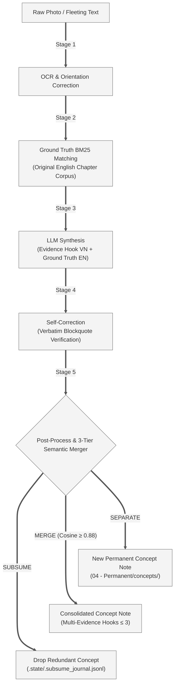
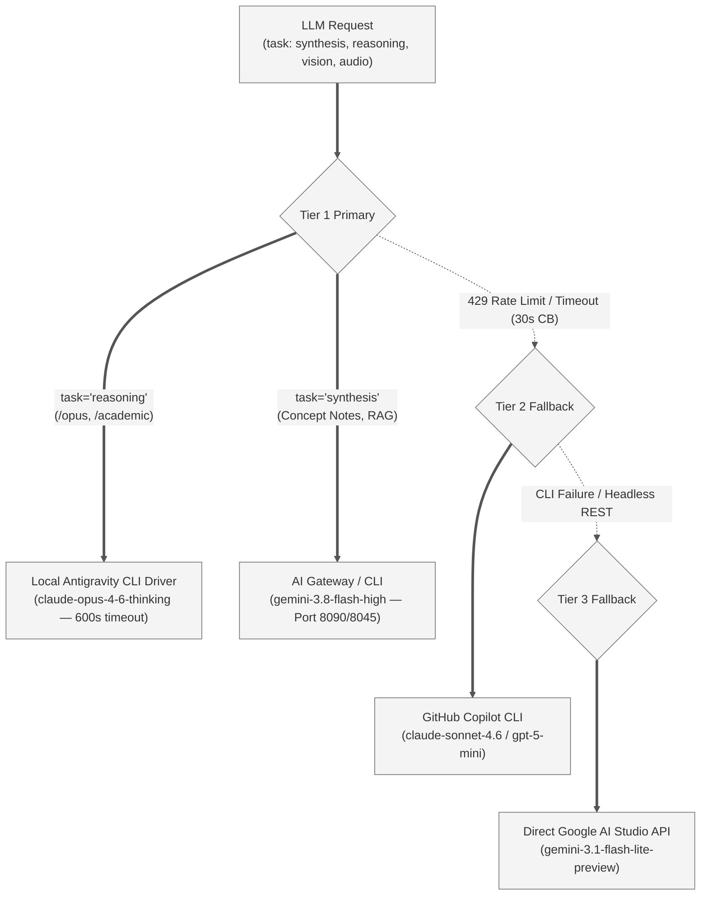

# ⚙️ VvC Second Brain — Pipeline Scripts (v8.15.13)

Autonomous knowledge ingestion pipeline following the **LLM Compiler Pattern** (Andrej Karpathy, 2026), operating as an autonomous "Zero-Touch" LLM OS.

> [!NOTE] Architecture & Historical Changelog
> - **Full Constitution & Rules**: [`AGENTS.md`](../AGENTS.md) (Authoritative Source of Truth)
> - **Pipeline Mode Override**: [`scripts/GEMINI.md`](GEMINI.md) (Automated daemon JIT prompt instructions)
> - **Complete Version History**: [`CHANGELOG.md`](../CHANGELOG.md) (All releases and architectural seam milestones)
> - **Current Milestone**: `v8.15.13 — Deep Module Seams: Weekly Synthesis Extraction, RAG & Wiki Health Deep Packages` (100% tests passed, 0 regressions).

---

## 1. Operating Model & Dual-Host Runtime

To prevent Google Drive file corruption and **Split-Brain synchronization races**, the pipeline enforces an **Active-Passive Single-Active Runner** policy:

| Host | Role | Execution Model | Daemon Management |
| :--- | :--- | :--- | :--- |
| **Server Linux Spark** (`100.83.192.30`) | **Primary Active Host** | 24/7 autonomous background daemon | Systemd User Services: `vvc-daemon.service`, `vvc-book-ingest.service`, `vvc-sleep.timer` |
| **Windows Workstation** | **Client / UI Host** | Obsidian frontend & interactive commands | Passive. Before running local runner, MUST stop remote runner via `stop_windows_runner.cmd`. |

### Daemon Lifecycle & Stale Daemon Invariant
Python holds imported modules in RAM at startup. Whenever modifying files in `scripts/` or `config.yaml`, you **MUST** reload running daemons:

```bash
# On Linux Server Spark (recommended):
systemctl --user restart vvc-daemon.service

# Or cross-platform CLI reload flag:
python scripts/daemon.py --restart
```

---

## 2. Directory Structure (v8.15.13)

```text
scripts/
├── daemon.py                  ← Main watchdog daemon (watch queue + 5-stage ingestion worker)
├── book_ingest.py             ← Book watcher: EPUB/PDF drop → automated workspace setup
├── sleep.py                   ← Weekly consolidation engine (lint, heal, MOC regeneration)
├── wiki_maintain.py           ← Source MOC + Domain MOC + Master Index (Zero-Concept pruning)
├── close_session.py           ← Interactive session wrap-up & Weekly Synthesis trigger
├── web_clip.py                ← Web article clipper: URL → Fleeting Markdown
├── epub_convert.py            ← EPUB to clean Markdown converter
├── pdf_convert.py             ← PDF OCR extraction converter
├── config.yaml                ← Centralized runtime configuration
│
├── .state/                    ← Operational state & cache (Zero Cloud Contamination)
├── logs/                      ← Centralized log files (daemon.log, sleep.log, etc.)
│
├── core/                      ← Core Shared Infrastructure
│   ├── config.py              ← VaultConfig singleton dataclass
│   ├── types.py               ← Central type definitions & runtime validation
│   ├── daemon_utils.py        ← Watchdog helpers & File Stability Guards
│   ├── file_lock.py           ← CrossProcessFileLock (PID-based flock / msvcrt lock)
│   ├── frontmatter.py         ← Canonical YAML frontmatter parse, build & stem normalization
│   ├── layout_router.py       ← Diagram topology auto-detection → engine router
│   ├── layouts/               ← 7 deterministic layout engines (Sugiyama, Radial, Wheel, etc.)
│   ├── llm/                   ← 3-Tier LLM routing package (Gateway, Copilot, Gemini, Audio, Vision)
│   ├── log.py                 ← Append-only thread-safe logger → log.md
│   ├── markdown_sanitizer.py  ← Deterministic sanitization seam (wikilink quotes, Mermaid edges, entities)
│   ├── media.py               ← FFmpeg/FFprobe locator & transcode SSOT
│   ├── prompts/               ← Prompt registry (pipeline.py, services.py, system.py)
│   ├── text_chunker.py        ← Heading-aware Map-Reduce document chunker (>200k chars)
│   ├── vault.py               ← Vault directory resolver & relative path utilities
│   ├── vector_io.py           ← Low-level NPZ storage reading & atomic saving
│   ├── vector_store.py        ← Fast NumPy vector store & cosine indexing
│   └── vector_sync.py         ← Full embedding synchronization & circuit breaker engine
│
├── pipeline/                  ← 5-Stage Ingestion Pipeline
│   ├── image_processor.py     ← 5-stage pipeline orchestrator (single image mode)
│   ├── batch_processor.py     ← Map-Reduce multi-page burst batch processor & hook exclusion
│   ├── ocr.py                 ← Stage 1: Vision API auto-orient + OCR + highlight extraction
│   ├── ground_truth.py        ← Stage 2: Chapter-scoped BM25 Ground Truth matching & correction
│   ├── synthesize.py          ← Stage 3: LLM Concept Note synthesis (Canonical v8.3 Cognitive Flow)
│   ├── self_correct.py        ← Stage 4: Verifiable blockquote accuracy verification
│   ├── post_process.py        ← Stage 5A: Strict snake_case saving, stub hydration & quality gate
│   ├── semantic_merger.py     ← Stage 5B: 3-Tier Merge Control, LLM Arbitrator & Consolidated Pruning
│   ├── semantic_fallback.py   ← BM25 2-tier cache & LLM fallback semantic overlap matcher
│   ├── image_archiver.py      ← WebP compression, collision suffixing & per-book archive manifest
│   ├── book_assets.py         ← JIT illustration extraction & publisher diagram alignment
│   ├── map_reduce.py          ← Multi-page batch ingestion Map-Reduce compiler
│   └── process_markdown.py    ← Raw markdown document ingestion & atomic concept decomposition
│
├── services/                  ← Interactive & Batch Services
│   ├── command/               ← Interactive Command Center Deep Package (inbox, coordinator, styles)
│   ├── brain_dump/            ← Brain Dump Decomposition Package (coordinator & workers)
│   ├── youtube/               ← YouTube Decomposition Package (4-tier native ASR, visual frames)
│   ├── rag/                   ← Hybrid RAG Deep Package (hybrid_search.py, context_builder.py)
│   ├── wiki_health/           ← Wiki Health Deep Package (linter, link_healer, title_standardizer...)
│   ├── weekly_synthesis.py    ← Weekly Synthesis & System Status Report compiler
│   ├── podcast.py             ← Podcast Ingestion Engine (Apple/Spotify/Web audio + Whisper)
│   ├── article_images.py      ← Web article diagram extractor & WebP compressor
│   ├── article_image_parser.py ← Smart Filter noise heuristics & React ThemeImage parser
│   ├── worker_dispatcher.py   ← ArtifactEngine: Strategy & Adapter Registry for all artifacts
│   ├── moc_builder.py         ← Source & Domain MOC constructor and markdown renderer
│   ├── master_index.py        ← Master Index dashboard compiler & Playbooks showcase
│   ├── orthography.py         ← ASR phonetic correction & Smart Bypass seam
│   ├── url_fetcher.py         ← Web scraping & garbage detection engine
│   ├── diagram_base.py        ← Shared diagram layout & Mermaid hygiene seam
│   ├── moc_mermaid.py         ← Domain MOC Concept Map flowchart generator
│   ├── moc_source_diagram.py  ← Source MOC chapter & flat overview diagram generator
│   ├── excalidraw_worker.py   ← Excalidraw 16:9 diagram generator (Auto-Expand, Wheel layout)
│   ├── mermaid_worker.py      ← Mermaid generator (Grayscale Base Theme, Dagre asymmetric weights)
│   ├── d2_worker.py           ← D2 vector diagram generator (Kroki HTTP fallback)
│   ├── doc_worker.py          ← Word/DOCX structured document generator
│   ├── ea_worker.py           ← Enterprise Architecture specification worker
│   ├── vision_qc_worker.py    ← Multimodal diagram visual inspection & QC worker
│   └── legal_sync_worker.py   ← Autonomous Legal Document Concept generator
│
├── tools/                     ← Operational & Batch Migration Utilities
│   ├── batch_ingest_books.py  ← Bulk book ingestion coordinator
│   ├── deduplicate_sources.py ← Source deduplication & automatic link redirection
│   ├── heal_video_frames.py   ← YouTube frame re-alignment & visual healing
│   ├── classify_figures.py    ← Figure classifier (diagram vs photo vs typography)
│   ├── enrich_figure_inventory.py ← Figure inventory metadata enrichment
│   ├── diagram_template_builder.py ← Excalidraw template scaffold builder
│   └── hydrate_url_registry.py← URL registry hydration from legacy notes
│
└── tests/                     ← Comprehensive unit test suite (pytest) — 100% Green, coverage ≥ 50%
```

---

## 3. The 5-Stage Ingestion Pipeline

All book photos and raw Fleeting texts pass through the 5-stage compiler:



---

## 4. 3-Tier AI Infrastructure & Routing

The pipeline resolves LLM requests through a 4-tier resilient mesh:



### Infrastructure Invariants
- **WinError 206 Protection**: CLI invocation uses native OS `CreateProcessW` APIs (bypassing `cmd.exe`), safely passing arguments up to **30,000 characters**. Payloads exceeding this limit stream via `stdin` (`--input-format stream-json`).
- **Circuit Breaker**: Detects 503/429 HTTP statuses, triggering an automatic 30s soft cooldown before retrying or failing over.
- **Autonomous CLI Artifact Ingestion (v8.15.9)**: `_resolve_cli_artifact_content()` detects `file:///...` brain artifact URIs in CLI output and reads the complete markdown file directly into memory, preventing truncated responses.
- **Round-Robin Load Balancing**: For bulk background tasks (such as `wiki_health`), `call_llm(strategy="round_robin")` distributes requests across all available tiers to maximize throughput.

---

## 5. Developer & Maintenance Commands

All commands should be executed from the **Vault Root** with the virtual environment activated:

### Environment Setup
```bash
# Linux Server Spark (always activate, or use venv binary directly to avoid wrapper collision):
source scripts/.venv/bin/activate
# Or directly:
scripts/.venv/bin/pytest scripts/tests/ -v

# Windows Workstation:
scripts\.venv\Scripts\activate
```

### Key Operational Commands
| Purpose | Command | Description |
| :--- | :--- | :--- |
| **Restart Daemon** | `python scripts/daemon.py --restart` | Terminate stale daemon instances and reload code into RAM |
| **Run Daemon Headless** | `pythonw scripts/daemon.py` | Run background watchdog (Windows headless) |
| **Run Book Watcher** | `python scripts/book_ingest.py` | Watch `03 - Resources/books/` for new EPUB/PDF drops |
| **Weekly Consolidation** | `python scripts/sleep.py` | Run full Lint, Heal, MOC regeneration & Sleep consolidation |
| **Rebuild All MOCs** | `python scripts/wiki_maintain.py` | Rebuild Source MOCs, Domain MOCs, and Master Index |
| **Web Clipper** | `python scripts/web_clip.py "<URL>"` | Clip web article into `05 - Fleeting/` |
| **EPUB Converter** | `python scripts/epub_convert.py "<file.epub>"` | Extract clean Markdown corpus and generate `_toc.json` |
| **Run Test Suite** | `pytest scripts/tests/ -v` | Run full test suite (100% Green) |
| **Run Health Test Only** | `pytest scripts/tests/test_wiki_health_package.py -v` | Run wiki_health contract tests (7 tests) |
| **Architectural Budgets** | `pytest scripts/tests/test_architectural_budgets.py -v` | Verify file line budget ($\le 350$) and AST function budgets ($\le 50$) |
| **Constitution Parity** | `pytest scripts/tests/test_agent_constitution.py -v` | Verify SSoT versioning, manifest sync, and README tree parity |
| **Import Depth Guard** | `python scripts/check_hub_import_depth.py` | Verify 0 deep imports from Hub to Spoke |
| **Spoke Cleanliness** | `python scripts/check_spoke_cleanliness.py` | Check spoke script budget ($\le 15$ standalone scripts) |
