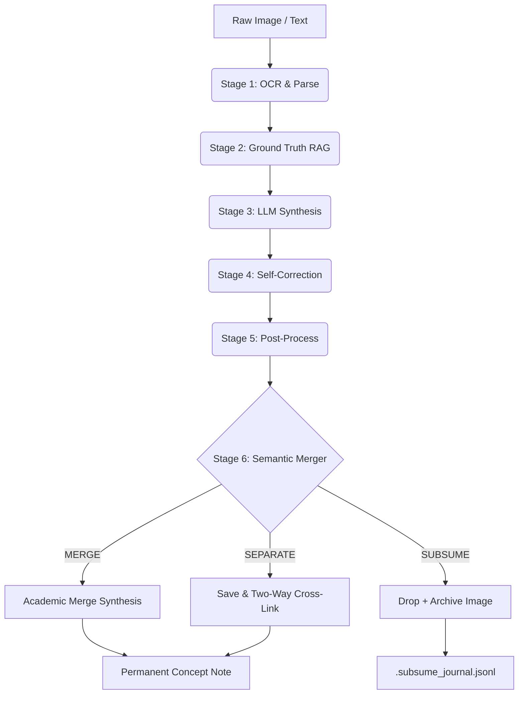

# VvC Second Brain — Pipeline Scripts (v8.6 3-Tier Merge Control)

Autonomous knowledge ingestion pipeline following the **LLM Compiler Pattern** (Karpathy, 2026).
*Rebuilt in v7.4: Separated God Objects into specialized Micro-services and created a Modular LLM Package.*
*Upgraded in v7.4.2: Implemented 2-step Map-Reduce architecture for long Brain Dump inputs.*
*Upgraded in v7.4.3: Implemented Excalidraw Text Auto-Sync & Zero-Concept MOC Filtering for cleaner vault organization.*
*Upgraded in v7.6: Dual-Source Frontmatter (`source_page/chapter` + `ground_truth_page/chapter`) + `people`, `companies`, `status` fields.*
*Upgraded in v7.7: Concept Note Cognitive Flow — canonical 5-step body order, no nested quotes in Core Idea, `---` separator, References = single wiki-link.*
*Upgraded in v8.3: Bilingual Standard & Secondary Citation — Evidence Hook BẮT BUỘC tiếng Việt, Citation Line kèm wiki-link, Ground Truth BẮT BUỘC tiếng Anh nguyên bản.*
*Upgraded in v7.5 (Architecture Hardening): 3 systemic fixes — Reverse Metadata Sync (`_toc.json` → Source Note), Deterministic File Stability Guard (replaces `time.sleep`), Temporal Batching Engine (10s cooldown → multi-page batch → 1 Concept Note).*
*Upgraded in v8.5 (Consolidation, Merger & Dynamic Limits): Scan-Once Sleep Architecture, AI Gateway Embeddings (7.5x speed), Semantic Knowledge Merger (Cosine 0.85 + Arbitrator + cross-linking), Proportional Dynamic Limit (Brain Dump Map-Reduce).*
*Upgraded in v8.6 (3-Tier Merge Control & SUBSUME): Replaced static 10KB hard limit with data-driven 3-tier system — Tier 1: Hook Count Gate (≥4 hooks → SEPARATE), Tier 2: Dynamic Size Limit (P95×1.3 ~7.7KB), Tier 3: LLM Arbitrator with 3-way decision (MERGE/SEPARATE/SUBSUME). SUBSUME drops redundant concepts entirely, logs to `.subsume_journal.jsonl` for weekly review.*

## Architecture (v7.4)

```
scripts/
├── daemon.py                  ← Main watchdog (v7.5): queue + 5-stage pipeline worker
                                   + Temporal Batching Engine + File Stability Guard
├── vault_sync.py              ← PC ↔ Google Drive bidirectional sync
├── book_ingest.py             ← Book watcher: EPUB/PDF → workspace setup
├── sleep.py                   ← Weekly consolidation (lint, heal, MOC rebuild)
├── wiki_maintain.py           ← Source MOC + Domain MOC + Master Index (w/ Zero-Concept filter)
├── epub_convert.py            ← EPUB → Markdown converter
├── web_clip.py                ← CLI tool: URL → Fleeting Markdown
├── config.yaml                ← Centralized configuration
│
├── core/                      ← Shared infrastructure
│   ├── config.py              ← VaultConfig dataclass (singleton)
│   ├── llm/                   ← 3-tier LLM Modular Package (Gateway, Copilot, Gemini, Vision, Audio)
│   ├── frontmatter.py         ← YAML frontmatter parse/build/normalize
│   ├── log.py                 ← Append-only logger → log.md
│   └── layout_router.py       ← Topology Router for Diagram Engines
│
├── pipeline/                  ← 5-Stage Ingestion Pipeline
│   ├── ocr.py                 ← Vision API: auto-orient → OCR → highlight parsing
│   │                             + Reverse Metadata Sync (_toc.json → Source Note)
│   ├── ground_truth.py        ← BM25 chapter-scoped matching + OCR correction
│   ├── synthesize.py          ← LLM concept note generation (Format v7.7 Cognitive Flow)
│   ├── self_correct.py        ← Independent blockquote accuracy verification
│   └── post_process.py        ← Save concept, archive image, trigger MOC (v8.6)
│                                  + 3-Tier Merge Control + SUBSUME deduplication
│
├── services/                  ← Interactive & Batch Services (~19 files)
│   ├── command.py             ← Command.md Facade handler
│   ├── brain_dump.py          ← Brain_Dump.md Map-Reduce Coordinator (w/ Dynamic Limits)
│   ├── worker_dispatcher.py   ← Triggers all generation workers
│   ├── url_fetcher.py         ← Web scraping & garbage detection
│   ├── text_chunker.py        ← Semantic chunking & AI correction
│   ├── youtube_transcript.py  ← YT transcript fetching
│   ├── rag_search.py          ← Hybrid RAG (BM25 + Embedding + RRF fusion)
│   ├── wiki_health.py         ← Consolidated: lint + heal + domain enrichment + Strict Abort
│   ├── diagram_base.py        ← Shared diagram infrastructure
│   ├── excalidraw_worker.py   ← Excalidraw JSON via Copilot CLI (w/ Text Auto-Sync)
│   ├── mermaid_worker.py      ← Mermaid diagram generation
│   └── legal_sync_worker.py   ← Autonomous Legal Document Concept generation
│
├── *layout_engines*           ← Root-level deterministic layout algorithms
│   ├── sugiyama_layout.py     ← Hierarchical Top-Down (Flowcharts, Org Charts)
│   ├── radial_layout.py       ← Hub-and-Spoke (Ecosystems)
│   ├── cycle_layout.py        ← Cyclic Loops with curved arrows
│   ├── matrix_layout.py       ← 2x2 Grids and Scatter plots
│   ├── concentric_layout.py   ← Concentric circles layout algorithm
│   ├── value_chain_layout.py  ← Horizontal Michael Porter value chain layout
│   └── tree_layout.py         ← Tree layout algorithm (Top-Down & Left-to-Right)
```

## Quick Start

```bash
# Activate virtual environment
.venv\Scripts\activate

# Start the daemon suite (Hidden mode via VBS)
wscript run_watcher.vbs

# Or manually (Headless):
pythonw daemon.py
pythonw vault_sync.py
pythonw book_ingest.py
```

## 3-Tier AI Infrastructure

The v7.7 compiler routes requests based on availability and capability using tier-specific model resolution:

1. **Tier 1 (Primary)**: AI Gateway (`ccba-ai` SDK) → 22 local/cloud models. Includes `gemini-3.1-pro-high` (with internal `gemini-pro-agent` fallback), `audio-primary` (Whisper V3 Turbo with `vad_filter`), and `gemini-embed` (3072-dimensional vector embedding model).
2. **Tier 2 (Fallback)**: Copilot CLI (`claude-sonnet-4.6` / `gpt-5-mini`)
3. **Tier 3 (Direct)**: Gemini REST API (`gemini-3-flash-preview`)

**Round-Robin Load Balancing**: For high-volume background tasks (e.g. `wiki_health`), the router automatically distributes requests evenly across all 3 tiers (`call_llm(strategy="round_robin")`) to bypass standard API rate limits.
**WinError 206 Protection**: By directly invoking the underlying OS `CreateProcessW` APIs (bypassing `cmd.exe`), payloads up to **30,000 characters** are now safely passed natively. Only payloads exceeding this limit trigger HTTP REST API fallback. This allows `text_chunker.py` to utilize a massive **25,000 max_chunk_size**, maximizing throughput.

## Pipeline Flow (The Lean Compiler v8.6)



## Concept Note Format v8.3 (Canonical Structure)

Every concept generated by `synthesize.py` and `brain_dump.py` follows this exact structure:

```
> "Evidence Hook — trích dẫn nguyên văn tiếng Việt" (BẮT BUỘC tiếng Việt, standalone, no section)
> — **Tên Tác Giả**, trích dẫn trong *Tên Sách* (Nguồn phụ, [[file_nguồn_thô|Tên Nguồn, Năm]])

## Core Idea
Phân tích thuần tiếng Việt. KHÔNG lồng quote. KHÔNG lặp Evidence Hook.

## 📖 Bản gốc & Ngữ cảnh mở rộng (Ground Truth)
> "Original English passage..." (BẮT BUỘC tiếng Anh nguyên bản)

---

## References
- [[source_note]]
```

**Quy tắc ngôn ngữ (v8.3):** Evidence Hook = tiếng Việt, Citation Line = tên tác giả + wiki-link, Ground Truth = tiếng Anh.
YAML fields bắt buộc: `source_page`, `source_chapter`, `ground_truth_page`, `ground_truth_chapter`, `people`, `companies`, `status`.
Tags rule: chỉ `knowledge`, `type/concept`, `domain/*` — KHÔNG thêm tên người/công ty vào tags.

## Maintenance Commands

```bash
# Run weekly consolidation (Lint + Heal + Domain MOCs)
python sleep.py

# Force rebuild all Master Indexes
python wiki_maintain.py

# Run test suite
pytest
```
