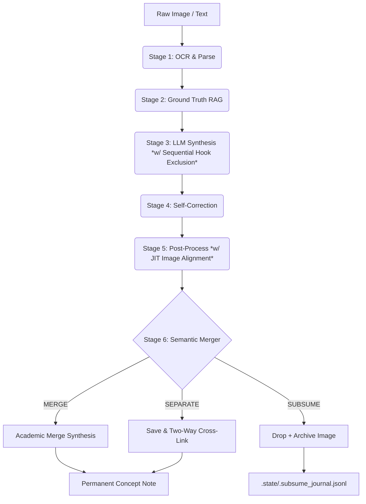

# VvC Second Brain — Pipeline Scripts (v8.12.1 - Hook Overlap Prevention & JIT Images)

Autonomous knowledge ingestion pipeline following the **LLM Compiler Pattern** (Karpathy, 2026).
*Upgraded in v8.12.1: Implemented Sequential Hook Overlap Prevention in Batch Processing to dynamically exclude duplicate quotes across adjacent pages using dynamic exclude_hooks registry, auto-injecting [CRITICAL DIRECTIVE] into synthesis prompt, and resolved 188/188 passed tests.*
*Upgraded in v8.12.0: Implemented JIT Image Alignment (extracting raw illustrations from book corpus matching Ground Truth ±800 chars and embedding standard WebP ![[image.webp]] inside ## Core Idea) and smart Adaptive Naming ([book]_[chapter]_[page]_[original_name] format).*
*Upgraded in v8.11.0: Implemented JIT Environment Loading (.env helper), secured enrich_book_context against YAML metadata erasure, fixed fuzzy-matching [L10] for truncated workspace names.*
*Rebuilt in v7.4: Separated God Objects into specialized Micro-services and created a Modular LLM Package.*
*Upgraded in v7.4.2: Implemented 2-step Map-Reduce architecture for long Brain Dump inputs.*
*Upgraded in v7.4.3: Implemented Excalidraw Text Auto-Sync & Zero-Concept MOC Filtering for cleaner vault organization.*
*Upgraded in v7.6: Dual-Source Frontmatter (`source_page/chapter` + `ground_truth_page/chapter`) + `people`, `companies`, `status` fields.*
*Upgraded in v7.7: Concept Note Cognitive Flow — canonical 5-step body order, no nested quotes in Core Idea, `---` separator, References = single wiki-link.*
*Upgraded in v8.3: Bilingual Standard & Secondary Citation — Evidence Hook BẮT BUỘC tiếng Việt, Citation Line kèm wiki-link, Ground Truth BẮT BUỘC tiếng Anh nguyên bản.*
*Upgraded in v7.5 (Architecture Hardening): 3 systemic fixes — Reverse Metadata Sync (`_toc.json` → Source Note), Deterministic File Stability Guard (replaces `time.sleep`), Temporal Batching Engine (10s cooldown → multi-page batch → 1 Concept Note).*
*Upgraded in v8.5 (Consolidation, Merger & Dynamic Limits): Scan-Once Sleep Architecture, AI Gateway Embeddings (7.5x speed), Semantic Knowledge Merger (Cosine 0.88 + Arbitrator + cross-linking), Proportional Dynamic Limit (Brain Dump Map-Reduce).*
*Upgraded in v8.6 (3-Tier Merge Control & SUBSUME): Replaced static 10KB hard limit with data-driven 3-tier system — Tier 1: Hook Count Gate (≥4 hooks → SEPARATE), Tier 2: Dynamic Size Limit (P95×1.3 ~7.7KB), Tier 3: LLM Arbitrator with 3-way decision (MERGE/SEPARATE/SUBSUME). SUBSUME drops redundant concepts entirely, logs to `.subsume_journal.jsonl` for weekly review.*
*Upgraded in v8.7 (WebP Archive Compression): `_archive_image()` now compresses images to WebP (RGB, 1536px max, Q80) instead of raw copy, reducing archive storage by ~92% (2.19GB → ~170MB for 1,074 images). Fallback to raw copy if Pillow fails.*
*Upgraded in v8.8 (Vault Mount Resilience): JIT Google Drive mount readiness guard added to prevent book_ingest.py crash on boot before GDrive mounts.*
*Upgraded in v8.9 (URL Deduplication & Re-processing Guard): Local URL Registry (`.processed_urls.json`) JIT prevents duplicate URL processing, automatically generating Auto-Feedback loops directly to Processed. Supports case-insensitive override keywords (xử lý lại, /force) with direct Semantic Knowledge Merger (v8.6) updates. Enforces Single-Write Commit to completely avoid Sync Race Conditions.*
*Upgraded in v8.9.5 (Video Visual Extraction): Implemented Video Visual Extraction from YouTube via FFmpeg (1 frame/10s, max 30 selected frames) and LiteLLM Gateway Multimodal API, providing comprehensive visual progression analysis (slides, charts) seamlessly merged with audio transcripts in Brain Dump pipeline.*
*Upgraded in v8.9.9 (Consolidated Pruning & Smart Core Size): Enhanced 3-Tier Merge Control in semantic_merger.py. Replaced hard block when existing note has ≥4 hooks with automatic Consolidated Pruning. Calculates core_size excluding blockquotes to allow merging large quote-bloated notes while protecting atomic note constraints.*
*Upgraded in v8.9.10 (Next.js Custom Image Extraction & Native SVG Support): Upgraded Smart Filter in article_images.py to extract high-value diagrams from Next.js dynamic React Components (<ThemeImage>) using Regex. Added vector SVG download support to bypass Pillow and size constraints, preserving 100% graphic sharpness in Obsidian.*
*Upgraded in v8.10.0 (Operational Separation & Ubiquitous Language): AI-Friendly Codebase Refactor. Migrated all log outputs to scripts/logs/ and operational states (.dump_state.json, .processed_urls.json, .rejected_stubs.json, .subsume_journal.jsonl, _embedding_index.npz) to scripts/.state/ for cloud and git isolation. Modularized brain_dump and youtube services, centralized templates in core/prompts/, enforced strict type safety, renamed variable abbreviations to match Ubiquitous Language (ground_truth, frontmatter, workspace_dir), and hardened pytest suite to 167/167 passed tests (coverage ≥ 50%).*

## Architecture (v8.12.1)

```text
scripts/
├── daemon.py                  ← Main watchdog (v7.5): queue + 5-stage pipeline worker
                                   + Temporal Batching Engine + File Stability Guard
├── book_ingest.py             ← Book watcher: EPUB/PDF → workspace setup
├── sleep.py                   ← Weekly consolidation (lint, heal, MOC rebuild)
├── wiki_maintain.py           ← Source MOC + Domain MOC + Master Index (w/ Zero-Concept filter)
├── epub_convert.py            ← EPUB → Markdown converter
├── web_clip.py                ← CLI tool: URL → Fleeting Markdown
├── config.yaml                ← Centralized configuration
│
├── .state/                    ← Operational state & journal data (Zero Cloud Contamination)
├── logs/                      ← Operational log files (daemon.log, sleep_daemon.log, etc.)
│
├── core/                      ← Shared infrastructure
│   ├── config.py              ← VaultConfig dataclass (singleton)
│   ├── types.py               ← Central type definitions & strict type checking
│   ├── daemon_utils.py        ← Watchdog helper & file stability guards
│   ├── prompts/               ← Prompts Registry (modularized text templates)
│   ├── llm/                   ← 3-tier LLM Modular Package (Gateway, Copilot, Gemini, Vision, Audio)
│   ├── layouts/               ← 7 deterministic layout engines (Sugiyama, Radial, Cycle, Matrix, etc.)
│   ├── layout_router.py       ← Topology auto-detection → engine dispatch
||   ├── frontmatter.py         ← YAML frontmatter parse/build/normalize_stem
│   └── log.py                 ← Append-only logger → log.md (weekly rotation)
│
├── pipeline/                  ← Ingestion stages (7 files)
│   ├── image_processor.py     ← 5-stage pipeline orchestrator (single + Map-Reduce batch)
│   ├── ocr.py                 ← Vision API: auto-orient → OCR → highlight parsing
│   ├── ground_truth.py        ← BM25 chapter-scoped matching + OCR correction
│   ├── synthesize.py          ← LLM concept note generation (Format v7.7 Cognitive Flow)
│   ├── self_correct.py        ← Independent blockquote accuracy verification
│   ├── post_process.py        ← Save concept (unicodedata strict snake_case), archive image
│   └── semantic_merger.py     ← Semantic Knowledge Merger (3-Tier Merge Control, cross-linking)
│
├── services/                  ← Interactive & Batch Services (~20 files)
│   ├── command.py             ← Command.md Facade handler
│   ├── brain_dump/            ← Brain Dump Decomposition Package (coordinator & workers)
│   ├── youtube/               ← YouTube Decomposition Package (transcripts & fallbacks)
│   ├── article_images.py      ← Web article image downloader & WebP compressor
│   ├── worker_dispatcher.py   ← Triggers all generation workers
│   ├── chat_history.py        ← Command.md Auto-Archive logic
│   ├── rag_builder.py         ← RAG Context XML formatter
│   ├── url_fetcher.py         ← Web scraping & garbage detection
│   ├── text_chunker.py        ← Semantic chunking & AI correction
│   ├── rag_search.py          ← Hybrid RAG (BM25 + Embedding + RRF fusion)
│   ├── wiki_health.py         ← Consolidated: lint + heal + domain enrichment + Strict Abort
│   ├── diagram_base.py        ← Shared diagram infrastructure
│   ├── excalidraw_worker.py   ← Excalidraw JSON via Copilot CLI (w/ Text Auto-Sync)
│   ├── mermaid_worker.py      ← Mermaid diagram generation
│   └── legal_sync_worker.py   ← Autonomous Legal Document Concept generation
│
└── tests/                     ← 188 unit tests (pytest) — coverage ≥ 50%
```

## Quick Start

```bash
# Activate virtual environment
.venv\Scripts\activate

# Start the daemon suite (Hidden mode via VBS)
wscript run_watcher.vbs

# Or manually (Headless):
pythonw daemon.py
pythonw book_ingest.py
```

## 3-Tier AI Infrastructure (v8.12.1)

The v8.12 compiler routes requests based on availability and capability using tier-specific model resolution:

1. **Tier 1 (Primary)**: AI Gateway (`ccba-ai` SDK) → 22 local/cloud models. Includes `gemini-3.5-flash-low` (with direct fallback), `audio-primary` (Whisper V3 Turbo with `vad_filter`), and `gemini-embed` (3072-dimensional vector embedding model).
2. **Tier 2 (Fallback)**: Copilot CLI (`claude-sonnet-4.6` / `gpt-5-mini`)
3. **Tier 3 (Direct)**: Gemini REST API (`gemini-3-flash-preview`)

**Round-Robin Load Balancing**: For high-volume background tasks (e.g. `wiki_health`), the router automatically distributes requests evenly across all 3 tiers (`call_llm(strategy="round_robin")`) to bypass standard API rate limits.
**WinError 206 Protection**: By directly invoking the underlying OS `CreateProcessW` APIs (bypassing `cmd.exe`), payloads up to **30,000 characters** are now safely passed natively. Only payloads exceeding this limit trigger HTTP REST API fallback. This allows `text_chunker.py` to utilize a massive **25,000 max_chunk_size**, maximizing throughput.

## Pipeline Flow (The Lean Compiler v8.12.1)



## Concept Note Format v8.12.0 (Canonical Structure)

Every concept generated by `synthesize.py` and `brain_dump.py` follows this exact structure to enforce **Bilateral Aesthetics**:

```markdown
> "Evidence Hook — trích dẫn nguyên văn tiếng Việt" (BẮT BUỘC tiếng Việt, standalone, no section)
> — **Tên Tác Giả**, trích dẫn trong *Tên Sách* (Nguồn phụ, [[file_nguồn_thô|Tên Nguồn, Năm]])

## Core Idea
Phân tích thuần tiếng Việt. KHÔNG lồng quote. KHÔNG lặp Evidence Hook.

![[book_chapter_page_image.webp]]  <-- JIT Image Alignment: nhúng sơ đồ NXB gốc (v8.12.0)

## 📖 Bản gốc & Ngữ cảnh mở rộng (Ground Truth)
> "Original English passage..." (BẮT BUỘC tiếng Anh nguyên bản)

---

## References
- [[source_note]]
```

**Quy tắc ngôn ngữ & Thẩm mỹ:**
1. **Evidence Hook:** BẮT BUỘC bằng tiếng Việt, Citation Line phải có tên tác giả và wiki-link trỏ về file nguồn thô.
2. **Ground Truth:** BẮT BUỘC tiếng Anh nguyên bản để phục vụ RAG và kiểm chứng học thuật.
3. **Bilateral Aesthetics (Căn chỉnh Song phương):** Siêu dữ liệu thô (`[IMG:...]`) bắt buộc đóng gói trong Obsidian Callout ẩn (`> [!info]- 🖼️ ...`) ở đầu trang để tối ưu thị giác con người và RAG của AI. Ảnh gốc từ NXB được nhúng sắc nét bằng định dạng WebP trực tiếp tại cuối mục `## Core Idea`.
4. **YAML fields bắt buộc:** `source_page`, `source_chapter`, `ground_truth_page`, `ground_truth_chapter`, `people`, `companies`, `status`.
5. **Tags rule:** chỉ `knowledge`, `type/concept`, `domain/*` — KHÔNG thêm tên người/công ty vào tags.

### 📝 Pipeline Design Notes (Hạ tầng & RAG)
- **[M6] Làm giàu Mục lục JIT (TOC Page Ranges)**: Tệp `_toc_original.json` ban đầu được sinh ra từ `epub_convert.py` sẽ không có trường `page_start`/`page_end`. Hệ thống hoạt động theo nguyên lý JIT: các thông tin trang tiếng Việt này sẽ tự động được làm giàu và đồng bộ khi người dùng chụp ảnh mục lục VN (`_toc.jpg`) và thả vào Fleeting. Khi chưa có thông tin trang VN, hàm `resolve_chapter()` sẽ thực hiện tìm kiếm BM25 trên toàn bộ corpus (RAG không giới hạn phạm vi).
- **[L9] Trường `source_chapter` của Concept Note**: Đối với các Concept Note được biên soạn từ nguồn ảnh chụp camera, trường `source_chapter` luôn mặc định để trống (`""`) vì pipeline không tự động trích xuất được chương tiếng Việt từ ảnh chụp OCR thô. Ghi nhận hành vi này để tránh nhầm lẫn khi kiểm toán schema.

## Maintenance Commands

```bash
# Run weekly consolidation (Lint + Heal + Domain MOCs)
python sleep.py

# Force rebuild all Master Indexes
python wiki_maintain.py

# Run test suite
pytest
```
